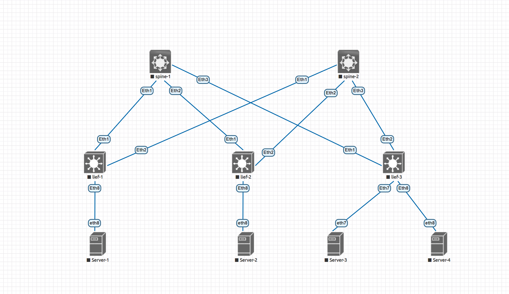

# Домашнее задание №1
## Основы проектирования сети

### Задание:
- Собрать схему CLOS;
- Распределить адресное пространство.

## Решение:

### Схема сети

### Таблица адресов

| hostname | interface |   IP/MASK   | Description |
| :------: | :-------: | :----------: | :---------: |
|  leaf-1  | Loopback2 | 10.1.0.1 /32 |            |
|  leaf-1  | Ethernet1 | 10.2.1.1 /31 | to-spine-1 |
|  leaf-1  | Ethernet2 | 10.2.2.1 /31 | to-spine-2 |
|          |          |              |            |
|  leaf-2  | Loopback2 | 10.1.0.2 /32 |            |
|  leaf-2  | Ethernet1 | 10.2.1.3 /31 | to-spine-1 |
|  leaf-2  | Ethernet2 | 10.2.2.3 /31 | to-spine-2 |
|          |          |              |            |
|  leaf-3  | Loopback2 | 10.1.0.3 /32 |            |
|  leaf-3  | Ethernet1 | 10.2.1.5 /31 | to-spine-1 |
|  leaf-3  | Ethernet2 | 10.2.2.5 /31 | to-spine-2 |
|          |          |              |            |
| spine-1 | Loopback1 | 10.0.1.0/32 |            |
| spine-1 | Ethernet1 | 10.2.1.0/31 |  to-leaf-1  |
| spine-1 | Ethernet2 | 10.2.1.2/31 |  to-leaf-2  |
| spine-1 | Ethernet3 | 10.2.1.4/31 |  to-leaf-3  |
|          |          |              |            |
| spine-2 | Loopback1 | 10.0.2.0/32 |            |
| spine-2 | Ethernet1 | 10.2.2.0/31 |  to-leaf-1  |
| spine-2 | Ethernet2 | 10.2.2.2/31 |  to-leaf-2  |
| spine-2 | Ethernet3 | 10.2.2.4/31 |  to-leaf-3  |

## Конфигурации устройств:

#### - [spine-1](Config/spine-1.cfg)
'''
hostname spine-1

interface Ethernet1
   description to-leaf-1
   no switchport
   ip address 10.2.1.0/31

 interface Ethernet2
   description to-leaf-2
   no switchport
   ip address 10.2.1.2/31

interface Ethernet3
   description to-leaf-3
   no switchport
   ip address 10.2.1.4/31

interface Loopback1
   ip address 10.0.1.0/32

'''

#### - [spine-2](Config/spine-2.cfg)

'''
hostname spine-2

interface Ethernet1
   description to-leaf-1
   no switchport
   ip address 10.2.2.0/31

interface Ethernet2 
   description to-leaf-2
   no switchport
   ip address 10.2.2.2/31

interface Ethernet3
   description to-leaf-3
   no switchport
   ip address 10.2.2.4/31

interface Loopback1
   ip address 10.0.2.0/32

'''

#### - [leaf-1](Config/leaf-1.cfg)

'''

hostname leaf-1

interface Ethernet1
   description to-spine-1
   no switchport
   ip address 10.2.1.1/31

interface Ethernet2
   description to-spine-2
   no switchport
   ip address 10.2.2.1/31

interface Loopback2
   ip address 10.1.0.1/32

'''

#### - [leaf-2](Config/leaf-2.cfg)

'''

hostname leaf-2

interface Ethernet1
   description to-spine-1
   no switchport
   ip address 10.2.1.3/31

interface Ethernet2
   description to-spine-2
   no switchport
   ip address 10.2.2.3/31

interface Loopback2
   ip address 10.1.0.2/32

'''

#### - [leaf-3](Config/leaf-3.cfg)

'''

hostname leaf-3

interface Ethernet1
   description to-spine-1
   no switchport
   ip address 10.2.1.5/31

interface Ethernet2
   description to-spine-2
   no switchport
   ip address 10.2.2.5/31

interface Loopback2
   ip address 10.1.0.3/32

'''
