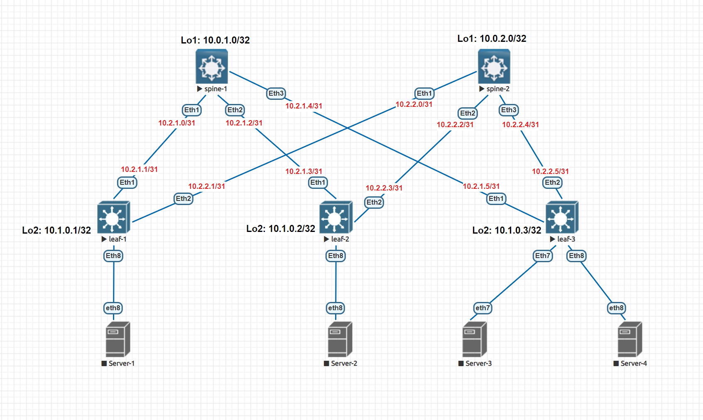

# Домашнее задание №1
## Основы проектирования сети

### Задание:
- Собрать схему CLOS;
- Распределить адресное пространство.

## Решение:

### Схема сети


### Таблица адресов

| hostname | interface |   IP/MASK   | Description |
| :------: | :-------: | :----------: | :---------: |
|  leaf-1  | Loopback2 | 10.1.0.1 /32 |            |
|  leaf-1  | Ethernet1 | 10.2.1.1 /31 | to-spine-1 |
|  leaf-1  | Ethernet2 | 10.2.2.1 /31 | to-spine-2 |
|          |          |              |            |
|  leaf-2  | Loopback2 | 10.1.0.2 /32 |            |
|  leaf-2  | Ethernet1 | 10.2.1.3 /31 | to-spine-1 |
|  leaf-2  | Ethernet2 | 10.2.2.3 /31 | to-spine-2 |
|          |          |              |            |
|  leaf-3  | Loopback2 | 10.1.0.3 /32 |            |
|  leaf-3  | Ethernet1 | 10.2.1.5 /31 | to-spine-1 |
|  leaf-3  | Ethernet2 | 10.2.2.5 /31 | to-spine-2 |
|          |          |              |            |
| spine-1 | Loopback1 | 10.0.1.0/32 |            |
| spine-1 | Ethernet1 | 10.2.1.0/31 |  to-leaf-1  |
| spine-1 | Ethernet2 | 10.2.1.2/31 |  to-leaf-2  |
| spine-1 | Ethernet3 | 10.2.1.4/31 |  to-leaf-3  |
|          |          |              |            |
| spine-2 | Loopback1 | 10.0.2.0/32 |            |
| spine-2 | Ethernet1 | 10.2.2.0/31 |  to-leaf-1  |
| spine-2 | Ethernet2 | 10.2.2.2/31 |  to-leaf-2  |
| spine-2 | Ethernet3 | 10.2.2.4/31 |  to-leaf-3  |

## Конфигурации устройств:

#### - [spine-1](Config/spine-1.cfg)
```
hostname spine-1

interface Ethernet1
   description to-leaf-1
   no switchport
   ip address 10.2.1.0/31

 interface Ethernet2
   description to-leaf-2
   no switchport
   ip address 10.2.1.2/31

interface Ethernet3
   description to-leaf-3
   no switchport
   ip address 10.2.1.4/31

interface Loopback1
   ip address 10.0.1.0/32

```

#### - [spine-2](Config/spine-2.cfg)

```
hostname spine-2

interface Ethernet1
   description to-leaf-1
   no switchport
   ip address 10.2.2.0/31

interface Ethernet2 
   description to-leaf-2
   no switchport
   ip address 10.2.2.2/31

interface Ethernet3
   description to-leaf-3
   no switchport
   ip address 10.2.2.4/31

interface Loopback1
   ip address 10.0.2.0/32

```

#### - [leaf-1](Config/leaf-1.cfg)

```

hostname leaf-1

interface Ethernet1
   description to-spine-1
   no switchport
   ip address 10.2.1.1/31

interface Ethernet2
   description to-spine-2
   no switchport
   ip address 10.2.2.1/31

interface Loopback2
   ip address 10.1.0.1/32

```

#### - [leaf-2](Config/leaf-2.cfg)

```

hostname leaf-2

interface Ethernet1
   description to-spine-1
   no switchport
   ip address 10.2.1.3/31

interface Ethernet2
   description to-spine-2
   no switchport
   ip address 10.2.2.3/31

interface Loopback2
   ip address 10.1.0.2/32

```

#### - [leaf-3](Config/leaf-3.cfg)

```

hostname leaf-3

interface Ethernet1
   description to-spine-1
   no switchport
   ip address 10.2.1.5/31

interface Ethernet2
   description to-spine-2
   no switchport
   ip address 10.2.2.5/31

interface Loopback2
   ip address 10.1.0.3/32

```
## Проверка соединений:

- spine-1
```
spine-1#ping 10.2.1.1
PING 10.2.1.1 (10.2.1.1) 72(100) bytes of data.
80 bytes from 10.2.1.1: icmp_seq=1 ttl=64 time=166 ms
80 bytes from 10.2.1.1: icmp_seq=2 ttl=64 time=161 ms
80 bytes from 10.2.1.1: icmp_seq=3 ttl=64 time=171 ms
80 bytes from 10.2.1.1: icmp_seq=4 ttl=64 time=177 ms
80 bytes from 10.2.1.1: icmp_seq=5 ttl=64 time=214 ms

--- 10.2.1.1 ping statistics ---
5 packets transmitted, 5 received, 0% packet loss, time 53ms
rtt min/avg/max/mdev = 161.019/178.165/214.984/19.179 ms, pipe 5, ipg/ewma 13.294/173.637 ms
```

```
spine-1#ping 10.2.1.3
PING 10.2.1.3 (10.2.1.3) 72(100) bytes of data.
80 bytes from 10.2.1.3: icmp_seq=1 ttl=64 time=17.3 ms
80 bytes from 10.2.1.3: icmp_seq=2 ttl=64 time=25.5 ms
80 bytes from 10.2.1.3: icmp_seq=3 ttl=64 time=6.65 ms
80 bytes from 10.2.1.3: icmp_seq=4 ttl=64 time=14.3 ms
80 bytes from 10.2.1.3: icmp_seq=5 ttl=64 time=12.8 ms

--- 10.2.1.3 ping statistics ---
5 packets transmitted, 5 received, 0% packet loss, time 80ms
rtt min/avg/max/mdev = 6.659/15.360/25.576/6.193 ms, pipe 2, ipg/ewma 20.069/16.145 ms
```

```
spine-1#ping 10.2.1.5
PING 10.2.1.5 (10.2.1.5) 72(100) bytes of data.
80 bytes from 10.2.1.5: icmp_seq=1 ttl=64 time=36.1 ms
80 bytes from 10.2.1.5: icmp_seq=2 ttl=64 time=35.4 ms
80 bytes from 10.2.1.5: icmp_seq=3 ttl=64 time=39.1 ms
80 bytes from 10.2.1.5: icmp_seq=4 ttl=64 time=30.0 ms
80 bytes from 10.2.1.5: icmp_seq=5 ttl=64 time=8.74 ms

--- 10.2.1.5 ping statistics ---
5 packets transmitted, 5 received, 0% packet loss, time 79ms
rtt min/avg/max/mdev = 8.745/29.900/39.155/10.977 ms, pipe 4, ipg/ewma 19.776/32.269 ms
```

- spine-2

```
spine-2#ping 10.2.2.1
PING 10.2.2.1 (10.2.2.1) 72(100) bytes of data.
80 bytes from 10.2.2.1: icmp_seq=1 ttl=64 time=104 ms
80 bytes from 10.2.2.1: icmp_seq=2 ttl=64 time=76.3 ms
80 bytes from 10.2.2.1: icmp_seq=3 ttl=64 time=69.1 ms
80 bytes from 10.2.2.1: icmp_seq=4 ttl=64 time=69.1 ms
80 bytes from 10.2.2.1: icmp_seq=5 ttl=64 time=60.9 ms

--- 10.2.2.1 ping statistics ---
5 packets transmitted, 5 received, 0% packet loss, time 68ms
rtt min/avg/max/mdev = 60.901/76.025/104.526/15.065 ms, pipe 5, ipg/ewma 17.080/89.464 ms
```

```
spine-2#ping 10.2.2.3
PING 10.2.2.3 (10.2.2.3) 72(100) bytes of data.
80 bytes from 10.2.2.3: icmp_seq=1 ttl=64 time=54.9 ms
80 bytes from 10.2.2.3: icmp_seq=2 ttl=64 time=43.1 ms
80 bytes from 10.2.2.3: icmp_seq=3 ttl=64 time=39.2 ms
80 bytes from 10.2.2.3: icmp_seq=4 ttl=64 time=33.2 ms
80 bytes from 10.2.2.3: icmp_seq=5 ttl=64 time=9.95 ms

--- 10.2.2.3 ping statistics ---
5 packets transmitted, 5 received, 0% packet loss, time 95ms
rtt min/avg/max/mdev = 9.951/36.094/54.900/14.869 ms, pipe 4, ipg/ewma 23.750/44.428 ms
```

```
spine-2#ping 10.2.2.5
PING 10.2.2.5 (10.2.2.5) 72(100) bytes of data.
80 bytes from 10.2.2.5: icmp_seq=1 ttl=64 time=32.5 ms
80 bytes from 10.2.2.5: icmp_seq=2 ttl=64 time=15.8 ms
80 bytes from 10.2.2.5: icmp_seq=3 ttl=64 time=17.6 ms
80 bytes from 10.2.2.5: icmp_seq=4 ttl=64 time=4.96 ms
80 bytes from 10.2.2.5: icmp_seq=5 ttl=64 time=5.94 ms

--- 10.2.2.5 ping statistics ---
5 packets transmitted, 5 received, 0% packet loss, time 86ms
rtt min/avg/max/mdev = 4.968/15.398/32.569/9.983 ms, pipe 3, ipg/ewma 21.725/23.395 ms
```
