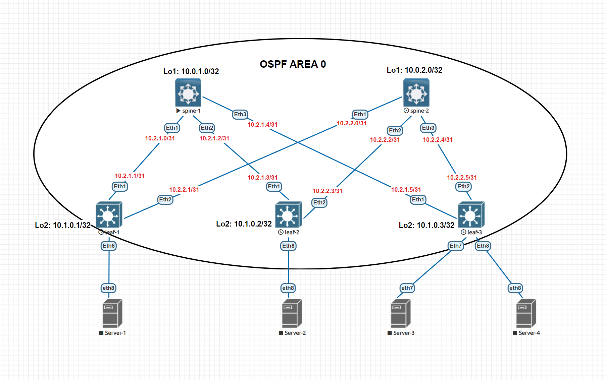

# Домашнее задание №2
## Построение Underlay сети OSPF

### Задание:
- Настроите OSPF в Underlay сети, для IP связанности между всеми сетевыми устройствами;
- Убедитесь в наличии IP связанности между устройствами в OSFP домене.

## Решение:

### Схема сети
