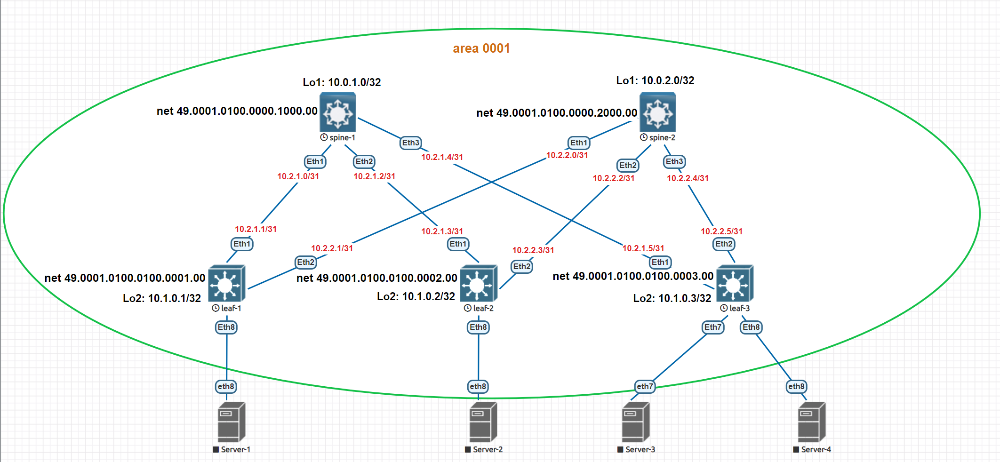

# Домашнее задание №3
## Построение Underlay сети IS-IS

### Задание:
- Настроите IS-IS в Underlay сети, для IP связанности между всеми сетевыми устройствами;
- Убедитесь в наличии IP связанности между устройствами в OSFP домене.

## Решение:

### Схема сети


## Конфигурации:

- [spine-1](Config/spine-1.cfg)

```
router isis 0001
   net 49.0001.0100.0100.0002.00
   is-type level-1
   !
   address-family ipv4 unicast

interface Ethernet1
   description to-leaf-1
   no switchport
   ip address 10.2.1.0/31
   bfd interval 100 min-rx 100 multiplier 3
   isis enable 0001
   isis bfd
   isis circuit-type level-1
   isis network point-to-point
   isis authentication key 7 kkH/BpnEzGmNpyc0bNYQKA==

interface Ethernet2
   description to-leaf-2
   no switchport
   ip address 10.2.1.2/31
   bfd interval 100 min-rx 100 multiplier 3
   isis enable 0001
   isis bfd
   isis circuit-type level-1
   isis network point-to-point
   isis authentication key 7 kkH/BpnEzGmNpyc0bNYQKA==

interface Ethernet3
   description to-leaf-3
   no switchport
   ip address 10.2.1.4/31
   bfd interval 100 min-rx 100 multiplier 3
   isis enable 0001
   isis bfd
   isis circuit-type level-1
   isis network point-to-point
   isis authentication key 7 kkH/BpnEzGmNpyc0bNYQKA==
   
```

- [spine-2](Config/spine-2.cfg)

```
router isis 0001
   net 49.0001.0100.0000.1000.00
   is-type level-1
   !
   address-family ipv4 unicast

interface Ethernet1
   description to-leaf-1
   no switchport
   ip address 10.2.2.0/31
   bfd interval 100 min-rx 100 multiplier 3
   isis enable 0001
   isis bfd
   isis circuit-type level-1
   isis network point-to-point
   isis authentication key 7 kkH/BpnEzGmNpyc0bNYQKA==

interface Ethernet2
   description to-leaf-2
   no switchport
   ip address 10.2.2.2/31
   bfd interval 100 min-rx 100 multiplier 3
   isis enable 0001
   isis bfd
   isis circuit-type level-1
   isis network point-to-point
   isis authentication key 7 kkH/BpnEzGmNpyc0bNYQKA==

interface Ethernet3
   description to-leaf-3
   no switchport
   ip address 10.2.2.4/31
   bfd interval 100 min-rx 100 multiplier 3
   isis enable 0001
   isis bfd
   isis circuit-type level-1
   isis network point-to-point
   isis authentication key 7 kkH/BpnEzGmNpyc0bNYQKA==

```

- [leaf-1](Config/leaf-1.cfg)

```
router isis 0001
   net 49.0001.0100.0000.1000.00
   is-type level-1
   !
   address-family ipv4 unicast

interface Ethernet1
   description to-spine-1
   no switchport
   ip address 10.2.1.1/31
   bfd interval 100 min-rx 100 multiplier 3
   isis enable 0001
   isis bfd
   isis circuit-type level-1
   isis network point-to-point
   isis authentication key 7 kkH/BpnEzGmNpyc0bNYQKA==

interface Ethernet2
   description to-spine-2
   no switchport
   ip address 10.2.2.1/31
   bfd interval 100 min-rx 100 multiplier 3
   isis enable 0001
   isis bfd
   isis circuit-type level-1
   isis network point-to-point
   isis authentication key 7 kkH/BpnEzGmNpyc0bNYQKA==

```

- [leaf-2](Config/leaf-2.cfg)

```

router isis 0001
   net 49.0001.0100.0000.1000.00
   is-type level-1
   !
   address-family ipv4 unicast

interface Ethernet1
   description to-spine-1
   no switchport
   ip address 10.2.1.3/31
   bfd interval 100 min-rx 100 multiplier 3
   isis enable 0001
   isis bfd
   isis circuit-type level-1
   isis network point-to-point
   isis authentication key 7 kkH/BpnEzGmNpyc0bNYQKA==

interface Ethernet2
   description to-spine-2
   no switchport
   ip address 10.2.2.3/31
   bfd interval 100 min-rx 100 multiplier 3
   isis enable 0001
   isis bfd
   isis circuit-type level-1
   isis network point-to-point
   isis authentication key 7 kkH/BpnEzGmNpyc0bNYQKA==

```

- [leaf-3](Config/leaf-3.cfg)

```
router isis 0001
   net 49.0001.0100.0000.1000.00
   is-type level-1
   !
   address-family ipv4 unicast

interface Ethernet1
   description to-spine-1
   no switchport
   ip address 10.2.1.5/31
   bfd interval 100 min-rx 100 multiplier 3
   isis enable 0001
   isis bfd
   isis circuit-type level-1
   isis network point-to-point
   isis authentication key 7 kkH/BpnEzGmNpyc0bNYQKA==

interface Ethernet2
   description to-spine-2
   no switchport
   ip address 10.2.2.5/31
   bfd interval 100 min-rx 100 multiplier 3
   isis enable 0001
   isis bfd
   isis circuit-type level-1
   isis network point-to-point
   isis authentication key 7 kkH/BpnEzGmNpyc0bNYQKA==

```

## Таблицы маршрутизации:
