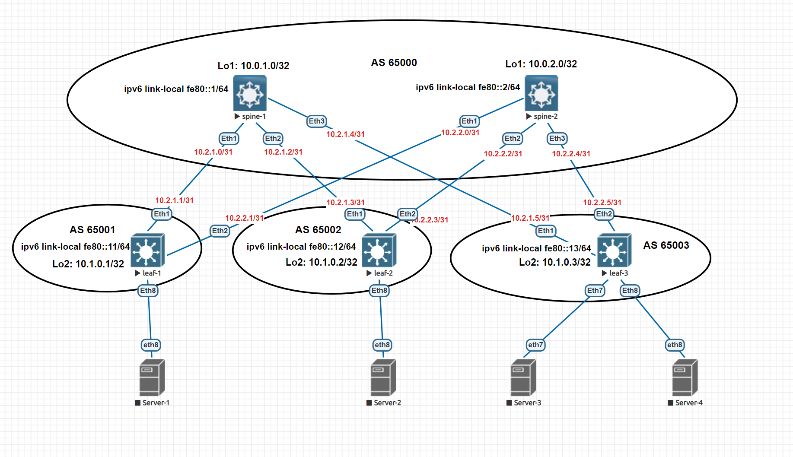

# Домашнее задание №4
## Построение Underlay сети eBGP

### Задание:
- Настроите BGP в Underlay сети, для IP связанности между всеми сетевыми устройствами;
- Убедитесь в наличии IP связанности между устройствами в BGP домене.

## Решение:

### Схема сети


## Конфигурации:

- [spine-1](Config/spine-1.cfg)

```
interface Ethernet1
   description to-leaf-1
   no switchport
   ip address 10.2.1.0/31
   ipv6 enable
   ipv6 address fe80::1/64 link-local

interface Ethernet2
   description to-leaf-2
   no switchport
   ip address 10.2.1.2/31
   ipv6 enable
   ipv6 address fe80::1/64 link-local

interface Ethernet3
   description to-leaf-3
   no switchport
   ip address 10.2.1.4/31
   ipv6 enable
   ipv6 address fe80::1/64 link-local

router bgp 65000
   router-id 10.0.1.0
   bgp default ipv4-unicast transport ipv6
   neighbor fe80::11%Et1 remote-as 65001
   neighbor fe80::11%Et1 bfd
   neighbor fe80::11%Et1 auto-local-addr
   neighbor fe80::12%Et2 remote-as 65002
   neighbor fe80::12%Et2 bfd
   neighbor fe80::12%Et2 auto-local-addr
   neighbor fe80::13%Et3 remote-as 65003
   neighbor fe80::13%Et3 bfd
   neighbor fe80::13%Et3 auto-local-addr
   
   address-family ipv4
      neighbor fe80::11%Et1 activate
      neighbor fe80::12%Et2 activate
      neighbor fe80::13%Et3 activate
      network 10.2.1.0/31
      network 10.2.1.2/31
      network 10.2.1.4/31
   
   address-family ipv6
      neighbor fe80::11%Et1 activate
      neighbor fe80::12%Et2 activate
      neighbor fe80::13%Et3 activate

```

- [spine-2](Config/spine-2.cfg)

```
interface Ethernet1
   description to-leaf-1
   no switchport
   ip address 10.2.2.0/31
   ipv6 enable
   ipv6 address fe80::2/64 link-local

interface Ethernet2
   description to-leaf-2
   no switchport
   ip address 10.2.2.2/31
   ipv6 enable
   ipv6 address fe80::2/64 link-local

interface Ethernet3
   description to-leaf-3
   no switchport
   ip address 10.2.2.4/31
   ipv6 enable
   ipv6 address fe80::2/64 link-local

router bgp 65000
   router-id 10.0.2.0
   bgp default ipv4-unicast transport ipv6
   neighbor fe80::11%Et1 remote-as 65001
   neighbor fe80::11%Et1 bfd
   neighbor fe80::11%Et1 auto-local-addr
   neighbor fe80::12%Et2 remote-as 65002
   neighbor fe80::12%Et2 bfd
   neighbor fe80::12%Et2 auto-local-addr
   neighbor fe80::13%Et3 remote-as 65003
   neighbor fe80::13%Et3 bfd
   neighbor fe80::13%Et3 auto-local-addr
   
   address-family ipv4
      neighbor fe80::11%Et1 activate
      neighbor fe80::12%Et2 activate
      neighbor fe80::13%Et3 activate
      network 10.2.2.0/31
      network 10.2.2.2/31
      network 10.2.2.4/31
   
   address-family ipv6
      neighbor fe80::11%Et1 activate
      neighbor fe80::12%Et2 activate
      neighbor fe80::13%Et3 activate

```

- [leaf-1.cfg](Config/leaf-1.cfg)

```
interface Ethernet1
   description to-spine-1
   no switchport
   ip address 10.2.1.1/31
   ipv6 enable
   ipv6 address fe80::11/64 link-local

interface Ethernet2
   description to-spine-2
   no switchport
   ip address 10.2.2.1/31
   ipv6 enable
   ipv6 address fe80::11/64 link-local

router bgp 65001
   router-id 10.1.0.1
   bgp default ipv4-unicast transport ipv6
   neighbor spines peer group
   neighbor spines remote-as 65000
   neighbor spines bfd
   neighbor spines auto-local-addr
   neighbor fe80::1%Et1 peer group spines
   neighbor fe80::2%Et2 peer group spines
   
   address-family ipv4
      neighbor spines activate
      network 10.2.1.0/31
      network 10.2.2.0/31
   
   address-family ipv6
      neighbor spines activate

```

- [leaf-2.cfg](Config/leaf-2.cfg)

```
interface Ethernet1
   description to-spine-1
   no switchport
   ip address 10.2.1.3/31
   ipv6 enable
   ipv6 address fe80::12/64 link-local

interface Ethernet2
   description to-spine-2
   no switchport
   ip address 10.2.2.3/31
   ipv6 enable
   ipv6 address fe80::12/64 link-local

router bgp 65002
   router-id 10.1.0.2
   bgp default ipv4-unicast transport ipv6
   neighbor spines peer group
   neighbor spines remote-as 65000
   neighbor spines bfd
   neighbor spines auto-local-addr
   neighbor fe80::1%Et1 peer group spines
   neighbor fe80::2%Et2 peer group spines
   
   address-family ipv4
      neighbor spines activate
      network 10.2.1.2/31
      network 10.2.2.2/31
   
   address-family ipv6
      neighbor spines activate

```

- [leaf-3.cfg](Config/leaf-3.cfg)

```
interface Ethernet1
   description to-spine-1
   no switchport
   ip address 10.2.1.5/31
   ipv6 enable
   ipv6 address fe80::13/64 link-local

interface Ethernet2
   description to-spine-2
   no switchport
   ip address 10.2.2.5/31
   ipv6 enable
   ipv6 address fe80::13/64 link-local

router bgp 65003
   router-id 10.1.0.3
   bgp default ipv4-unicast transport ipv6
   neighbor spines peer group
   neighbor spines remote-as 65000
   neighbor spines bfd
   neighbor spines auto-local-addr
   neighbor fe80::1%Et1 peer group spines
   neighbor fe80::2%Et2 peer group spines
   !
   address-family ipv4
      neighbor spines activate
      network 10.2.1.4/31
      network 10.2.2.4/31
   !
   address-family ipv6
      neighbor spines activate

```
## Проверка соседства и таблицы маршрутизации

- spine-1

```
spine-1#show ipv6 bgp summary
BGP summary information for VRF default
Router identifier 10.0.1.0, local AS number 65000
Neighbor Status Codes: m - Under maintenance
  Neighbor         V  AS           MsgRcvd   MsgSent  InQ OutQ  Up/Down State   PfxRcd PfxAcc
  fe80::11%Et1     4  65001            112       122    0    0 01:06:50 Estab   0      0
  fe80::12%Et2     4  65002             80        88    0    0 00:52:32 Estab   0      0
  fe80::13%Et3     4  65003             70        71    0    0 00:41:01 Estab   0      0
spine-1#
spine-1#show ip route bgp

VRF: default
Codes: C - connected, S - static, K - kernel,
       O - OSPF, IA - OSPF inter area, E1 - OSPF external type 1,
       E2 - OSPF external type 2, N1 - OSPF NSSA external type 1,
       N2 - OSPF NSSA external type2, B - Other BGP Routes,
       B I - iBGP, B E - eBGP, R - RIP, I L1 - IS-IS level 1,
       I L2 - IS-IS level 2, O3 - OSPFv3, A B - BGP Aggregate,
       A O - OSPF Summary, NG - Nexthop Group Static Route,
       V - VXLAN Control Service, M - Martian,
       DH - DHCP client installed default route,
       DP - Dynamic Policy Route, L - VRF Leaked,
       G  - gRIBI, RC - Route Cache Route

 B E      10.2.2.0/31 [200/0] via 10.2.1.1, Ethernet1
 B E      10.2.2.2/31 [200/0] via 10.2.1.3, Ethernet2
 B E      10.2.2.4/31 [200/0] via 10.2.1.5, Ethernet3

spine-1#

```
- spine-2

```
spine-2#show ipv6 bgp summary
BGP summary information for VRF default
Router identifier 10.0.2.0, local AS number 65000
Neighbor Status Codes: m - Under maintenance
  Neighbor         V  AS           MsgRcvd   MsgSent  InQ OutQ  Up/Down State   PfxRcd PfxAcc
  fe80::11%Et1     4  65001            112       111    0    0 01:09:58 Estab   0      0
  fe80::12%Et2     4  65002             63        64    0    0 00:54:19 Estab   0      0
  fe80::13%Et3     4  65003             67        67    0    0 00:44:30 Estab   0      0
spine-2#
spine-2#show ip route bgp

VRF: default
Codes: C - connected, S - static, K - kernel,
       O - OSPF, IA - OSPF inter area, E1 - OSPF external type 1,
       E2 - OSPF external type 2, N1 - OSPF NSSA external type 1,
       N2 - OSPF NSSA external type2, B - Other BGP Routes,
       B I - iBGP, B E - eBGP, R - RIP, I L1 - IS-IS level 1,
       I L2 - IS-IS level 2, O3 - OSPFv3, A B - BGP Aggregate,
       A O - OSPF Summary, NG - Nexthop Group Static Route,
       V - VXLAN Control Service, M - Martian,
       DH - DHCP client installed default route,
       DP - Dynamic Policy Route, L - VRF Leaked,
       G  - gRIBI, RC - Route Cache Route

 B E      10.2.1.0/31 [200/0] via 10.2.2.1, Ethernet1
 B E      10.2.1.2/31 [200/0] via 10.2.2.3, Ethernet2
 B E      10.2.1.4/31 [200/0] via 10.2.2.5, Ethernet3

spine-2#

```
- leaf-1

```
leaf-1#show ipv6 bgp summary
BGP summary information for VRF default
Router identifier 10.1.0.1, local AS number 65001
Neighbor Status Codes: m - Under maintenance
  Neighbor         V  AS           MsgRcvd   MsgSent  InQ OutQ  Up/Down State   PfxRcd PfxAcc
  fe80::1%Et1      4  65000            119       116    0    0 01:11:49 Estab   0      0
  fe80::2%Et2      4  65000            111       116    0    0 01:11:28 Estab   0      0
leaf-1#
leaf-1#show ip route bgp

VRF: default
Codes: C - connected, S - static, K - kernel,
       O - OSPF, IA - OSPF inter area, E1 - OSPF external type 1,
       E2 - OSPF external type 2, N1 - OSPF NSSA external type 1,
       N2 - OSPF NSSA external type2, B - Other BGP Routes,
       B I - iBGP, B E - eBGP, R - RIP, I L1 - IS-IS level 1,
       I L2 - IS-IS level 2, O3 - OSPFv3, A B - BGP Aggregate,
       A O - OSPF Summary, NG - Nexthop Group Static Route,
       V - VXLAN Control Service, M - Martian,
       DH - DHCP client installed default route,
       DP - Dynamic Policy Route, L - VRF Leaked,
       G  - gRIBI, RC - Route Cache Route

 B E      10.2.1.2/31 [200/0] via 10.2.1.0, Ethernet1
 B E      10.2.1.4/31 [200/0] via 10.2.1.0, Ethernet1
 B E      10.2.2.2/31 [200/0] via 10.2.2.0, Ethernet2
 B E      10.2.2.4/31 [200/0] via 10.2.2.0, Ethernet2

leaf-1#

```
- leaf-2

```
leaf-2#show ipv6 bgp summary
BGP summary information for VRF default
Router identifier 10.1.0.2, local AS number 65002
Neighbor Status Codes: m - Under maintenance
  Neighbor         V  AS           MsgRcvd   MsgSent  InQ OutQ  Up/Down State   PfxRcd PfxAcc
  fe80::1%Et1      4  65000            107       105    0    0 00:58:42 Estab   0      0
  fe80::2%Et2      4  65000             73        74    0    0 00:56:59 Estab   0      0
leaf-2#
leaf-2#show ip route bgp

VRF: default
Codes: C - connected, S - static, K - kernel,
       O - OSPF, IA - OSPF inter area, E1 - OSPF external type 1,
       E2 - OSPF external type 2, N1 - OSPF NSSA external type 1,
       N2 - OSPF NSSA external type2, B - Other BGP Routes,
       B I - iBGP, B E - eBGP, R - RIP, I L1 - IS-IS level 1,
       I L2 - IS-IS level 2, O3 - OSPFv3, A B - BGP Aggregate,
       A O - OSPF Summary, NG - Nexthop Group Static Route,
       V - VXLAN Control Service, M - Martian,
       DH - DHCP client installed default route,
       DP - Dynamic Policy Route, L - VRF Leaked,
       G  - gRIBI, RC - Route Cache Route

 B E      10.2.1.0/31 [200/0] via 10.2.1.2, Ethernet1
 B E      10.2.1.4/31 [200/0] via 10.2.1.2, Ethernet1
 B E      10.2.2.0/31 [200/0] via 10.2.2.2, Ethernet2
 B E      10.2.2.4/31 [200/0] via 10.2.2.2, Ethernet2

leaf-2#

```
- leaf-3

```
leaf-3#show ipv6 bgp summary
BGP summary information for VRF default
Router identifier 10.1.0.3, local AS number 65003
Neighbor Status Codes: m - Under maintenance
  Neighbor         V  AS           MsgRcvd   MsgSent  InQ OutQ  Up/Down State   PfxRcd PfxAcc
  fe80::1%Et1      4  65000             70        72    0    0 00:48:17 Estab   0      0
  fe80::2%Et2      4  65000             70        73    0    0 00:48:17 Estab   0      0
leaf-3#
leaf-3#show ip route bgp

VRF: default
Codes: C - connected, S - static, K - kernel,
       O - OSPF, IA - OSPF inter area, E1 - OSPF external type 1,
       E2 - OSPF external type 2, N1 - OSPF NSSA external type 1,
       N2 - OSPF NSSA external type2, B - Other BGP Routes,
       B I - iBGP, B E - eBGP, R - RIP, I L1 - IS-IS level 1,
       I L2 - IS-IS level 2, O3 - OSPFv3, A B - BGP Aggregate,
       A O - OSPF Summary, NG - Nexthop Group Static Route,
       V - VXLAN Control Service, M - Martian,
       DH - DHCP client installed default route,
       DP - Dynamic Policy Route, L - VRF Leaked,
       G  - gRIBI, RC - Route Cache Route

 B E      10.2.1.0/31 [200/0] via 10.2.1.4, Ethernet1
 B E      10.2.1.2/31 [200/0] via 10.2.1.4, Ethernet1
 B E      10.2.2.0/31 [200/0] via 10.2.2.4, Ethernet2
 B E      10.2.2.2/31 [200/0] via 10.2.2.4, Ethernet2

leaf-3#

```

## Проверка связи между leafs

- leaf-1

```
leaf-1#ping 10.2.1.3
PING 10.2.1.3 (10.2.1.3) 72(100) bytes of data.
80 bytes from 10.2.1.3: icmp_seq=1 ttl=63 time=152 ms
80 bytes from 10.2.1.3: icmp_seq=2 ttl=63 time=143 ms
80 bytes from 10.2.1.3: icmp_seq=3 ttl=63 time=142 ms
80 bytes from 10.2.1.3: icmp_seq=4 ttl=63 time=135 ms
80 bytes from 10.2.1.3: icmp_seq=5 ttl=63 time=128 ms

--- 10.2.1.3 ping statistics ---
5 packets transmitted, 5 received, 0% packet loss, time 59ms
rtt min/avg/max/mdev = 128.601/140.402/152.057/7.982 ms, pipe 5, ipg/ewma 14.968/145.661 ms
leaf-1#
leaf-1#ping 10.2.1.5
PING 10.2.1.5 (10.2.1.5) 72(100) bytes of data.
80 bytes from 10.2.1.5: icmp_seq=1 ttl=63 time=57.7 ms
80 bytes from 10.2.1.5: icmp_seq=2 ttl=63 time=57.1 ms
80 bytes from 10.2.1.5: icmp_seq=3 ttl=63 time=53.8 ms
80 bytes from 10.2.1.5: icmp_seq=4 ttl=63 time=50.7 ms
80 bytes from 10.2.1.5: icmp_seq=5 ttl=63 time=51.2 ms

--- 10.2.1.5 ping statistics ---
5 packets transmitted, 5 received, 0% packet loss, time 49ms
rtt min/avg/max/mdev = 50.728/54.161/57.734/2.897 ms, pipe 5, ipg/ewma 12.313/55.746 ms
leaf-1#
leaf-1#ping 10.2.2.3
PING 10.2.2.3 (10.2.2.3) 72(100) bytes of data.
80 bytes from 10.2.2.3: icmp_seq=1 ttl=63 time=46.5 ms
80 bytes from 10.2.2.3: icmp_seq=2 ttl=63 time=46.8 ms
80 bytes from 10.2.2.3: icmp_seq=3 ttl=63 time=53.5 ms
80 bytes from 10.2.2.3: icmp_seq=4 ttl=63 time=121 ms
80 bytes from 10.2.2.3: icmp_seq=5 ttl=63 time=133 ms

--- 10.2.2.3 ping statistics ---
5 packets transmitted, 5 received, 0% packet loss, time 44ms
rtt min/avg/max/mdev = 46.584/80.521/133.911/38.880 ms, pipe 5, ipg/ewma 11.024/66.405 ms
leaf-1#
leaf-1#ping 10.2.2.5
PING 10.2.2.5 (10.2.2.5) 72(100) bytes of data.
80 bytes from 10.2.2.5: icmp_seq=1 ttl=63 time=34.2 ms
80 bytes from 10.2.2.5: icmp_seq=2 ttl=63 time=32.5 ms
80 bytes from 10.2.2.5: icmp_seq=3 ttl=63 time=33.5 ms
80 bytes from 10.2.2.5: icmp_seq=4 ttl=63 time=22.9 ms
80 bytes from 10.2.2.5: icmp_seq=5 ttl=63 time=22.4 ms

--- 10.2.2.5 ping statistics ---
5 packets transmitted, 5 received, 0% packet loss, time 97ms
rtt min/avg/max/mdev = 22.483/29.155/34.201/5.277 ms, pipe 3, ipg/ewma 24.372/31.309 ms
leaf-1#

```
- leaf-2

```
leaf-2#ping 10.2.1.1
PING 10.2.1.1 (10.2.1.1) 72(100) bytes of data.
80 bytes from 10.2.1.1: icmp_seq=1 ttl=63 time=54.0 ms
80 bytes from 10.2.1.1: icmp_seq=2 ttl=63 time=50.7 ms
80 bytes from 10.2.1.1: icmp_seq=3 ttl=63 time=51.9 ms
80 bytes from 10.2.1.1: icmp_seq=4 ttl=63 time=59.9 ms
80 bytes from 10.2.1.1: icmp_seq=5 ttl=63 time=57.5 ms

--- 10.2.1.1 ping statistics ---
5 packets transmitted, 5 received, 0% packet loss, time 48ms
rtt min/avg/max/mdev = 50.719/54.854/59.920/3.439 ms, pipe 5, ipg/ewma 12.199/54.675 ms
leaf-2#
leaf-2#ping 10.2.1.5
PING 10.2.1.5 (10.2.1.5) 72(100) bytes of data.
80 bytes from 10.2.1.5: icmp_seq=1 ttl=63 time=74.7 ms
80 bytes from 10.2.1.5: icmp_seq=2 ttl=63 time=58.0 ms
80 bytes from 10.2.1.5: icmp_seq=3 ttl=63 time=59.4 ms
80 bytes from 10.2.1.5: icmp_seq=4 ttl=63 time=58.4 ms
80 bytes from 10.2.1.5: icmp_seq=5 ttl=63 time=61.3 ms

--- 10.2.1.5 ping statistics ---
5 packets transmitted, 5 received, 0% packet loss, time 56ms
rtt min/avg/max/mdev = 58.027/62.403/74.766/6.295 ms, pipe 5, ipg/ewma 14.189/68.434 ms
leaf-2#
leaf-2#ping 10.2.2.1
PING 10.2.2.1 (10.2.2.1) 72(100) bytes of data.
80 bytes from 10.2.2.1: icmp_seq=1 ttl=63 time=55.1 ms
80 bytes from 10.2.2.1: icmp_seq=2 ttl=63 time=46.9 ms
80 bytes from 10.2.2.1: icmp_seq=3 ttl=63 time=46.4 ms
80 bytes from 10.2.2.1: icmp_seq=4 ttl=63 time=44.1 ms
80 bytes from 10.2.2.1: icmp_seq=5 ttl=63 time=45.1 ms

--- 10.2.2.1 ping statistics ---
5 packets transmitted, 5 received, 0% packet loss, time 54ms
rtt min/avg/max/mdev = 44.140/47.573/55.197/3.949 ms, pipe 5, ipg/ewma 13.507/51.201 ms
leaf-2#
leaf-2#ping 10.2.2.5
PING 10.2.2.5 (10.2.2.5) 72(100) bytes of data.
80 bytes from 10.2.2.5: icmp_seq=1 ttl=63 time=33.0 ms
80 bytes from 10.2.2.5: icmp_seq=2 ttl=63 time=34.8 ms
80 bytes from 10.2.2.5: icmp_seq=3 ttl=63 time=36.8 ms
80 bytes from 10.2.2.5: icmp_seq=4 ttl=63 time=25.3 ms
80 bytes from 10.2.2.5: icmp_seq=5 ttl=63 time=25.1 ms

--- 10.2.2.5 ping statistics ---
5 packets transmitted, 5 received, 0% packet loss, time 100ms
rtt min/avg/max/mdev = 25.199/31.072/36.888/4.885 ms, pipe 3, ipg/ewma 25.188/31.729 ms
leaf-2#

```
- leaf-3

```
leaf-3#ping 10.2.1.1
PING 10.2.1.1 (10.2.1.1) 72(100) bytes of data.
80 bytes from 10.2.1.1: icmp_seq=1 ttl=63 time=37.7 ms
80 bytes from 10.2.1.1: icmp_seq=2 ttl=63 time=123 ms
80 bytes from 10.2.1.1: icmp_seq=3 ttl=63 time=137 ms

--- 10.2.1.1 ping statistics ---
5 packets transmitted, 3 received, 40% packet loss, time 109ms
rtt min/avg/max/mdev = 37.797/99.825/137.786/44.225 ms, pipe 4, ipg/ewma 27.463/59.712 ms
leaf-3#
leaf-3#ping 10.2.1.3
PING 10.2.1.3 (10.2.1.3) 72(100) bytes of data.
80 bytes from 10.2.1.3: icmp_seq=1 ttl=63 time=25.8 ms
80 bytes from 10.2.1.3: icmp_seq=2 ttl=63 time=27.5 ms
80 bytes from 10.2.1.3: icmp_seq=3 ttl=63 time=23.5 ms
80 bytes from 10.2.1.3: icmp_seq=4 ttl=63 time=29.8 ms
80 bytes from 10.2.1.3: icmp_seq=5 ttl=63 time=33.2 ms

--- 10.2.1.3 ping statistics ---
5 packets transmitted, 5 received, 0% packet loss, time 98ms
rtt min/avg/max/mdev = 23.535/28.012/33.297/3.362 ms, pipe 2, ipg/ewma 24.632/27.137 ms
leaf-3#
leaf-3#ping 10.2.2.1
PING 10.2.2.1 (10.2.2.1) 72(100) bytes of data.
80 bytes from 10.2.2.1: icmp_seq=1 ttl=63 time=48.7 ms
80 bytes from 10.2.2.1: icmp_seq=2 ttl=63 time=58.7 ms
80 bytes from 10.2.2.1: icmp_seq=3 ttl=63 time=54.5 ms
80 bytes from 10.2.2.1: icmp_seq=4 ttl=63 time=52.7 ms
80 bytes from 10.2.2.1: icmp_seq=5 ttl=63 time=45.5 ms

--- 10.2.2.1 ping statistics ---
5 packets transmitted, 5 received, 0% packet loss, time 47ms
rtt min/avg/max/mdev = 45.548/52.073/58.783/4.596 ms, pipe 5, ipg/ewma 11.763/50.165 ms
leaf-3#
leaf-3#ping 10.2.2.3
PING 10.2.2.3 (10.2.2.3) 72(100) bytes of data.
80 bytes from 10.2.2.3: icmp_seq=1 ttl=63 time=24.4 ms
80 bytes from 10.2.2.3: icmp_seq=2 ttl=63 time=30.2 ms
80 bytes from 10.2.2.3: icmp_seq=3 ttl=63 time=38.7 ms
80 bytes from 10.2.2.3: icmp_seq=4 ttl=63 time=26.1 ms
80 bytes from 10.2.2.3: icmp_seq=5 ttl=63 time=35.9 ms

--- 10.2.2.3 ping statistics ---
5 packets transmitted, 5 received, 0% packet loss, time 90ms
rtt min/avg/max/mdev = 24.499/31.117/38.731/5.483 ms, pipe 2, ipg/ewma 22.571/27.954 ms
leaf-3#

```