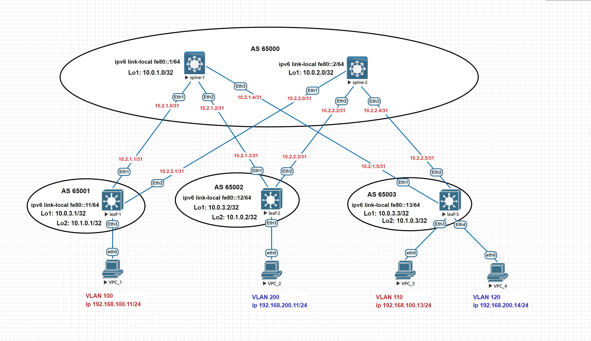

# Домашнее задание №5
## Построение Overlay сети VxLAN L2

### Задание:
- Настроите BGP peering между Leaf и Spine в AF l2vpn evpn;
- Настроите связанность между клиентами в первой зоне и убедитесь в её наличии.git

## Решение:

### Схема сети


## Конфигурации:

- [spine-1](Config/spine-1.cfg)

```
ip prefix-list Loop seq 10 permit 10.0.1.0/32

route-map BGP_ALLOW permit 10
   match ip address prefix-list Loop

peer-filter EVPN
   10 match as-range 65001-65003 result accept

peer-filter LEAFS
   10 match as-range 65001-65003 result accept

router bgp 65000
   router-id 10.0.1.0
   bgp default ipv4-unicast transport ipv6
   timers bgp 3 9
   maximum-paths 2 ecmp 2
   bgp listen range 10.0.3.0/24 peer-group EVPN peer-filter EVPN
   bgp listen range fe80::/64 peer-group LEAFS peer-filter LEAFS
   neighbor EVPN peer group
   neighbor EVPN next-hop-unchanged
   neighbor EVPN update-source Loopback1
   neighbor EVPN ebgp-multihop 3
   neighbor EVPN send-community extended
   neighbor LEAFS peer group
   neighbor LEAFS bfd
   neighbor LEAFS auto-local-addr
   neighbor LEAFS send-community
   redistribute connected route-map BGP_ALLOW
   
   address-family evpn
      neighbor EVPN activate
   
   address-family ipv4
      neighbor LEAFS activate
   
   address-family ipv6
      neighbor LEAFS activate

```

- [spine-2](Config/spine-2.cfg)

```
ip prefix-list Loop seq 10 permit 10.0.2.0/32

route-map BGP_ALLOW permit 10
   match ip address prefix-list Loop

peer-filter EVPN
   10 match as-range 65001-65003 result accept

peer-filter LEAFS
   10 match as-range 65001-65003 result accept

router bgp 65000
   router-id 10.0.2.0
   bgp default ipv4-unicast transport ipv6
   timers bgp 3 9
   maximum-paths 2 ecmp 2
   bgp listen range 10.0.3.0/24 peer-group EVPN peer-filter EVPN
   bgp listen range fe80::/64 peer-group LEAFS peer-filter LEAFS
   neighbor EVPN peer group
   neighbor EVPN next-hop-unchanged
   neighbor EVPN update-source Loopback1
   neighbor EVPN ebgp-multihop 3
   neighbor EVPN send-community extended
   neighbor LEAFS peer group
   neighbor LEAFS bfd
   neighbor LEAFS auto-local-addr
   neighbor LEAFS send-community
   redistribute connected route-map BGP_ALLOW
   
   address-family evpn
      neighbor EVPN activate
   
   address-family ipv4
      neighbor LEAFS activate
   
   address-family ipv6
      neighbor LEAFS activate

```

- [leaf-1](Config/leaf-1.cfg)

```
vlan 100
interface Ethernet3
   switchport access vlan 100

interface Loopback1
   ip address 10.0.3.1/32

interface Loopback2
   ip address 10.1.0.1/32

interface Vxlan1
   vxlan source-interface Loopback2
   vxlan udp-port 4789
   vxlan vlan 100 vni 10010
   vxlan learn-restrict any

ip prefix-list Loop seq 10 permit 10.1.0.1/32
ip prefix-list Loop seq 20 permit 10.0.3.1/32

route-map BGP_ALLOW permit 10
   match ip address prefix-list Loop

router bgp 65001
   router-id 10.1.0.1
   bgp default ipv4-unicast transport ipv6
   timers bgp 3 9
   maximum-paths 2 ecmp 2
   neighbor EVPN peer group
   neighbor EVPN remote-as 65000
   neighbor EVPN update-source Loopback1
   neighbor EVPN ebgp-multihop 3
   neighbor EVPN send-community extended
   neighbor spines peer group
   neighbor spines remote-as 65000
   neighbor spines bfd
   neighbor spines auto-local-addr
   neighbor 10.0.1.0 peer group EVPN
   neighbor 10.0.2.0 peer group EVPN
   neighbor fe80::1%Et1 peer group spines
   neighbor fe80::2%Et2 peer group spines
   redistribute connected route-map BGP_ALLOW
   
   vlan 100
      rd 65001:10010
      route-target both 10:10010
      redistribute learned
   
   address-family evpn
      neighbor EVPN activate
   
   address-family ipv4
      neighbor spines activate
   
   address-family ipv6
      neighbor spines activate

```

- [leaf-2](Config/leaf-2.cfg)

```
vlan 200
interface Ethernet3
   switchport access vlan 200

interface Loopback1
   ip address 10.0.3.2/32
!
interface Loopback2
   ip address 10.1.0.2/32

interface Vxlan1
   vxlan source-interface Loopback2
   vxlan udp-port 4789
   vxlan vlan 200 vni 10020
   vxlan learn-restrict any

ip prefix-list Loop seq 10 permit 10.1.0.2/32
ip prefix-list Loop seq 20 permit 10.0.3.2/32

route-map BGP_ALLOW permit 10
   match ip address prefix-list Loop

router bgp 65002
   router-id 10.1.0.2
   bgp default ipv4-unicast transport ipv6
   timers bgp 3 9
   maximum-paths 2 ecmp 2
   neighbor EVPN peer group
   neighbor EVPN remote-as 65000
   neighbor EVPN update-source Loopback1
   neighbor EVPN ebgp-multihop 3
   neighbor EVPN send-community extended
   neighbor spines peer group
   neighbor spines remote-as 65000
   neighbor spines bfd
   neighbor spines auto-local-addr
   neighbor 10.0.1.0 peer group EVPN
   neighbor 10.0.2.0 peer group EVPN
   neighbor fe80::1%Et1 peer group spines
   neighbor fe80::2%Et2 peer group spines
   redistribute connected route-map BGP_ALLOW
   
   vlan 200
      rd 65002:10020
      route-target both 20:10020
      redistribute learned
   
   address-family evpn
      neighbor EVPN activate
   
   address-family ipv4
      neighbor spines activate
   
   address-family ipv6
      neighbor spines activate

```

- [leaf-3](Config/leaf-3.cfg)

```
vlan 110,120
interface Ethernet3
   switchport access vlan 110

interface Ethernet4
   switchport access vlan 120

interface Loopback1
   ip address 10.0.3.3/32

interface Loopback2
   ip address 10.1.0.3/32

interface Vxlan1
   vxlan source-interface Loopback2
   vxlan udp-port 4789
   vxlan vlan 110 vni 10010
   vxlan vlan 120 vni 10020
   vxlan learn-restrict any

ip prefix-list Loop seq 10 permit 10.1.0.3/32
ip prefix-list Loop seq 20 permit 10.0.3.3/32

route-map BGP_ALLOW permit 10
   match ip address prefix-list Loop

router bgp 65003
   router-id 10.1.0.3
   bgp default ipv4-unicast transport ipv6
   timers bgp 3 9
   maximum-paths 2 ecmp 2
   neighbor EVPN peer group
   neighbor EVPN remote-as 65000
   neighbor EVPN update-source Loopback1
   neighbor EVPN ebgp-multihop 3
   neighbor EVPN send-community extended
   neighbor spines peer group
   neighbor spines remote-as 65000
   neighbor spines bfd
   neighbor spines auto-local-addr
   neighbor 10.0.1.0 peer group EVPN
   neighbor 10.0.2.0 peer group EVPN
   neighbor fe80::1%Et1 peer group spines
   neighbor fe80::2%Et2 peer group spines
   redistribute connected route-map BGP_ALLOW
   
   vlan 110
      rd 65003:10010
      route-target both 10:10010
      redistribute learned
   
   vlan 120
      rd 65003:10020
      route-target both 20:10020
      redistribute learned
   
   address-family evpn
      neighbor EVPN activate
   
   address-family ipv4
      neighbor spines activate
   
   address-family ipv6
      neighbor spines activate

```

## Проверка связанности клиентов

- spine-1

spine-1#show bgp evpn summary
BGP summary information for VRF default
Router identifier 10.0.1.0, local AS number 65000
Neighbor Status Codes: m - Under maintenance
  Neighbor V AS           MsgRcvd   MsgSent  InQ OutQ  Up/Down State   PfxRcd PfxAcc
  10.0.3.1 4 65001           2252      2244    0    0 01:34:54 Estab   1      1
  10.0.3.2 4 65002           1716      1713    0    0 01:12:28 Estab   1      1
  10.0.3.3 4 65003           1364      1367    0    0 00:57:28 Estab   2      2

- spine-2

spine-2#show bgp evpn summary
BGP summary information for VRF default
Router identifier 10.0.2.0, local AS number 65000
Neighbor Status Codes: m - Under maintenance
  Neighbor V AS           MsgRcvd   MsgSent  InQ OutQ  Up/Down State   PfxRcd PfxAcc
  10.0.3.1 4 65001           1951      1970    0    0 01:22:42 Estab   1      1
  10.0.3.2 4 65002           1730      1759    0    0 01:13:41 Estab   1      1
  10.0.3.3 4 65003           1392      1401    0    0 00:58:42 Estab   2      2

- leaf-1

leaf-1#show ip route

VRF: default
Codes: C - connected, S - static, K - kernel,
       O - OSPF, IA - OSPF inter area, E1 - OSPF external type 1,
       E2 - OSPF external type 2, N1 - OSPF NSSA external type 1,
       N2 - OSPF NSSA external type2, B - Other BGP Routes,
       B I - iBGP, B E - eBGP, R - RIP, I L1 - IS-IS level 1,
       I L2 - IS-IS level 2, O3 - OSPFv3, A B - BGP Aggregate,
       A O - OSPF Summary, NG - Nexthop Group Static Route,
       V - VXLAN Control Service, M - Martian,
       DH - DHCP client installed default route,
       DP - Dynamic Policy Route, L - VRF Leaked,
       G  - gRIBI, RC - Route Cache Route

Gateway of last resort is not set

 B E      10.0.1.0/32 [200/0] via 10.2.1.0, Ethernet1
 B E      10.0.2.0/32 [200/0] via 10.2.2.0, Ethernet2
 C        10.0.3.1/32 is directly connected, Loopback1
 B E      10.0.3.2/32 [200/0] via 10.2.1.0, Ethernet1
                              via 10.2.2.0, Ethernet2
 B E      10.0.3.3/32 [200/0] via 10.2.1.0, Ethernet1
                              via 10.2.2.0, Ethernet2
 C        10.1.0.1/32 is directly connected, Loopback2
 B E      10.1.0.2/32 [200/0] via 10.2.1.0, Ethernet1
                              via 10.2.2.0, Ethernet2
 B E      10.1.0.3/32 [200/0] via 10.2.1.0, Ethernet1
                              via 10.2.2.0, Ethernet2
 C        10.2.1.0/31 is directly connected, Ethernet1
 C        10.2.2.0/31 is directly connected, Ethernet2

leaf-1#show ip bgp summary
BGP summary information for VRF default
Router identifier 10.1.0.1, local AS number 65001
Neighbor Status Codes: m - Under maintenance
  Neighbor    V AS           MsgRcvd   MsgSent  InQ OutQ  Up/Down State   PfxRcd PfxAcc
  10.0.1.0    4 65000           2382      2389    0    0 01:38:26 Estab   5      5
  10.0.2.0    4 65000           2025      2006    0    0 01:25:00 Estab   5      5
  fe80::1%Et1 4 65000           2975      2985    0    0 01:37:47 Estab   5      5
  fe80::2%Et2 4 65000           2422      2423    0    0 00:20:25 Estab   5      5

leaf-1#show vxlan vtep
Remote VTEPS for Vxlan1:

VTEP           Tunnel Type(s)
-------------- --------------
10.1.0.3       flood

Total number of remote VTEPS:  1

leaf-1#show vxlan address-table
          Vxlan Mac Address Table
----------------------------------------------------------------------

VLAN  Mac Address     Type      Prt  VTEP             Moves   Last Move
----  -----------     ----      ---  ----             -----   ---------
 100  0050.7966.6808  EVPN      Vx1  10.1.0.3         1       0:00:46 ago
Total Remote Mac Addresses for this criterion: 1

leaf-1#show bgp evpn route-type mac-ip
BGP routing table information for VRF default
Router identifier 10.1.0.1, local AS number 65001
Route status codes: * - valid, > - active, S - Stale, E - ECMP head, e - ECMP
                    c - Contributing to ECMP, % - Pending BGP convergence
Origin codes: i - IGP, e - EGP, ? - incomplete
AS Path Attributes: Or-ID - Originator ID, C-LST - Cluster List, LL Nexthop - Link Local Nexthop

          Network                Next Hop              Metric  LocPref Weight  Path
 * >      RD: 65001:10010 mac-ip 0050.7966.6806
                                 -                     -       -       0       i
 * >Ec    RD: 65003:10010 mac-ip 0050.7966.6808
                                 10.1.0.3              -       100     0       65000 65003 i
 *  ec    RD: 65003:10010 mac-ip 0050.7966.6808
                                 10.1.0.3              -       100     0       65000 65003 i


- leaf-2

leaf-2#show ip route

VRF: default
Codes: C - connected, S - static, K - kernel,
       O - OSPF, IA - OSPF inter area, E1 - OSPF external type 1,
       E2 - OSPF external type 2, N1 - OSPF NSSA external type 1,
       N2 - OSPF NSSA external type2, B - Other BGP Routes,
       B I - iBGP, B E - eBGP, R - RIP, I L1 - IS-IS level 1,
       I L2 - IS-IS level 2, O3 - OSPFv3, A B - BGP Aggregate,
       A O - OSPF Summary, NG - Nexthop Group Static Route,
       V - VXLAN Control Service, M - Martian,
       DH - DHCP client installed default route,
       DP - Dynamic Policy Route, L - VRF Leaked,
       G  - gRIBI, RC - Route Cache Route

Gateway of last resort is not set

 B E      10.0.1.0/32 [200/0] via 10.2.1.2, Ethernet1
 B E      10.0.2.0/32 [200/0] via 10.2.2.2, Ethernet2
 B E      10.0.3.1/32 [200/0] via 10.2.1.2, Ethernet1
                              via 10.2.2.2, Ethernet2
 C        10.0.3.2/32 is directly connected, Loopback1
 B E      10.0.3.3/32 [200/0] via 10.2.1.2, Ethernet1
                              via 10.2.2.2, Ethernet2
 B E      10.1.0.1/32 [200/0] via 10.2.1.2, Ethernet1
                              via 10.2.2.2, Ethernet2
 C        10.1.0.2/32 is directly connected, Loopback2
 B E      10.1.0.3/32 [200/0] via 10.2.1.2, Ethernet1
                              via 10.2.2.2, Ethernet2
 C        10.2.1.2/31 is directly connected, Ethernet1
 C        10.2.2.2/31 is directly connected, Ethernet2

leaf-2#show ip bgp summary
BGP summary information for VRF default
Router identifier 10.1.0.2, local AS number 65002
Neighbor Status Codes: m - Under maintenance
  Neighbor    V AS           MsgRcvd   MsgSent  InQ OutQ  Up/Down State   PfxRcd PfxAcc
  10.0.1.0    4 65000            351       354    0    0 00:14:26 Estab   5      5
  10.0.2.0    4 65000            355       357    0    0 00:14:31 Estab   5      5
  fe80::1%Et1 4 65000            354       356    0    0 00:14:32 Estab   5      5
  fe80::2%Et2 4 65000            360       358    0    0 00:14:32 Estab   5      5

leaf-2#show vxlan vtep
Remote VTEPS for Vxlan1:

VTEP           Tunnel Type(s)
-------------- --------------
10.1.0.3       unicast, flood

Total number of remote VTEPS:  1

leaf-2#show vxlan address-table
          Vxlan Mac Address Table
----------------------------------------------------------------------

VLAN  Mac Address     Type      Prt  VTEP             Moves   Last Move
----  -----------     ----      ---  ----             -----   ---------
 200  0050.7966.6809  EVPN      Vx1  10.1.0.3         1       0:04:41 ago
Total Remote Mac Addresses for this criterion: 1

leaf-2#show bgp evpn route-type mac-ip
BGP routing table information for VRF default
Router identifier 10.1.0.2, local AS number 65002
Route status codes: * - valid, > - active, S - Stale, E - ECMP head, e - ECMP
                    c - Contributing to ECMP, % - Pending BGP convergence
Origin codes: i - IGP, e - EGP, ? - incomplete
AS Path Attributes: Or-ID - Originator ID, C-LST - Cluster List, LL Nexthop - Link Local Nexthop

          Network                Next Hop              Metric  LocPref Weight  Path
 * >      RD: 65002:10020 mac-ip 0050.7966.6807
                                 -                     -       -       0       i
 * >Ec    RD: 65003:10020 mac-ip 0050.7966.6809
                                 10.1.0.3              -       100     0       65000 65003 i
 *  ec    RD: 65003:10020 mac-ip 0050.7966.6809
                                 10.1.0.3              -       100     0       65000 65003 i

- leaf-3

leaf-3#show ip route

VRF: default
Codes: C - connected, S - static, K - kernel,
       O - OSPF, IA - OSPF inter area, E1 - OSPF external type 1,
       E2 - OSPF external type 2, N1 - OSPF NSSA external type 1,
       N2 - OSPF NSSA external type2, B - Other BGP Routes,
       B I - iBGP, B E - eBGP, R - RIP, I L1 - IS-IS level 1,
       I L2 - IS-IS level 2, O3 - OSPFv3, A B - BGP Aggregate,
       A O - OSPF Summary, NG - Nexthop Group Static Route,
       V - VXLAN Control Service, M - Martian,
       DH - DHCP client installed default route,
       DP - Dynamic Policy Route, L - VRF Leaked,
       G  - gRIBI, RC - Route Cache Route

Gateway of last resort is not set

 B E      10.0.1.0/32 [200/0] via 10.2.1.4, Ethernet1
 B E      10.0.2.0/32 [200/0] via 10.2.2.4, Ethernet2
 B E      10.0.3.1/32 [200/0] via 10.2.1.4, Ethernet1
                              via 10.2.2.4, Ethernet2
 B E      10.0.3.2/32 [200/0] via 10.2.1.4, Ethernet1
                              via 10.2.2.4, Ethernet2
 C        10.0.3.3/32 is directly connected, Loopback1
 B E      10.1.0.1/32 [200/0] via 10.2.1.4, Ethernet1
                              via 10.2.2.4, Ethernet2
 B E      10.1.0.2/32 [200/0] via 10.2.1.4, Ethernet1
                              via 10.2.2.4, Ethernet2
 C        10.1.0.3/32 is directly connected, Loopback2
 C        10.2.1.4/31 is directly connected, Ethernet1
 C        10.2.2.4/31 is directly connected, Ethernet2

leaf-3#show ip bgp summary
BGP summary information for VRF default
Router identifier 10.1.0.3, local AS number 65003
Neighbor Status Codes: m - Under maintenance
  Neighbor    V AS           MsgRcvd   MsgSent  InQ OutQ  Up/Down State   PfxRcd PfxAcc
  10.0.1.0    4 65000           2027      2033    0    0 01:24:45 Estab   5      5
  10.0.2.0    4 65000           2032      2025    0    0 01:24:46 Estab   5      5
  fe80::1%Et1 4 65000           3505      3509    0    0 01:32:15 Estab   5      5
  fe80::2%Et2 4 65000           2639      2626    0    0 00:44:11 Estab   5      5

leaf-3#show vxlan vtep
Remote VTEPS for Vxlan1:

VTEP           Tunnel Type(s)
-------------- --------------
10.1.0.1       flood
10.1.0.2       flood

Total number of remote VTEPS:  2

leaf-3#show vxlan address-table
          Vxlan Mac Address Table
----------------------------------------------------------------------

VLAN  Mac Address     Type      Prt  VTEP             Moves   Last Move
----  -----------     ----      ---  ----             -----   ---------
 110  0050.7966.6806  EVPN      Vx1  10.1.0.1         1       0:00:31 ago
 120  0050.7966.6807  EVPN      Vx1  10.1.0.2         1       0:01:29 ago
Total Remote Mac Addresses for this criterion: 2

leaf-3#show bgp evpn route-type mac-ip
BGP routing table information for VRF default
Router identifier 10.1.0.3, local AS number 65003
Route status codes: * - valid, > - active, S - Stale, E - ECMP head, e - ECMP
                    c - Contributing to ECMP, % - Pending BGP convergence
Origin codes: i - IGP, e - EGP, ? - incomplete
AS Path Attributes: Or-ID - Originator ID, C-LST - Cluster List, LL Nexthop - Link Local Nexthop

          Network                Next Hop              Metric  LocPref Weight  Path
 * >Ec    RD: 65001:10010 mac-ip 0050.7966.6806
                                 10.1.0.1              -       100     0       65000 65001 i
 *  ec    RD: 65001:10010 mac-ip 0050.7966.6806
                                 10.1.0.1              -       100     0       65000 65001 i
 * >Ec    RD: 65002:10020 mac-ip 0050.7966.6807
                                 10.1.0.2              -       100     0       65000 65002 i
 *  ec    RD: 65002:10020 mac-ip 0050.7966.6807
                                 10.1.0.2              -       100     0       65000 65002 i
 * >      RD: 65003:10010 mac-ip 0050.7966.6808
                                 -                     -       -       0       i
 * >      RD: 65003:10020 mac-ip 0050.7966.6809
                                 -                     -       -       0       i

- VPC-1

VPC_1> ping 192.168.100.13

84 bytes from 192.168.100.13 icmp_seq=1 ttl=64 time=40.891 ms
84 bytes from 192.168.100.13 icmp_seq=2 ttl=64 time=36.520 ms
84 bytes from 192.168.100.13 icmp_seq=3 ttl=64 time=17.515 ms
84 bytes from 192.168.100.13 icmp_seq=4 ttl=64 time=17.768 ms
84 bytes from 192.168.100.13 icmp_seq=5 ttl=64 time=44.500 ms

- VPC-2

VPC_2> ping 192.168.200.14

84 bytes from 192.168.200.14 icmp_seq=1 ttl=64 time=42.874 ms
84 bytes from 192.168.200.14 icmp_seq=2 ttl=64 time=36.683 ms
84 bytes from 192.168.200.14 icmp_seq=3 ttl=64 time=19.413 ms
84 bytes from 192.168.200.14 icmp_seq=4 ttl=64 time=23.374 ms
84 bytes from 192.168.200.14 icmp_seq=5 ttl=64 time=18.620 ms

- VPC-3

VPC_3> ping 192.168.100.11

84 bytes from 192.168.100.11 icmp_seq=1 ttl=64 time=116.848 ms
84 bytes from 192.168.100.11 icmp_seq=2 ttl=64 time=28.033 ms
84 bytes from 192.168.100.11 icmp_seq=3 ttl=64 time=54.580 ms
84 bytes from 192.168.100.11 icmp_seq=4 ttl=64 time=88.401 ms
84 bytes from 192.168.100.11 icmp_seq=5 ttl=64 time=21.657 ms

- VPC-4

VPC_4> ping 192.168.200.11

84 bytes from 192.168.200.11 icmp_seq=1 ttl=64 time=21.250 ms
84 bytes from 192.168.200.11 icmp_seq=2 ttl=64 time=26.530 ms
84 bytes from 192.168.200.11 icmp_seq=3 ttl=64 time=24.758 ms
84 bytes from 192.168.200.11 icmp_seq=4 ttl=64 time=18.924 ms
84 bytes from 192.168.200.11 icmp_seq=5 ttl=64 time=26.181 ms


