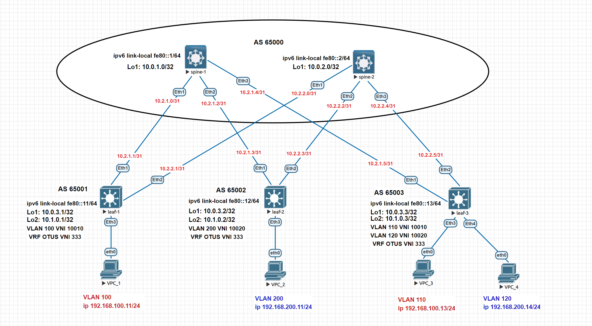

# Домашнее задание №6
## Построение Overlay сети VxLAN L3

### Задание:
- Настроите каждого клиента в своем VNI;
- Настроите маршрутизацию между клиентами.

## Решение:

### Схема сети

## Конфигурации: