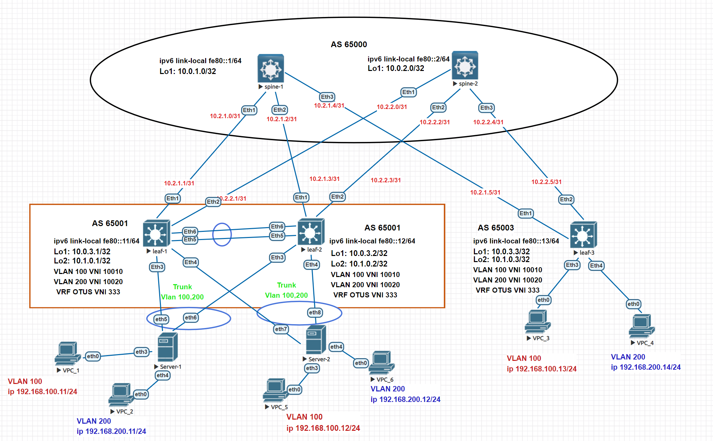

# Домашнее задание №7
## Построение Overlay сети VxLAN Multihoming

### Задание:
- Подключите клиентов 2-я линками к различным Leaf
- Настроите агрегированный канал со стороны клиента
- Настроите multihoming для работы в Overlay сети. Если используете Cisco NXOS - vPC, если иной вендор - то ESI LAG (либо MC-LAG с поддержкой VXLAN)

## Решение:

### Схема сети


## Конфигурации:

- [spine-1](Config/spine-1.cfg)

```
interface Loopback1
   ip address 10.0.1.0/32

ip prefix-list BGP_out seq 10 permit 10.0.1.0/32

route-map BGP_out_map permit 10
   match ip address prefix-list BGP_out

peer-filter EVPN
   10 match as-range 65001-65003 result accept

peer-filter LEAFS
   10 match as-range 65001-65003 result accept

router bgp 65000
   router-id 10.0.1.0
   bgp default ipv4-unicast transport ipv6
   timers bgp 3 9
   maximum-paths 2 ecmp 2
   bgp listen range 10.0.3.0/24 peer-group EVPN peer-filter EVPN
   bgp listen range fe80::/64 peer-group LEAFS peer-filter LEAFS
   neighbor EVPN peer group
   neighbor EVPN next-hop-unchanged
   neighbor EVPN update-source Loopback1
   neighbor EVPN ebgp-multihop 3
   neighbor EVPN send-community extended
   neighbor LEAFS peer group
   neighbor LEAFS bfd
   neighbor LEAFS auto-local-addr
   neighbor LEAFS password 7 b86CRLUyvVyBSvjcT7UH5A==
   neighbor LEAFS send-community
   redistribute connected route-map BGP_out_map
   
   address-family evpn
      neighbor EVPN activate
   
   address-family ipv4
      neighbor LEAFS activate
   
   address-family ipv6
      neighbor LEAFS activate

```
- [spine-2](Config/spine-2.cfg)

```
interface Loopback1
   ip address 10.0.2.0/32

ip prefix-list BGP_out seq 10 permit 10.0.2.0/32

route-map BGP_out_map permit 10
   match ip address prefix-list BGP_out

peer-filter EVPN
   10 match as-range 65001-65003 result accept

peer-filter LEAFS
   10 match as-range 65001-65003 result accept

router bgp 65000
   router-id 10.0.2.0
   timers bgp 3 9
   maximum-paths 2 ecmp 2
   bgp listen range 10.0.3.0/24 peer-group EVPN peer-filter EVPN
   bgp listen range fe80::/64 peer-group LEAFS peer-filter LEAFS
   neighbor EVPN peer group
   neighbor EVPN next-hop-unchanged
   neighbor EVPN update-source Loopback1
   neighbor EVPN ebgp-multihop 3
   neighbor EVPN send-community extended
   neighbor LEAFS peer group
   neighbor LEAFS bfd
   neighbor LEAFS auto-local-addr
   neighbor LEAFS password 7 b86CRLUyvVyBSvjcT7UH5A==
   neighbor LEAFS send-community
   redistribute connected route-map BGP_out_map
   
   address-family evpn
      neighbor EVPN activate
   
   address-family ipv4
      neighbor LEAFS activate
   
   address-family ipv6
      neighbor LEAFS activate

```
- [leaf-1](Config/leaf-1.cfg)

```
spanning-tree mode mstp
no spanning-tree vlan-id 4094

vlan 100,200

vlan 4094
   trunk group mlagpeer

vrf instance OTUS

interface Port-Channel1
   description MLAG
   switchport mode trunk
   switchport trunk group mlagpeer

interface Port-Channel10
   switchport trunk allowed vlan 100,200
   switchport mode trunk
   mlag 10

interface Port-Channel11
   switchport trunk allowed vlan 100,200
   switchport mode trunk
   mlag 11

interface Ethernet1
   description Link to spine-1
   no switchport
   ip address 10.2.1.1/31
   ipv6 enable
   ipv6 address fe80::11/64 link-local

interface Ethernet2
   description Link to spine-2
   no switchport
   ip address 10.2.2.1/31
   ipv6 enable
   ipv6 address fe80::11/64 link-local

interface Ethernet3
   channel-group 10 mode active

interface Ethernet4
   channel-group 11 mode active

interface Ethernet5
   description Port-channel-1 Link to LEAF-2
   channel-group 1 mode active

interface Ethernet6
   description Port-channel-1 Link to LEAF-2
   channel-group 1 mode active

interface Loopback1
   description EVPN_VxLAN
   ip address 10.0.3.1/32

interface Loopback2
   description router-id for BGP
   ip address 10.1.0.1/32

interface Vlan100
   vrf OTUS
   ip address virtual 192.168.100.1/24

interface Vlan200
   vrf OTUS
   ip address virtual 192.168.200.1/24

interface Vlan4094
   description MLAG Peer Link
   ip address 10.3.0.1/30

interface Vxlan1
   vxlan source-interface Loopback1
   vxlan udp-port 4789
   vxlan vlan 100 vni 10010
   vxlan vlan 200 vni 10020
   vxlan vrf OTUS vni 333
   vxlan virtual-vtep local-interface Loopback1
   vxlan learn-restrict any

ip virtual-router mac-address 00:00:00:00:00:01

mlag configuration
   domain-id MLAG-OTUS
   local-interface Vlan4094
   peer-address 10.3.0.2
   peer-link Port-Channel1

```

- [leaf-2](Config/leaf-2.cfg)

```
spanning-tree mode mstp
no spanning-tree vlan-id 4094

vlan 100,200

vlan 4094
   trunk group mlagpeer

vrf instance OTUS

interface Port-Channel1
   description MLAG
   switchport mode trunk
   switchport trunk group mlagpeer

interface Port-Channel10
   switchport trunk allowed vlan 100,200
   switchport mode trunk
   mlag 10

interface Port-Channel11
   switchport trunk allowed vlan 100,200
   switchport mode trunk
   mlag 11

interface Ethernet1
   description Link to spine-1
   no switchport
   ip address 10.2.1.3/31
   ipv6 enable
   ipv6 address fe80::12/64 link-local

interface Ethernet2
   description Link to spine-2
   no switchport
   ip address 10.2.2.3/31
   ipv6 enable
   ipv6 address fe80::12/64 link-local

interface Ethernet3
   channel-group 10 mode active

interface Ethernet4
   shutdown
   channel-group 11 mode active

interface Ethernet5
   description Port-channel-1 Link to LEAF-1
   channel-group 1 mode active

interface Ethernet6
   description Port-channel-1 Link to LEAF-1
   channel-group 1 mode active

interface Loopback1
   description EVPN_VxLAN
   ip address 10.0.3.2/32

interface Loopback2
   description router-id for BGP
   ip address 10.1.0.2/32

interface Vlan100
   vrf OTUS
   ip address virtual 192.168.100.1/24
   ip virtual-router address 192.168.100.1
   mac address virtual-router

interface Vlan200
   vrf OTUS
   ip address virtual 192.168.200.1/24
   ip virtual-router address 192.168.200.1
   mac address virtual-router

interface Vlan4094
   description MLAG Peer Link
   ip address 10.3.0.2/30

interface Vxlan1
   vxlan source-interface Loopback1
   vxlan udp-port 4789
   vxlan vlan 100 vni 10010
   vxlan vlan 200 vni 10020
   vxlan vrf OTUS vni 333
   vxlan virtual-vtep local-interface Loopback1
   vxlan learn-restrict any

ip virtual-router mac-address 00:00:00:00:00:02

mlag configuration
   domain-id MLAG-OTUS
   local-interface Vlan4094
   peer-address 10.3.0.1
   peer-link Port-Channel1

```

- [leaf-3](Config/leaf-3.cfg)

```
vlan 100,200

vrf instance OTUS

interface Ethernet1
   description Link to spine-1
   no switchport
   ip address 10.2.1.5/31
   bfd interval 100 min-rx 100 multiplier 3
   ipv6 enable
   ipv6 address fe80::13/64 link-local

interface Ethernet2
   description Link to spine-2
   no switchport
   ip address 10.2.2.5/31
   bfd interval 100 min-rx 100 multiplier 3
   ipv6 enable
   ipv6 address fe80::13/64 link-local

interface Ethernet3
   description Link to VPC_3
   switchport access vlan 100

interface Ethernet4
   description Link to VPC_4
   switchport access vlan 200

interface Loopback1
   description EVPN_VxLAN
   ip address 10.0.3.3/32

interface Loopback2
   description router-id for BGP
   ip address 10.1.0.3/32

interface Vlan100
   vrf OTUS
   ip address virtual 192.168.100.1/24

interface Vlan200
   vrf OTUS
   ip address virtual 192.168.200.1/24

interface Vxlan1
   vxlan source-interface Loopback1
   vxlan udp-port 4789
   vxlan vlan 100 vni 10010
   vxlan vlan 200 vni 10020
   vxlan vrf OTUS vni 333
   vxlan learn-restrict any

ip virtual-router mac-address 00:00:00:00:00:03

```

## Проверка связанности

