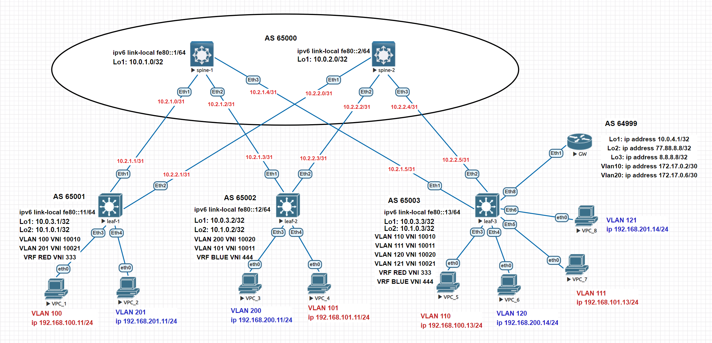

# Домашнее задание №8
## Построение Overlay сети VxLAN. Маршруты type 5.

### Задание:
- Анонсировать суммарные префиксы клиентов в Overlay сеть.
- Настроите маршрутизацию между клиентами через суммарный префикс.

## Решение:

### Схема сети


## Конфигурации:

- [spine-1](Config/spine-1.cfg)

```
interface Loopback1
   ip address 10.0.1.0/32

ip prefix-list BGP_out seq 10 permit 10.0.1.0/32

route-map BGP_out_map permit 10
   match ip address prefix-list BGP_out

peer-filter EVPN
   10 match as-range 65001-65003 result accept

peer-filter LEAFS
   10 match as-range 65001-65003 result accept

router bgp 65000
   router-id 10.0.1.0
   bgp default ipv4-unicast transport ipv6
   timers bgp 3 9
   maximum-paths 2 ecmp 2
   bgp listen range 10.0.3.0/24 peer-group EVPN peer-filter EVPN
   bgp listen range fe80::/64 peer-group LEAFS peer-filter LEAFS
   neighbor EVPN peer group
   neighbor EVPN next-hop-unchanged
   neighbor EVPN update-source Loopback1
   neighbor EVPN ebgp-multihop 3
   neighbor EVPN send-community extended
   neighbor LEAFS peer group
   neighbor LEAFS bfd
   neighbor LEAFS auto-local-addr
   neighbor LEAFS password 7 b86CRLUyvVyBSvjcT7UH5A==
   neighbor LEAFS send-community
   redistribute connected route-map BGP_out_map
   
   address-family evpn
      neighbor EVPN activate
   
   address-family ipv4
      neighbor LEAFS activate
   
   address-family ipv6
      neighbor LEAFS activate

```
- [spine-2](Config/spine-2.cfg)

```
interface Loopback1
   ip address 10.0.2.0/32

ip prefix-list BGP_out seq 10 permit 10.0.2.0/32

route-map BGP_out_map permit 10
   match ip address prefix-list BGP_out

peer-filter EVPN
   10 match as-range 65001-65003 result accept

peer-filter LEAFS
   10 match as-range 65001-65003 result accept

router bgp 65000
   router-id 10.0.2.0
   timers bgp 3 9
   maximum-paths 2 ecmp 2
   bgp listen range 10.0.3.0/24 peer-group EVPN peer-filter EVPN
   bgp listen range fe80::/64 peer-group LEAFS peer-filter LEAFS
   neighbor EVPN peer group
   neighbor EVPN next-hop-unchanged
   neighbor EVPN update-source Loopback1
   neighbor EVPN ebgp-multihop 3
   neighbor EVPN send-community extended
   neighbor LEAFS peer group
   neighbor LEAFS bfd
   neighbor LEAFS auto-local-addr
   neighbor LEAFS password 7 b86CRLUyvVyBSvjcT7UH5A==
   neighbor LEAFS send-community
   redistribute connected route-map BGP_out_map
   
   address-family evpn
      neighbor EVPN activate
   
   address-family ipv4
      neighbor LEAFS activate
   
   address-family ipv6
      neighbor LEAFS activate

```
- [leaf-1](Config/leaf-1.cfg)

```
vlan 100,201

vrf instance BLUE

vrf instance RED

interface Ethernet3
   description Link to VPC_1
   switchport access vlan 100

interface Ethernet4
   description Link to VPC_4
   switchport access vlan 201

interface Vlan100
   vrf RED
   ip address virtual 192.168.100.1/24

interface Vlan201
   vrf BLUE
   ip address virtual 192.168.201.1/24

interface Vxlan1
   vxlan source-interface Loopback1
   vxlan udp-port 4789
   vxlan vlan 100 vni 10010
   vxlan vlan 201 vni 10021
   vxlan vrf BLUE vni 444
   vxlan vrf RED vni 333
   vxlan learn-restrict any

ip routing
ip routing vrf BLUE
ip routing vrf RED

router bgp 65001
...
vlan 100
      rd 65001:10010
      route-target both 10:10010
      redistribute learned
   
   vlan 201
      rd 65001:10021
      route-target both 20:10021
      redistribute learned
   
   address-family evpn
      neighbor EVPN activate
   
   address-family ipv4
      neighbor SPINES activate
   
   address-family ipv6
      neighbor SPINES activate
   
   vrf BLUE
      rd 65001:444
      route-target import evpn 33:444
      route-target export evpn 33:444
   
   vrf RED
      rd 65001:333
      route-target import evpn 33:333
      route-target export evpn 33:333
```

- [leaf-2](Config/leaf-2.cfg)

```
vlan 101,200

vrf instance BLUE

vrf instance RED

interface Ethernet3
   description Link to VPC_3
   switchport access vlan 200

interface Ethernet4
   description Linkto VPC_4
   switchport access vlan 101

interface Vlan101
   vrf RED
   ip address virtual 192.168.101.1/24

interface Vlan200
   vrf BLUE
   ip address virtual 192.168.200.1/24

interface Vxlan1
   vxlan source-interface Loopback1
   vxlan udp-port 4789
   vxlan vlan 101 vni 10011
   vxlan vlan 200 vni 10020
   vxlan vrf BLUE vni 444
   vxlan vrf RED vni 333
   vxlan learn-restrict any

ip routing
ip routing vrf BLUE
ip routing vrf RED

router bgp 65002
...
vlan 101
      rd 65002:333
      route-target both 10:10011
      redistribute learned
   !
   vlan 200
      rd 65002:10020
      route-target both 20:10020
      redistribute learned
   !
   address-family evpn
      neighbor EVPN activate
   !
   address-family ipv4
      neighbor SPINES activate
   !
   address-family ipv6
      neighbor SPINES activate
   !
   vrf BLUE
      rd 65002:444
      route-target import evpn 33:444
      route-target export evpn 33:444
   !
   vrf RED
      rd 65002:333
      route-target import evpn 33:333
      route-target export evpn 33:333
```
- [leaf-3](Config/leaf-3.cfg)

```
vlan 10,20,110-111,120-121

vrf instance BLUE

vrf instance RED

interface Ethernet3
   description Link to VPC_3
   switchport access vlan 110

interface Ethernet4
   description Link to VPC_4
   switchport access vlan 120

interface Ethernet5
   description Link to VPC_7
   switchport access vlan 111
   switchport trunk allowed vlan 10,20

interface Ethernet6
   description Link tto VPC_8
   switchport access vlan 121

interface Ethernet8
   description Link to GW
   switchport trunk allowed vlan 10,20
   switchport mode trunk

interface Vlan10
   description Link to GW 
   vrf RED
   ip address 172.17.0.1/30

interface Vlan20
   description Link to GW 
   vrf BLUE
   ip address 172.17.0.5/30

interface Vlan110
   vrf RED
   ip address virtual 192.168.100.1/24

interface Vlan111
   vrf RED
   ip address virtual 192.168.101.1/24

interface Vlan120
   vrf BLUE
   ip address virtual 192.168.200.1/24

interface Vlan121
   vrf BLUE
   ip address virtual 192.168.201.1/24

interface Vxlan1
   vxlan source-interface Loopback1
   vxlan udp-port 4789
   vxlan vlan 110 vni 10010
   vxlan vlan 111 vni 10011
   vxlan vlan 120 vni 10020
   vxlan vlan 121 vni 10021
   vxlan vrf BLUE vni 444
   vxlan vrf RED vni 333
   vxlan learn-restrict any

ip access-list standard BLUE_IP
   10 permit 192.168.200.0/24
   20 permit 192.168.201.0/24

ip access-list standard RED_IP
   10 permit 192.168.100.0/24
   20 permit 192.168.101.0/24

ip routing
ip routing vrf BLUE
ip routing vrf RED

route-map BLUE_LIST permit 10
   match ip address access-list BLUE_IP

route-map RED_LIST permit 10
   match ip address access-list RED_IP

router bgp 65003
...
vlan 110
      rd 65003:10010
      route-target both 10:10010
      redistribute learned
   
   vlan 111
      rd 65003:10011
      route-target both 10:10011
      redistribute learned
   
   vlan 120
      rd 65003:10020
      route-target both 20:10020
      redistribute learned
   
   vlan 121
      rd 65003:10021
      route-target both 20:10021
      redistribute learned
   
   address-family evpn
      neighbor EVPN activate
   
   address-family ipv4
      neighbor SPINES activate
   
   address-family ipv6
      neighbor SPINES activate
   
   vrf BLUE
      rd 65003:444
      route-target import evpn 33:444
      route-target export evpn 33:444
      neighbor 172.17.0.6 remote-as 64999
      neighbor 172.17.0.6 allowas-in 3      
      network 192.168.200.0/24
      network 192.168.201.0/24
      aggregate-address 192.168.200.0/23 summary-only match-map BLUE_LIST
   
   vrf RED
      rd 65003:333
      route-target import evpn 33:333
      route-target export evpn 33:333
      neighbor 172.17.0.2 remote-as 64999
      neighbor 172.17.0.2 allowas-in 3
      network 192.168.100.0/24
      network 192.168.101.0/24
      aggregate-address 192.168.100.0/23 summary-only match-map RED_LIS

```

- [GW](Config/GW.cfg)

```
vlan 10,20

interface Ethernet1
   description Link to leaf-3
   switchport trunk allowed vlan 10,20
   switchport mode trunk

interface Loopback1
   ip address 10.0.4.1/32

interface Loopback2
   ip address 77.88.8.8/32

interface Loopback3
   ip address 8.8.8.8/32

interface Management1

interface Vlan10
   ip address 172.17.0.2/30

interface Vlan20
   ip address 172.17.0.6/30

ip routing

ip route 0.0.0.0/0 Null0

router bgp 64999
   router-id 10.0.4.1
   bgp listen range 172.17.0.0/29 peer-group leaf remote-as 65003
   neighbor leaf peer group
   redistribute static
```

## Проверка маршрутов в таблицах VRF

- lief-1

```
leaf-1#show ip route vrf BLUE

VRF: BLUE
Codes: C - connected, S - static, K - kernel,
       O - OSPF, IA - OSPF inter area, E1 - OSPF external type 1,
       E2 - OSPF external type 2, N1 - OSPF NSSA external type 1,
       N2 - OSPF NSSA external type2, B - Other BGP Routes,
       B I - iBGP, B E - eBGP, R - RIP, I L1 - IS-IS level 1,
       I L2 - IS-IS level 2, O3 - OSPFv3, A B - BGP Aggregate,
       A O - OSPF Summary, NG - Nexthop Group Static Route,
       V - VXLAN Control Service, M - Martian,
       DH - DHCP client installed default route,
       DP - Dynamic Policy Route, L - VRF Leaked,
       G  - gRIBI, RC - Route Cache Route

Gateway of last resort:
 B E      0.0.0.0/0 [200/0] via VTEP 10.0.3.3 VNI 444 router-mac 50:00:00:15:f4:e8 local-interface Vxlan1

 B E      192.168.100.0/23 [200/0] via VTEP 10.0.3.3 VNI 444 router-mac 50:00:00:15:f4:e8 local-interface Vxlan1
 B E      192.168.201.14/32 [200/0] via VTEP 10.0.3.3 VNI 444 router-mac 50:00:00:15:f4:e8 local-interface Vxlan1
 C        192.168.201.0/24 is directly connected, Vlan201
 B E      192.168.200.0/23 [200/0] via VTEP 10.0.3.3 VNI 444 router-mac 50:00:00:15:f4:e8 local-interface Vxlan1

leaf-1#
leaf-1#show ip route vrf RED

VRF: RED
Codes: C - connected, S - static, K - kernel,
       O - OSPF, IA - OSPF inter area, E1 - OSPF external type 1,
       E2 - OSPF external type 2, N1 - OSPF NSSA external type 1,
       N2 - OSPF NSSA external type2, B - Other BGP Routes,
       B I - iBGP, B E - eBGP, R - RIP, I L1 - IS-IS level 1,
       I L2 - IS-IS level 2, O3 - OSPFv3, A B - BGP Aggregate,
       A O - OSPF Summary, NG - Nexthop Group Static Route,
       V - VXLAN Control Service, M - Martian,
       DH - DHCP client installed default route,
       DP - Dynamic Policy Route, L - VRF Leaked,
       G  - gRIBI, RC - Route Cache Route

Gateway of last resort:
 B E      0.0.0.0/0 [200/0] via VTEP 10.0.3.3 VNI 333 router-mac 50:00:00:15:f4:e8 local-interface Vxlan1

 C        192.168.100.0/24 is directly connected, Vlan100
 B E      192.168.101.13/32 [200/0] via VTEP 10.0.3.3 VNI 333 router-mac 50:00:00:15:f4:e8 local-interface Vxlan1
 B E      192.168.100.0/23 [200/0] via VTEP 10.0.3.3 VNI 333 router-mac 50:00:00:15:f4:e8 local-interface Vxlan1
 B E      192.168.200.0/23 [200/0] via VTEP 10.0.3.3 VNI 333 router-mac 50:00:00:15:f4:e8 local-interface Vxlan1

leaf-1#
```

- leaf-2

```
leaf-2#show ip route vrf RED

VRF: RED
Codes: C - connected, S - static, K - kernel,
       O - OSPF, IA - OSPF inter area, E1 - OSPF external type 1,
       E2 - OSPF external type 2, N1 - OSPF NSSA external type 1,
       N2 - OSPF NSSA external type2, B - Other BGP Routes,
       B I - iBGP, B E - eBGP, R - RIP, I L1 - IS-IS level 1,
       I L2 - IS-IS level 2, O3 - OSPFv3, A B - BGP Aggregate,
       A O - OSPF Summary, NG - Nexthop Group Static Route,
       V - VXLAN Control Service, M - Martian,
       DH - DHCP client installed default route,
       DP - Dynamic Policy Route, L - VRF Leaked,
       G  - gRIBI, RC - Route Cache Route

Gateway of last resort:
 B E      0.0.0.0/0 [200/0] via VTEP 10.0.3.3 VNI 333 router-mac 50:00:00:15:f4:e8 local-interface Vxlan1

 B E      192.168.100.11/32 [200/0] via VTEP 10.0.3.1 VNI 333 router-mac 50:00:00:d5:5d:c0 local-interface Vxlan1
 C        192.168.101.0/24 is directly connected, Vlan101
 B E      192.168.100.0/23 [200/0] via VTEP 10.0.3.3 VNI 333 router-mac 50:00:00:15:f4:e8 local-interface Vxlan1
 B E      192.168.200.0/23 [200/0] via VTEP 10.0.3.3 VNI 333 router-mac 50:00:00:15:f4:e8 local-interface Vxlan1

leaf-2#
leaf-2#show ip route vrf BLUE

VRF: BLUE
Codes: C - connected, S - static, K - kernel,
       O - OSPF, IA - OSPF inter area, E1 - OSPF external type 1,
       E2 - OSPF external type 2, N1 - OSPF NSSA external type 1,
       N2 - OSPF NSSA external type2, B - Other BGP Routes,
       B I - iBGP, B E - eBGP, R - RIP, I L1 - IS-IS level 1,
       I L2 - IS-IS level 2, O3 - OSPFv3, A B - BGP Aggregate,
       A O - OSPF Summary, NG - Nexthop Group Static Route,
       V - VXLAN Control Service, M - Martian,
       DH - DHCP client installed default route,
       DP - Dynamic Policy Route, L - VRF Leaked,
       G  - gRIBI, RC - Route Cache Route

Gateway of last resort:
 B E      0.0.0.0/0 [200/0] via VTEP 10.0.3.3 VNI 444 router-mac 50:00:00:15:f4:e8 local-interface Vxlan1

 B E      192.168.100.0/23 [200/0] via VTEP 10.0.3.3 VNI 444 router-mac 50:00:00:15:f4:e8 local-interface Vxlan1
 C        192.168.200.0/24 is directly connected, Vlan200
 B E      192.168.200.0/23 [200/0] via VTEP 10.0.3.3 VNI 444 router-mac 50:00:00:15:f4:e8 local-interface Vxlan1

leaf-2#
```
- leaf-3

```
leaf-3#show ip route vrf RED

VRF: RED
Codes: C - connected, S - static, K - kernel,
       O - OSPF, IA - OSPF inter area, E1 - OSPF external type 1,
       E2 - OSPF external type 2, N1 - OSPF NSSA external type 1,
       N2 - OSPF NSSA external type2, B - Other BGP Routes,
       B I - iBGP, B E - eBGP, R - RIP, I L1 - IS-IS level 1,
       I L2 - IS-IS level 2, O3 - OSPFv3, A B - BGP Aggregate,
       A O - OSPF Summary, NG - Nexthop Group Static Route,
       V - VXLAN Control Service, M - Martian,
       DH - DHCP client installed default route,
       DP - Dynamic Policy Route, L - VRF Leaked,
       G  - gRIBI, RC - Route Cache Route

Gateway of last resort:
 B E      0.0.0.0/0 [200/0] via 172.17.0.2, Vlan10

 C        172.17.0.0/30 is directly connected, Vlan10
 C        192.168.100.0/24 is directly connected, Vlan110
 C        192.168.101.0/24 is directly connected, Vlan111
 A B      192.168.100.0/23 is directly connected, Null0
 B E      192.168.200.0/23 [200/0] via 172.17.0.2, Vlan10

leaf-3#
leaf-3#show ip route vrf BLUE

VRF: BLUE
Codes: C - connected, S - static, K - kernel,
       O - OSPF, IA - OSPF inter area, E1 - OSPF external type 1,
       E2 - OSPF external type 2, N1 - OSPF NSSA external type 1,
       N2 - OSPF NSSA external type2, B - Other BGP Routes,
       B I - iBGP, B E - eBGP, R - RIP, I L1 - IS-IS level 1,
       I L2 - IS-IS level 2, O3 - OSPFv3, A B - BGP Aggregate,
       A O - OSPF Summary, NG - Nexthop Group Static Route,
       V - VXLAN Control Service, M - Martian,
       DH - DHCP client installed default route,
       DP - Dynamic Policy Route, L - VRF Leaked,
       G  - gRIBI, RC - Route Cache Route

Gateway of last resort:
 B E      0.0.0.0/0 [200/0] via 172.17.0.6, Vlan20

 C        172.17.0.4/30 is directly connected, Vlan20
 B E      192.168.100.0/23 [200/0] via 172.17.0.6, Vlan20
 C        192.168.200.0/24 is directly connected, Vlan120
 C        192.168.201.0/24 is directly connected, Vlan121
 A B      192.168.200.0/23 is directly connected, Null0

leaf-3#
```

- GW

```
GW#show ip route

VRF: default
Codes: C - connected, S - static, K - kernel,
       O - OSPF, IA - OSPF inter area, E1 - OSPF external type 1,
       E2 - OSPF external type 2, N1 - OSPF NSSA external type 1,
       N2 - OSPF NSSA external type2, B - Other BGP Routes,
       B I - iBGP, B E - eBGP, R - RIP, I L1 - IS-IS level 1,
       I L2 - IS-IS level 2, O3 - OSPFv3, A B - BGP Aggregate,
       A O - OSPF Summary, NG - Nexthop Group Static Route,
       V - VXLAN Control Service, M - Martian,
       DH - DHCP client installed default route,
       DP - Dynamic Policy Route, L - VRF Leaked,
       G  - gRIBI, RC - Route Cache Route

Gateway of last resort:
 S        0.0.0.0/0 is directly connected, Null0

 C        8.8.8.8/32 is directly connected, Loopback3
 C        10.0.4.1/32 is directly connected, Loopback1
 C        77.88.8.8/32 is directly connected, Loopback2
 C        172.17.0.0/30 is directly connected, Vlan10
 C        172.17.0.4/30 is directly connected, Vlan20
 B E      192.168.100.0/23 [200/0] via 172.17.0.1, Vlan10
 B E      192.168.200.0/23 [200/0] via 172.17.0.5, Vlan20

GW#
```

## Проверка связанности между хостами, трассировка маршрутов.

- VPC_1

```
VPC_1> ping 192.168.200.11

84 bytes from 192.168.200.11 icmp_seq=1 ttl=60 time=450.756 ms
84 bytes from 192.168.200.11 icmp_seq=2 ttl=60 time=48.499 ms
84 bytes from 192.168.200.11 icmp_seq=3 ttl=60 time=40.701 ms
84 bytes from 192.168.200.11 icmp_seq=4 ttl=60 time=40.785 ms
84 bytes from 192.168.200.11 icmp_seq=5 ttl=60 time=41.680 ms

VPC_1> trace 192.168.200.11
trace to 192.168.200.11, 8 hops max, press Ctrl+C to stop
 1   192.168.100.1   3.480 ms  5.051 ms  2.301 ms
 2   172.17.0.1   12.184 ms  11.349 ms  12.179 ms
 3   172.17.0.2   23.462 ms  21.323 ms  24.025 ms
 4   172.17.0.5   27.394 ms  26.013 ms  24.469 ms
 5   192.168.200.1   40.657 ms  34.126 ms  38.869 ms
 6   *192.168.200.11   39.201 ms (ICMP type:3, code:3, Destination port unreachable)

VPC_1> ping 192.168.201.11

84 bytes from 192.168.201.11 icmp_seq=1 ttl=60 time=221.973 ms
84 bytes from 192.168.201.11 icmp_seq=2 ttl=60 time=60.220 ms
84 bytes from 192.168.201.11 icmp_seq=3 ttl=60 time=40.493 ms
84 bytes from 192.168.201.11 icmp_seq=4 ttl=60 time=39.177 ms
84 bytes from 192.168.201.11 icmp_seq=5 ttl=60 time=35.651 ms

VPC_1> trace 192.168.201.11
trace to 192.168.201.11, 8 hops max, press Ctrl+C to stop
 1   192.168.100.1   3.382 ms  3.065 ms  2.654 ms
 2   172.17.0.1   13.715 ms  11.635 ms  18.346 ms
 3   172.17.0.2   18.238 ms  17.554 ms  16.726 ms
 4   172.17.0.5   23.617 ms  26.492 ms  27.132 ms
 5   192.168.201.1   35.844 ms  33.611 ms  41.764 ms
 6   *192.168.201.11   43.712 ms (ICMP type:3, code:3, Destination port unreachable)

VPC_1> ping 77.88.8.8

84 bytes from 77.88.8.8 icmp_seq=1 ttl=62 time=20.719 ms
84 bytes from 77.88.8.8 icmp_seq=2 ttl=62 time=17.668 ms
84 bytes from 77.88.8.8 icmp_seq=3 ttl=62 time=27.881 ms
84 bytes from 77.88.8.8 icmp_seq=4 ttl=62 time=22.528 ms
84 bytes from 77.88.8.8 icmp_seq=5 ttl=62 time=17.422 ms

VPC_1> ping 8.8.8.8

84 bytes from 8.8.8.8 icmp_seq=1 ttl=62 time=29.731 ms
84 bytes from 8.8.8.8 icmp_seq=2 ttl=62 time=20.010 ms
84 bytes from 8.8.8.8 icmp_seq=3 ttl=62 time=21.961 ms
84 bytes from 8.8.8.8 icmp_seq=4 ttl=62 time=18.009 ms
84 bytes from 8.8.8.8 icmp_seq=5 ttl=62 time=26.225 ms

VPC_1>
```

- VPC_3

```
VPC_3> ping 192.168.101.13

84 bytes from 192.168.101.13 icmp_seq=1 ttl=60 time=144.494 ms
84 bytes from 192.168.101.13 icmp_seq=2 ttl=60 time=33.946 ms
84 bytes from 192.168.101.13 icmp_seq=3 ttl=60 time=32.375 ms
84 bytes from 192.168.101.13 icmp_seq=4 ttl=60 time=35.020 ms
84 bytes from 192.168.101.13 icmp_seq=5 ttl=60 time=28.510 ms

VPC_3> trace 192.168.101.13
trace to 192.168.101.13, 8 hops max, press Ctrl+C to stop
 1   192.168.200.1   7.013 ms  2.900 ms  2.603 ms
 2   172.17.0.5   26.112 ms  19.599 ms  18.580 ms
 3   172.17.0.6   19.861 ms  19.660 ms  25.419 ms
 4   172.17.0.1   25.290 ms  21.851 ms  50.745 ms
 5   *192.168.101.13   39.608 ms (ICMP type:3, code:3, Destination port unreachable)

VPC_3> ping 192.168.201.11

84 bytes from 192.168.201.11 icmp_seq=1 ttl=62 time=29.285 ms
84 bytes from 192.168.201.11 icmp_seq=2 ttl=62 time=16.871 ms
84 bytes from 192.168.201.11 icmp_seq=3 ttl=62 time=21.433 ms
84 bytes from 192.168.201.11 icmp_seq=4 ttl=62 time=19.225 ms
84 bytes from 192.168.201.11 icmp_seq=5 ttl=62 time=16.913 ms

VPC_3> ping 192.168.101.11

84 bytes from 192.168.101.11 icmp_seq=1 ttl=60 time=262.841 ms
84 bytes from 192.168.101.11 icmp_seq=2 ttl=60 time=43.819 ms
84 bytes from 192.168.101.11 icmp_seq=3 ttl=60 time=56.917 ms
84 bytes from 192.168.101.11 icmp_seq=4 ttl=60 time=36.625 ms
84 bytes from 192.168.101.11 icmp_seq=5 ttl=60 time=56.654 ms

VPC_3> trace 192.168.101.11
trace to 192.168.101.11, 8 hops max, press Ctrl+C to stop
 1   192.168.200.1   4.318 ms  2.360 ms  3.045 ms
 2   172.17.0.5   12.748 ms  14.564 ms  15.940 ms
 3   172.17.0.6   22.672 ms  22.136 ms  19.477 ms
 4   172.17.0.1   25.820 ms  29.930 ms  30.907 ms
 5   192.168.101.1   44.359 ms  51.939 ms  53.436 ms
 6   *192.168.101.11   54.837 ms (ICMP type:3, code:3, Destination port unreachable)

VPC_3> ping 77.88.8.8

84 bytes from 77.88.8.8 icmp_seq=1 ttl=62 time=21.173 ms
84 bytes from 77.88.8.8 icmp_seq=2 ttl=62 time=20.413 ms
84 bytes from 77.88.8.8 icmp_seq=3 ttl=62 time=25.148 ms
84 bytes from 77.88.8.8 icmp_seq=4 ttl=62 time=18.573 ms
84 bytes from 77.88.8.8 icmp_seq=5 ttl=62 time=21.240 ms

VPC_3>
```

- VPC_6

```
VPC_6> ping 192.168.201.14

84 bytes from 192.168.201.14 icmp_seq=1 ttl=63 time=40.314 ms
84 bytes from 192.168.201.14 icmp_seq=2 ttl=63 time=6.001 ms
84 bytes from 192.168.201.14 icmp_seq=3 ttl=63 time=8.792 ms
84 bytes from 192.168.201.14 icmp_seq=4 ttl=63 time=9.538 ms
84 bytes from 192.168.201.14 icmp_seq=5 ttl=63 time=4.559 ms

VPC_6> ping 192.168.200.11

84 bytes from 192.168.200.11 icmp_seq=1 ttl=64 time=28.873 ms
84 bytes from 192.168.200.11 icmp_seq=2 ttl=64 time=23.295 ms
84 bytes from 192.168.200.11 icmp_seq=3 ttl=64 time=16.260 ms
84 bytes from 192.168.200.11 icmp_seq=4 ttl=64 time=13.767 ms
84 bytes from 192.168.200.11 icmp_seq=5 ttl=64 time=14.461 ms

VPC_6> ping 192.168.100.13

84 bytes from 192.168.100.13 icmp_seq=1 ttl=61 time=154.657 ms
84 bytes from 192.168.100.13 icmp_seq=2 ttl=61 time=17.950 ms
84 bytes from 192.168.100.13 icmp_seq=3 ttl=61 time=18.382 ms
84 bytes from 192.168.100.13 icmp_seq=4 ttl=61 time=27.882 ms
84 bytes from 192.168.100.13 icmp_seq=5 ttl=61 time=12.904 ms

VPC_6> trace 192.168.100.13
trace to 192.168.100.13, 8 hops max, press Ctrl+C to stop
 1   192.168.200.1   4.479 ms  2.758 ms  2.088 ms
 2   172.17.0.6   11.787 ms  11.071 ms  11.745 ms
 3   172.17.0.1   18.828 ms  20.700 ms  15.336 ms
 4   *192.168.100.13   26.457 ms (ICMP type:3, code:3, Destination port unreachable)

VPC_6> ping 192.168.100.11

84 bytes from 192.168.100.11 icmp_seq=1 ttl=60 time=43.942 ms
84 bytes from 192.168.100.11 icmp_seq=2 ttl=60 time=35.793 ms
84 bytes from 192.168.100.11 icmp_seq=3 ttl=60 time=33.432 ms
84 bytes from 192.168.100.11 icmp_seq=4 ttl=60 time=37.416 ms
84 bytes from 192.168.100.11 icmp_seq=5 ttl=60 time=29.568 ms

VPC_6> trace 192.168.100.11
trace to 192.168.100.11, 8 hops max, press Ctrl+C to stop
 1   192.168.200.1   4.650 ms  3.821 ms  2.055 ms
 2   172.17.0.6   11.181 ms  18.301 ms  16.314 ms
 3   172.17.0.1   16.781 ms  17.283 ms  26.422 ms
 4   192.168.100.1   33.020 ms  35.762 ms  29.566 ms
 5   *192.168.100.11   46.707 ms (ICMP type:3, code:3, Destination port unreachable)

VPC_6> ping 8.8.8.8

84 bytes from 8.8.8.8 icmp_seq=1 ttl=63 time=11.192 ms
84 bytes from 8.8.8.8 icmp_seq=2 ttl=63 time=11.257 ms
84 bytes from 8.8.8.8 icmp_seq=3 ttl=63 time=9.924 ms
84 bytes from 8.8.8.8 icmp_seq=4 ttl=63 time=10.078 ms
84 bytes from 8.8.8.8 icmp_seq=5 ttl=63 time=8.810 ms

VPC_6>
```

Из проверок можно видно, что хосты имет связанность между собой, а так же то, что маршрутизация осуществляется через GW.