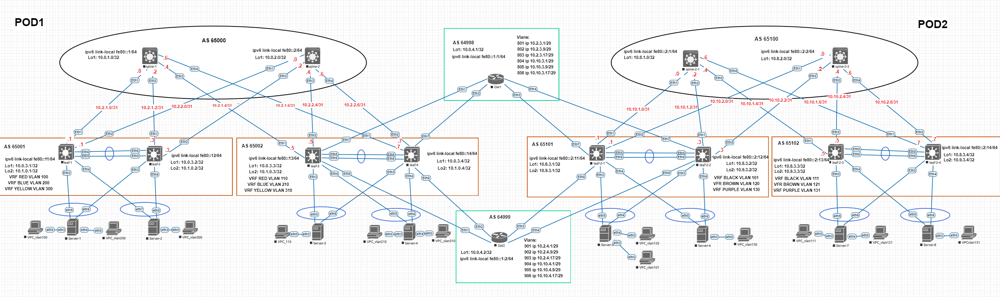

# Проект на тему "Проектирование L3 сети ЦОД без внедрения L2"

 
## Задача:
   - Спроектировать сеть ЦОД с возможностью масштабирования и обеспечением отказоустойчивости на уровне L3.

## Используемые технологии:
   - VxLAN, EVPN, eBGP, MLAG, LACP.

## Схема сети:


## Конфигурации устройств:
  - [spine-1](Config/spine-1.cfg)
  - [spine-2](Config/spine-2.cfg)
  - [leaf-1](Config/leaf-1.cfg)
  - [leaf-2](Config/leaf-2.cfg)
  - [leaf-3](Config/leaf-3.cfg)
  - [leaf-4](Config/leaf-4.cfg)
  - [GW1](Config/GW1.cfg)
  - [GW2](Config/GW2.cfg)
  - [spine-2-1](Config/spine-2-1.cfg)
  - [spine-2-2](Config/spine-2-2.cfg)
  - [leaf-2-1](Config/leaf-2-1.cfg)
  - [leaf-2-2](Config/leaf-2-2.cfg)
  - [leaf-2-3](Config/leaf-2-3.cfg)
  - [leaf-2-4](Config/leaf-2-4.cfg)
  - VRF RED:

      VPC_vlan100 ip - 192.168.10.254/24 gw 192.168.10.1

      VPC_vlan110 ip - 192.168.11.254/24 gw 192.168.11.1  

  - VRF BLUE:

      VPC_vlan200 ip - 192.168.20.254/24 gw 192.168.20.1

      VPC_vlan210 ip - 192.168.21.254/24 gw 192.168.21.1 

  - VRF YELLOW:

      VPC_vlan300 ip - 192.168.30.254/24 gw 192.168.30.1

      VPC_vlan310 ip - 192.168.31.254/24 gw 192.168.31.1

  - VRF BLACK:

      VPC_vlan101 ip - 192.168.110.254/24 gw 192.168.110.1

      VPC_vlan111 ip - 192.168.111.254/24 gw 192.168.111.1

  - VRF BROWN:

      VPC_vlan120 ip - 192.168.120.254/24 gw 192.168.120.1

      VPC_vlan121 ip - 192.168.121.254/24 gw 192.168.121.1

  - VRF PURPLE:

      VPC_vlan130 ip - 192.168.130.254/24 gw 192.168.130.1

      VPC_vlan131 ip - 192.168.131.254/24 gw 192.168.131.1

## Проверка маршрутной информации на spine

- spine-1
```
spine-1#show ipv6 bgp summary
BGP summary information for VRF default
Router identifier 10.0.1.0, local AS number 65000
Neighbor Status Codes: m - Under maintenance
  Neighbor     V AS           MsgRcvd   MsgSent  InQ OutQ  Up/Down State   PfxRcd PfxAcc
  fe80::11%Et1 4 65001             98       101    0    0 00:03:57 Estab   0      0
  fe80::12%Et2 4 65001            630       628    0    0 00:26:21 Estab   0      0
  fe80::13%Et3 4 65002            615       620    0    0 00:25:57 Estab   0      0
  fe80::14%Et4 4 65002            625       629    0    0 00:26:22 Estab   0      0
spine-1#
spine-1#show bgp evpn
BGP routing table information for VRF default
Router identifier 10.0.1.0, local AS number 65000
Route status codes: * - valid, > - active, S - Stale, E - ECMP head, e - ECMP
                    c - Contributing to ECMP, % - Pending BGP convergence
Origin codes: i - IGP, e - EGP, ? - incomplete
AS Path Attributes: Or-ID - Originator ID, C-LST - Cluster List, LL Nexthop - Link Local Nexthop

          Network                Next Hop              Metric  LocPref Weight  Path
 * >Ec    RD: 65002:1011 ip-prefix 0.0.0.0/0
                                 10.0.3.3              -       100     0       65002 64998 ?
 *  ec    RD: 65002:1011 ip-prefix 0.0.0.0/0
                                 10.0.3.4              -       100     0       65002 64998 ?
 * >Ec    RD: 65002:2021 ip-prefix 0.0.0.0/0
                                 10.0.3.3              -       100     0       65002 64998 ?
 *  ec    RD: 65002:2021 ip-prefix 0.0.0.0/0
                                 10.0.3.4              -       100     0       65002 64998 ?
 * >Ec    RD: 65002:3031 ip-prefix 0.0.0.0/0
                                 10.0.3.3              -       100     0       65002 64998 ?
 *  ec    RD: 65002:3031 ip-prefix 0.0.0.0/0
                                 10.0.3.4              -       100     0       65002 64999 ?
 * >Ec    RD: 65002:1011 ip-prefix 192.168.10.0/23
                                 10.0.3.4              -       100     0       65002 i
 *  ec    RD: 65002:1011 ip-prefix 192.168.10.0/23
                                 10.0.3.3              -       100     0       65002 i
 * >Ec    RD: 65002:2021 ip-prefix 192.168.10.0/23
                                 10.0.3.3              -       100     0       65002 64999 65002 i
 *  ec    RD: 65002:2021 ip-prefix 192.168.10.0/23
                                 10.0.3.4              -       100     0       65002 64998 65002 i
 * >Ec    RD: 65002:3031 ip-prefix 192.168.10.0/23
                                 10.0.3.3              -       100     0       65002 64999 65002 i
 *  ec    RD: 65002:3031 ip-prefix 192.168.10.0/23
                                 10.0.3.4              -       100     0       65002 64999 65002 i
 * >Ec    RD: 65001:1011 ip-prefix 192.168.10.0/24
                                 10.0.3.2              -       100     0       65001 i
 *  ec    RD: 65001:1011 ip-prefix 192.168.10.0/24
                                 10.0.3.1              -       100     0       65001 i
 * >Ec    RD: 65002:1011 ip-prefix 192.168.20.0/23
                                 10.0.3.3              -       100     0       65002 64998 65002 i
 *  ec    RD: 65002:1011 ip-prefix 192.168.20.0/23
                                 10.0.3.4              -       100     0       65002 64998 65002 i
 * >Ec    RD: 65002:2021 ip-prefix 192.168.20.0/23
                                 10.0.3.4              -       100     0       65002 i
 *  ec    RD: 65002:2021 ip-prefix 192.168.20.0/23
                                 10.0.3.3              -       100     0       65002 i
 * >Ec    RD: 65002:3031 ip-prefix 192.168.20.0/23
                                 10.0.3.3              -       100     0       65002 64998 65002 i
 *  ec    RD: 65002:3031 ip-prefix 192.168.20.0/23
                                 10.0.3.4              -       100     0       65002 64999 65002 i
 * >Ec    RD: 65001:2021 ip-prefix 192.168.20.0/24
                                 10.0.3.2              -       100     0       65001 i
 *  ec    RD: 65001:2021 ip-prefix 192.168.20.0/24
                                 10.0.3.1              -       100     0       65001 i
 * >Ec    RD: 65002:1011 ip-prefix 192.168.30.0/23
                                 10.0.3.3              -       100     0       65002 64999 65002 i
 *  ec    RD: 65002:1011 ip-prefix 192.168.30.0/23
                                 10.0.3.4              -       100     0       65002 64998 65002 i
 * >Ec    RD: 65002:2021 ip-prefix 192.168.30.0/23
                                 10.0.3.3              -       100     0       65002 64999 65002 i
 *  ec    RD: 65002:2021 ip-prefix 192.168.30.0/23
                                 10.0.3.4              -       100     0       65002 64998 65002 i
 * >Ec    RD: 65002:3031 ip-prefix 192.168.30.0/23
                                 10.0.3.4              -       100     0       65002 i
 *  ec    RD: 65002:3031 ip-prefix 192.168.30.0/23
                                 10.0.3.3              -       100     0       65002 i
 * >Ec    RD: 65001:3031 ip-prefix 192.168.30.0/24
                                 10.0.3.2              -       100     0       65001 i
 *  ec    RD: 65001:3031 ip-prefix 192.168.30.0/24
                                 10.0.3.1              -       100     0       65001 i
 * >Ec    RD: 65002:1011 ip-prefix 192.168.110.0/23
                                 10.0.3.3              -       100     0       65002 64999 65101 i
 *  ec    RD: 65002:1011 ip-prefix 192.168.110.0/23
                                 10.0.3.4              -       100     0       65002 64999 65101 i
 * >Ec    RD: 65002:2021 ip-prefix 192.168.110.0/23
                                 10.0.3.3              -       100     0       65002 64999 65101 i
 *  ec    RD: 65002:2021 ip-prefix 192.168.110.0/23
                                 10.0.3.4              -       100     0       65002 64999 65101 i
 * >Ec    RD: 65002:3031 ip-prefix 192.168.110.0/23
                                 10.0.3.3              -       100     0       65002 64999 65101 i
 *  ec    RD: 65002:3031 ip-prefix 192.168.110.0/23
                                 10.0.3.4              -       100     0       65002 64999 65101 i
 * >Ec    RD: 65002:1011 ip-prefix 192.168.120.0/23
                                 10.0.3.3              -       100     0       65002 64999 65101 i
 *  ec    RD: 65002:1011 ip-prefix 192.168.120.0/23
                                 10.0.3.4              -       100     0       65002 64999 65101 i
 * >Ec    RD: 65002:2021 ip-prefix 192.168.120.0/23
                                 10.0.3.3              -       100     0       65002 64999 65101 i
 *  ec    RD: 65002:2021 ip-prefix 192.168.120.0/23
                                 10.0.3.4              -       100     0       65002 64999 65101 i
 * >Ec    RD: 65002:3031 ip-prefix 192.168.120.0/23
                                 10.0.3.3              -       100     0       65002 64999 65101 i
 *  ec    RD: 65002:3031 ip-prefix 192.168.120.0/23
                                 10.0.3.4              -       100     0       65002 64999 65101 i
 * >Ec    RD: 65002:1011 ip-prefix 192.168.130.0/23
                                 10.0.3.3              -       100     0       65002 64999 65101 i
 *  ec    RD: 65002:1011 ip-prefix 192.168.130.0/23
                                 10.0.3.4              -       100     0       65002 64999 65101 i
 * >Ec    RD: 65002:2021 ip-prefix 192.168.130.0/23
                                 10.0.3.3              -       100     0       65002 64999 65101 i
 *  ec    RD: 65002:2021 ip-prefix 192.168.130.0/23
                                 10.0.3.4              -       100     0       65002 64999 65101 i
 * >Ec    RD: 65002:3031 ip-prefix 192.168.130.0/23
                                 10.0.3.3              -       100     0       65002 64999 65101 i
 *  ec    RD: 65002:3031 ip-prefix 192.168.130.0/23
                                 10.0.3.4              -       100     0       65002 64999 65101 i
spine-1#
spine-1#show ip route

VRF: default
Codes: C - connected, S - static, K - kernel,
       O - OSPF, IA - OSPF inter area, E1 - OSPF external type 1,
       E2 - OSPF external type 2, N1 - OSPF NSSA external type 1,
       N2 - OSPF NSSA external type2, B - Other BGP Routes,
       B I - iBGP, B E - eBGP, R - RIP, I L1 - IS-IS level 1,
       I L2 - IS-IS level 2, O3 - OSPFv3, A B - BGP Aggregate,
       A O - OSPF Summary, NG - Nexthop Group Static Route,
       V - VXLAN Control Service, M - Martian,
       DH - DHCP client installed default route,
       DP - Dynamic Policy Route, L - VRF Leaked,
       G  - gRIBI, RC - Route Cache Route

Gateway of last resort is not set

 C        10.0.1.0/32 is directly connected, Loopback1
 B E      10.0.3.1/32 [200/0] via 10.2.1.1, Ethernet1
 B E      10.0.3.2/32 [200/0] via 10.2.1.3, Ethernet2
 B E      10.0.3.3/32 [200/0] via 10.2.1.5, Ethernet3
 B E      10.0.3.4/32 [200/0] via 10.2.1.7, Ethernet4
 B E      10.1.0.1/32 [200/0] via 10.2.1.1, Ethernet1
 B E      10.1.0.2/32 [200/0] via 10.2.1.3, Ethernet2
 B E      10.1.0.3/32 [200/0] via 10.2.1.5, Ethernet3
 B E      10.1.0.4/32 [200/0] via 10.2.1.7, Ethernet4
 C        10.2.1.0/31 is directly connected, Ethernet1
 C        10.2.1.2/31 is directly connected, Ethernet2
 C        10.2.1.4/31 is directly connected, Ethernet3
 C        10.2.1.6/31 is directly connected, Ethernet4

spine-1#
```
- spine-2
```
spine-2#show ipv6 bgp summary
BGP summary information for VRF default
Router identifier 10.0.2.0, local AS number 65000
Neighbor Status Codes: m - Under maintenance
  Neighbor     V AS           MsgRcvd   MsgSent  InQ OutQ  Up/Down State   PfxRcd PfxAcc
  fe80::11%Et1 4 65001            165       161    0    0 00:06:39 Estab   0      0
  fe80::12%Et2 4 65001           1530      1533    0    0 01:04:57 Estab   0      0
  fe80::13%Et3 4 65002            684       681    0    0 00:28:40 Estab   0      0
  fe80::14%Et4 4 65002           1579      1579    0    0 01:06:30 Estab   0      0
spine-2#
spine-2#show bgp evpn
BGP routing table information for VRF default
Router identifier 10.0.2.0, local AS number 65000
Route status codes: * - valid, > - active, S - Stale, E - ECMP head, e - ECMP
                    c - Contributing to ECMP, % - Pending BGP convergence
Origin codes: i - IGP, e - EGP, ? - incomplete
AS Path Attributes: Or-ID - Originator ID, C-LST - Cluster List, LL Nexthop - Link Local Nexthop

          Network                Next Hop              Metric  LocPref Weight  Path
 * >Ec    RD: 65002:1011 ip-prefix 0.0.0.0/0
                                 10.0.3.3              -       100     0       65002 64998 ?
 *  ec    RD: 65002:1011 ip-prefix 0.0.0.0/0
                                 10.0.3.4              -       100     0       65002 64998 ?
 * >Ec    RD: 65002:2021 ip-prefix 0.0.0.0/0
                                 10.0.3.3              -       100     0       65002 64998 ?
 *  ec    RD: 65002:2021 ip-prefix 0.0.0.0/0
                                 10.0.3.4              -       100     0       65002 64998 ?
 * >Ec    RD: 65002:3031 ip-prefix 0.0.0.0/0
                                 10.0.3.3              -       100     0       65002 64998 ?
 *  ec    RD: 65002:3031 ip-prefix 0.0.0.0/0
                                 10.0.3.4              -       100     0       65002 64999 ?
 * >Ec    RD: 65002:1011 ip-prefix 192.168.10.0/23
                                 10.0.3.4              -       100     0       65002 i
 *  ec    RD: 65002:1011 ip-prefix 192.168.10.0/23
                                 10.0.3.3              -       100     0       65002 i
 * >Ec    RD: 65002:2021 ip-prefix 192.168.10.0/23
                                 10.0.3.3              -       100     0       65002 64999 65002 i
 *  ec    RD: 65002:2021 ip-prefix 192.168.10.0/23
                                 10.0.3.4              -       100     0       65002 64998 65002 i
 * >Ec    RD: 65002:3031 ip-prefix 192.168.10.0/23
                                 10.0.3.3              -       100     0       65002 64999 65002 i
 *  ec    RD: 65002:3031 ip-prefix 192.168.10.0/23
                                 10.0.3.4              -       100     0       65002 64999 65002 i
 * >Ec    RD: 65001:1011 ip-prefix 192.168.10.0/24
                                 10.0.3.2              -       100     0       65001 i
 *  ec    RD: 65001:1011 ip-prefix 192.168.10.0/24
                                 10.0.3.1              -       100     0       65001 i
 * >Ec    RD: 65002:1011 ip-prefix 192.168.20.0/23
                                 10.0.3.3              -       100     0       65002 64998 65002 i
 *  ec    RD: 65002:1011 ip-prefix 192.168.20.0/23
                                 10.0.3.4              -       100     0       65002 64998 65002 i
 * >Ec    RD: 65002:2021 ip-prefix 192.168.20.0/23
                                 10.0.3.4              -       100     0       65002 i
 *  ec    RD: 65002:2021 ip-prefix 192.168.20.0/23
                                 10.0.3.3              -       100     0       65002 i
 * >Ec    RD: 65002:3031 ip-prefix 192.168.20.0/23
                                 10.0.3.3              -       100     0       65002 64998 65002 i
 *  ec    RD: 65002:3031 ip-prefix 192.168.20.0/23
                                 10.0.3.4              -       100     0       65002 64999 65002 i
 * >Ec    RD: 65001:2021 ip-prefix 192.168.20.0/24
                                 10.0.3.2              -       100     0       65001 i
 *  ec    RD: 65001:2021 ip-prefix 192.168.20.0/24
                                 10.0.3.1              -       100     0       65001 i
 * >Ec    RD: 65002:1011 ip-prefix 192.168.30.0/23
                                 10.0.3.3              -       100     0       65002 64999 65002 i
 *  ec    RD: 65002:1011 ip-prefix 192.168.30.0/23
                                 10.0.3.4              -       100     0       65002 64998 65002 i
 * >Ec    RD: 65002:2021 ip-prefix 192.168.30.0/23
                                 10.0.3.3              -       100     0       65002 64999 65002 i
 *  ec    RD: 65002:2021 ip-prefix 192.168.30.0/23
                                 10.0.3.4              -       100     0       65002 64998 65002 i
 * >Ec    RD: 65002:3031 ip-prefix 192.168.30.0/23
                                 10.0.3.4              -       100     0       65002 i
 *  ec    RD: 65002:3031 ip-prefix 192.168.30.0/23
                                 10.0.3.3              -       100     0       65002 i
 * >Ec    RD: 65001:3031 ip-prefix 192.168.30.0/24
                                 10.0.3.2              -       100     0       65001 i
 *  ec    RD: 65001:3031 ip-prefix 192.168.30.0/24
                                 10.0.3.1              -       100     0       65001 i
 * >Ec    RD: 65002:1011 ip-prefix 192.168.110.0/23
                                 10.0.3.3              -       100     0       65002 64999 65101 i
 *  ec    RD: 65002:1011 ip-prefix 192.168.110.0/23
                                 10.0.3.4              -       100     0       65002 64999 65101 i
 * >Ec    RD: 65002:2021 ip-prefix 192.168.110.0/23
                                 10.0.3.3              -       100     0       65002 64999 65101 i
 *  ec    RD: 65002:2021 ip-prefix 192.168.110.0/23
                                 10.0.3.4              -       100     0       65002 64999 65101 i
 * >Ec    RD: 65002:3031 ip-prefix 192.168.110.0/23
                                 10.0.3.3              -       100     0       65002 64999 65101 i
 *  ec    RD: 65002:3031 ip-prefix 192.168.110.0/23
                                 10.0.3.4              -       100     0       65002 64999 65101 i
 * >Ec    RD: 65002:1011 ip-prefix 192.168.120.0/23
                                 10.0.3.3              -       100     0       65002 64999 65101 i
 *  ec    RD: 65002:1011 ip-prefix 192.168.120.0/23
                                 10.0.3.4              -       100     0       65002 64999 65101 i
 * >Ec    RD: 65002:2021 ip-prefix 192.168.120.0/23
                                 10.0.3.3              -       100     0       65002 64999 65101 i
 *  ec    RD: 65002:2021 ip-prefix 192.168.120.0/23
                                 10.0.3.4              -       100     0       65002 64999 65101 i
 * >Ec    RD: 65002:3031 ip-prefix 192.168.120.0/23
                                 10.0.3.3              -       100     0       65002 64999 65101 i
 *  ec    RD: 65002:3031 ip-prefix 192.168.120.0/23
                                 10.0.3.4              -       100     0       65002 64999 65101 i
 * >Ec    RD: 65002:1011 ip-prefix 192.168.130.0/23
                                 10.0.3.3              -       100     0       65002 64999 65101 i
 *  ec    RD: 65002:1011 ip-prefix 192.168.130.0/23
                                 10.0.3.4              -       100     0       65002 64999 65101 i
 * >Ec    RD: 65002:2021 ip-prefix 192.168.130.0/23
                                 10.0.3.3              -       100     0       65002 64999 65101 i
 *  ec    RD: 65002:2021 ip-prefix 192.168.130.0/23
                                 10.0.3.4              -       100     0       65002 64999 65101 i
 * >Ec    RD: 65002:3031 ip-prefix 192.168.130.0/23
                                 10.0.3.3              -       100     0       65002 64999 65101 i
 *  ec    RD: 65002:3031 ip-prefix 192.168.130.0/23
                                 10.0.3.4              -       100     0       65002 64999 65101 i
spine-2#
spine-2#show ip route

VRF: default
Codes: C - connected, S - static, K - kernel,
       O - OSPF, IA - OSPF inter area, E1 - OSPF external type 1,
       E2 - OSPF external type 2, N1 - OSPF NSSA external type 1,
       N2 - OSPF NSSA external type2, B - Other BGP Routes,
       B I - iBGP, B E - eBGP, R - RIP, I L1 - IS-IS level 1,
       I L2 - IS-IS level 2, O3 - OSPFv3, A B - BGP Aggregate,
       A O - OSPF Summary, NG - Nexthop Group Static Route,
       V - VXLAN Control Service, M - Martian,
       DH - DHCP client installed default route,
       DP - Dynamic Policy Route, L - VRF Leaked,
       G  - gRIBI, RC - Route Cache Route

Gateway of last resort is not set

 C        10.0.2.0/32 is directly connected, Loopback1
 B E      10.0.3.1/32 [200/0] via 10.2.2.1, Ethernet1
 B E      10.0.3.2/32 [200/0] via 10.2.2.3, Ethernet2
 B E      10.0.3.3/32 [200/0] via 10.2.2.5, Ethernet3
 B E      10.0.3.4/32 [200/0] via 10.2.2.7, Ethernet4
 B E      10.1.0.1/32 [200/0] via 10.2.2.1, Ethernet1
 B E      10.1.0.2/32 [200/0] via 10.2.2.3, Ethernet2
 B E      10.1.0.3/32 [200/0] via 10.2.2.5, Ethernet3
 B E      10.1.0.4/32 [200/0] via 10.2.2.7, Ethernet4
 C        10.2.2.0/31 is directly connected, Ethernet1
 C        10.2.2.2/31 is directly connected, Ethernet2
 C        10.2.2.4/31 is directly connected, Ethernet3
 C        10.2.2.6/31 is directly connected, Ethernet4

spine-2#
```
- spine-2-1
```
spine-2-1#show ipv6 bgp summary
BGP summary information for VRF default
Router identifier 10.8.1.0, local AS number 65100
Neighbor Status Codes: m - Under maintenance
  Neighbor       V AS           MsgRcvd   MsgSent  InQ OutQ  Up/Down State   PfxRcd PfxAcc
  fe80::2:11%Et1 4 65101            252       253    0    0 00:10:30 Estab   0      0
  fe80::2:12%Et2 4 65101            299       305    0    0 00:12:23 Estab   0      0
  fe80::2:13%Et3 4 65102            253       256    0    0 00:10:31 Estab   0      0
  fe80::2:14%Et4 4 65102            254       250    0    0 00:10:31 Estab   0      0
spine-2-1#
spine-2-1#show bgp evpn
BGP routing table information for VRF default
Router identifier 10.8.1.0, local AS number 65100
Route status codes: * - valid, > - active, S - Stale, E - ECMP head, e - ECMP
                    c - Contributing to ECMP, % - Pending BGP convergence
Origin codes: i - IGP, e - EGP, ? - incomplete
AS Path Attributes: Or-ID - Originator ID, C-LST - Cluster List, LL Nexthop - Link Local Nexthop

          Network                Next Hop              Metric  LocPref Weight  Path
 * >Ec    RD: 65101:1000 ip-prefix 0.0.0.0/0
                                 10.8.3.2              -       100     0       65101 64999 ?
 *  ec    RD: 65101:1000 ip-prefix 0.0.0.0/0
                                 10.8.3.1              -       100     0       65101 64999 ?
 * >Ec    RD: 65101:2000 ip-prefix 0.0.0.0/0
                                 10.8.3.2              -       100     0       65101 64999 ?
 *  ec    RD: 65101:2000 ip-prefix 0.0.0.0/0
                                 10.8.3.1              -       100     0       65101 64999 ?
 * >Ec    RD: 65101:3000 ip-prefix 0.0.0.0/0
                                 10.8.3.2              -       100     0       65101 64999 ?
 *  ec    RD: 65101:3000 ip-prefix 0.0.0.0/0
                                 10.8.3.1              -       100     0       65101 64999 ?
 * >Ec    RD: 65101:1000 ip-prefix 192.168.10.0/23
                                 10.8.3.2              -       100     0       65101 64999 65002 i
 *  ec    RD: 65101:1000 ip-prefix 192.168.10.0/23
                                 10.8.3.1              -       100     0       65101 64999 65002 i
 * >Ec    RD: 65101:2000 ip-prefix 192.168.10.0/23
                                 10.8.3.2              -       100     0       65101 64999 65002 i
 *  ec    RD: 65101:2000 ip-prefix 192.168.10.0/23
                                 10.8.3.1              -       100     0       65101 64999 65002 i
 * >Ec    RD: 65101:3000 ip-prefix 192.168.10.0/23
                                 10.8.3.2              -       100     0       65101 64999 65002 i
 *  ec    RD: 65101:3000 ip-prefix 192.168.10.0/23
                                 10.8.3.1              -       100     0       65101 64999 65002 i
 * >Ec    RD: 65101:1000 ip-prefix 192.168.20.0/23
                                 10.8.3.2              -       100     0       65101 64999 65002 i
 *  ec    RD: 65101:1000 ip-prefix 192.168.20.0/23
                                 10.8.3.1              -       100     0       65101 64999 65002 i
 * >Ec    RD: 65101:2000 ip-prefix 192.168.20.0/23
                                 10.8.3.2              -       100     0       65101 64999 65002 i
 *  ec    RD: 65101:2000 ip-prefix 192.168.20.0/23
                                 10.8.3.1              -       100     0       65101 64999 65002 i
 * >Ec    RD: 65101:3000 ip-prefix 192.168.20.0/23
                                 10.8.3.2              -       100     0       65101 64999 65002 i
 *  ec    RD: 65101:3000 ip-prefix 192.168.20.0/23
                                 10.8.3.1              -       100     0       65101 64999 65002 i
 * >Ec    RD: 65101:1000 ip-prefix 192.168.30.0/23
                                 10.8.3.2              -       100     0       65101 64999 65002 i
 *  ec    RD: 65101:1000 ip-prefix 192.168.30.0/23
                                 10.8.3.1              -       100     0       65101 64999 65002 i
 * >Ec    RD: 65101:2000 ip-prefix 192.168.30.0/23
                                 10.8.3.2              -       100     0       65101 64999 65002 i
 *  ec    RD: 65101:2000 ip-prefix 192.168.30.0/23
                                 10.8.3.1              -       100     0       65101 64999 65002 i
 * >Ec    RD: 65101:3000 ip-prefix 192.168.30.0/23
                                 10.8.3.2              -       100     0       65101 64999 65002 i
 *  ec    RD: 65101:3000 ip-prefix 192.168.30.0/23
                                 10.8.3.1              -       100     0       65101 64999 65002 i
 * >Ec    RD: 65101:1000 ip-prefix 192.168.110.0/23
                                 10.8.3.2              -       100     0       65101 i
 *  ec    RD: 65101:1000 ip-prefix 192.168.110.0/23
                                 10.8.3.1              -       100     0       65101 i
 * >Ec    RD: 65101:2000 ip-prefix 192.168.110.0/23
                                 10.8.3.2              -       100     0       65101 64999 65101 i
 *  ec    RD: 65101:2000 ip-prefix 192.168.110.0/23
                                 10.8.3.1              -       100     0       65101 64999 65101 i
 * >Ec    RD: 65101:3000 ip-prefix 192.168.110.0/23
                                 10.8.3.1              -       100     0       65101 64999 65101 i
 *  ec    RD: 65101:3000 ip-prefix 192.168.110.0/23
                                 10.8.3.2              -       100     0       65101 64999 65101 i
 * >Ec    RD: 65102:1000 ip-prefix 192.168.111.0/24
                                 10.8.3.4              -       100     0       65102 i
 *  ec    RD: 65102:1000 ip-prefix 192.168.111.0/24
                                 10.8.3.3              -       100     0       65102 i
 * >Ec    RD: 65101:1000 ip-prefix 192.168.120.0/23
                                 10.8.3.2              -       100     0       65101 64999 65101 i
 *  ec    RD: 65101:1000 ip-prefix 192.168.120.0/23
                                 10.8.3.1              -       100     0       65101 64999 65101 i
 * >Ec    RD: 65101:2000 ip-prefix 192.168.120.0/23
                                 10.8.3.2              -       100     0       65101 i
 *  ec    RD: 65101:2000 ip-prefix 192.168.120.0/23
                                 10.8.3.1              -       100     0       65101 i
 * >Ec    RD: 65101:3000 ip-prefix 192.168.120.0/23
                                 10.8.3.2              -       100     0       65101 64999 65101 i
 *  ec    RD: 65101:3000 ip-prefix 192.168.120.0/23
                                 10.8.3.1              -       100     0       65101 64999 65101 i
 * >Ec    RD: 65102:2000 ip-prefix 192.168.121.0/24
                                 10.8.3.4              -       100     0       65102 i
 *  ec    RD: 65102:2000 ip-prefix 192.168.121.0/24
                                 10.8.3.3              -       100     0       65102 i
 * >Ec    RD: 65101:1000 ip-prefix 192.168.130.0/23
                                 10.8.3.2              -       100     0       65101 64999 65101 i
 *  ec    RD: 65101:1000 ip-prefix 192.168.130.0/23
                                 10.8.3.1              -       100     0       65101 64999 65101 i
 * >Ec    RD: 65101:2000 ip-prefix 192.168.130.0/23
                                 10.8.3.2              -       100     0       65101 64999 65101 i
 *  ec    RD: 65101:2000 ip-prefix 192.168.130.0/23
                                 10.8.3.1              -       100     0       65101 64999 65101 i
 * >Ec    RD: 65101:3000 ip-prefix 192.168.130.0/23
                                 10.8.3.2              -       100     0       65101 i
 *  ec    RD: 65101:3000 ip-prefix 192.168.130.0/23
                                 10.8.3.1              -       100     0       65101 i
 * >Ec    RD: 65102:3000 ip-prefix 192.168.131.0/24
                                 10.8.3.4              -       100     0       65102 i
 *  ec    RD: 65102:3000 ip-prefix 192.168.131.0/24
                                 10.8.3.3              -       100     0       65102 i
spine-2-1#
spine-2-1#show ip route

VRF: default
Codes: C - connected, S - static, K - kernel,
       O - OSPF, IA - OSPF inter area, E1 - OSPF external type 1,
       E2 - OSPF external type 2, N1 - OSPF NSSA external type 1,
       N2 - OSPF NSSA external type2, B - Other BGP Routes,
       B I - iBGP, B E - eBGP, R - RIP, I L1 - IS-IS level 1,
       I L2 - IS-IS level 2, O3 - OSPFv3, A B - BGP Aggregate,
       A O - OSPF Summary, NG - Nexthop Group Static Route,
       V - VXLAN Control Service, M - Martian,
       DH - DHCP client installed default route,
       DP - Dynamic Policy Route, L - VRF Leaked,
       G  - gRIBI, RC - Route Cache Route

Gateway of last resort is not set

 C        10.8.1.0/32 is directly connected, Loopback1
 B E      10.8.3.1/32 [200/0] via 10.10.1.1, Ethernet1
 B E      10.8.3.2/32 [200/0] via 10.10.1.3, Ethernet2
 B E      10.8.3.3/32 [200/0] via 10.10.1.5, Ethernet3
 B E      10.8.3.4/32 [200/0] via 10.10.1.7, Ethernet4
 B E      10.9.3.1/32 [200/0] via 10.10.1.1, Ethernet1
 B E      10.9.3.2/32 [200/0] via 10.10.1.3, Ethernet2
 B E      10.9.3.3/32 [200/0] via 10.10.1.5, Ethernet3
 B E      10.9.3.4/32 [200/0] via 10.10.1.7, Ethernet4
 C        10.10.1.0/31 is directly connected, Ethernet1
 C        10.10.1.2/31 is directly connected, Ethernet2
 C        10.10.1.4/31 is directly connected, Ethernet3
 C        10.10.1.6/31 is directly connected, Ethernet4

spine-2-1#
```
- spine-2-2
```
spine-2-2#show ipv6 bgp summary
BGP summary information for VRF default
Router identifier 10.8.2.0, local AS number 65100
Neighbor Status Codes: m - Under maintenance
  Neighbor       V AS           MsgRcvd   MsgSent  InQ OutQ  Up/Down State   PfxRcd PfxAcc
  fe80::2:11%Et1 4 65101            297       296    0    0 00:12:22 Estab   0      0
  fe80::2:12%Et2 4 65101            344       350    0    0 00:14:15 Estab   0      0
  fe80::2:13%Et3 4 65102            298       298    0    0 00:12:22 Estab   0      0
  fe80::2:14%Et4 4 65102            298       299    0    0 00:12:22 Estab   0      0
spine-2-2#
spine-2-2#show bgp evpn
BGP routing table information for VRF default
Router identifier 10.8.2.0, local AS number 65100
Route status codes: * - valid, > - active, S - Stale, E - ECMP head, e - ECMP
                    c - Contributing to ECMP, % - Pending BGP convergence
Origin codes: i - IGP, e - EGP, ? - incomplete
AS Path Attributes: Or-ID - Originator ID, C-LST - Cluster List, LL Nexthop - Link Local Nexthop

          Network                Next Hop              Metric  LocPref Weight  Path
 * >Ec    RD: 65101:1000 ip-prefix 0.0.0.0/0
                                 10.8.3.2              -       100     0       65101 64999 ?
 *  ec    RD: 65101:1000 ip-prefix 0.0.0.0/0
                                 10.8.3.1              -       100     0       65101 64999 ?
 * >Ec    RD: 65101:2000 ip-prefix 0.0.0.0/0
                                 10.8.3.2              -       100     0       65101 64999 ?
 *  ec    RD: 65101:2000 ip-prefix 0.0.0.0/0
                                 10.8.3.1              -       100     0       65101 64999 ?
 * >Ec    RD: 65101:3000 ip-prefix 0.0.0.0/0
                                 10.8.3.2              -       100     0       65101 64999 ?
 *  ec    RD: 65101:3000 ip-prefix 0.0.0.0/0
                                 10.8.3.1              -       100     0       65101 64999 ?
 * >Ec    RD: 65101:1000 ip-prefix 192.168.10.0/23
                                 10.8.3.2              -       100     0       65101 64999 65002 i
 *  ec    RD: 65101:1000 ip-prefix 192.168.10.0/23
                                 10.8.3.1              -       100     0       65101 64999 65002 i
 * >Ec    RD: 65101:2000 ip-prefix 192.168.10.0/23
                                 10.8.3.2              -       100     0       65101 64999 65002 i
 *  ec    RD: 65101:2000 ip-prefix 192.168.10.0/23
                                 10.8.3.1              -       100     0       65101 64999 65002 i
 * >Ec    RD: 65101:3000 ip-prefix 192.168.10.0/23
                                 10.8.3.1              -       100     0       65101 64999 65002 i
 *  ec    RD: 65101:3000 ip-prefix 192.168.10.0/23
                                 10.8.3.2              -       100     0       65101 64999 65002 i
 * >Ec    RD: 65101:1000 ip-prefix 192.168.20.0/23
                                 10.8.3.1              -       100     0       65101 64999 65002 i
 *  ec    RD: 65101:1000 ip-prefix 192.168.20.0/23
                                 10.8.3.2              -       100     0       65101 64999 65002 i
 * >Ec    RD: 65101:2000 ip-prefix 192.168.20.0/23
                                 10.8.3.2              -       100     0       65101 64999 65002 i
 *  ec    RD: 65101:2000 ip-prefix 192.168.20.0/23
                                 10.8.3.1              -       100     0       65101 64999 65002 i
 * >Ec    RD: 65101:3000 ip-prefix 192.168.20.0/23
                                 10.8.3.1              -       100     0       65101 64999 65002 i
 *  ec    RD: 65101:3000 ip-prefix 192.168.20.0/23
                                 10.8.3.2              -       100     0       65101 64999 65002 i
 * >Ec    RD: 65101:1000 ip-prefix 192.168.30.0/23
                                 10.8.3.1              -       100     0       65101 64999 65002 i
 *  ec    RD: 65101:1000 ip-prefix 192.168.30.0/23
                                 10.8.3.2              -       100     0       65101 64999 65002 i
 * >Ec    RD: 65101:2000 ip-prefix 192.168.30.0/23
                                 10.8.3.1              -       100     0       65101 64999 65002 i
 *  ec    RD: 65101:2000 ip-prefix 192.168.30.0/23
                                 10.8.3.2              -       100     0       65101 64999 65002 i
 * >Ec    RD: 65101:3000 ip-prefix 192.168.30.0/23
                                 10.8.3.1              -       100     0       65101 64999 65002 i
 *  ec    RD: 65101:3000 ip-prefix 192.168.30.0/23
                                 10.8.3.2              -       100     0       65101 64999 65002 i
 * >Ec    RD: 65101:1000 ip-prefix 192.168.110.0/23
                                 10.8.3.2              -       100     0       65101 i
 *  ec    RD: 65101:1000 ip-prefix 192.168.110.0/23
                                 10.8.3.1              -       100     0       65101 i
 * >Ec    RD: 65101:2000 ip-prefix 192.168.110.0/23
                                 10.8.3.2              -       100     0       65101 64999 65101 i
 *  ec    RD: 65101:2000 ip-prefix 192.168.110.0/23
                                 10.8.3.1              -       100     0       65101 64999 65101 i
 * >Ec    RD: 65101:3000 ip-prefix 192.168.110.0/23
                                 10.8.3.2              -       100     0       65101 64999 65101 i
 *  ec    RD: 65101:3000 ip-prefix 192.168.110.0/23
                                 10.8.3.1              -       100     0       65101 64999 65101 i
 * >Ec    RD: 65102:1000 ip-prefix 192.168.111.0/24
                                 10.8.3.4              -       100     0       65102 i
 *  ec    RD: 65102:1000 ip-prefix 192.168.111.0/24
                                 10.8.3.3              -       100     0       65102 i
 * >Ec    RD: 65101:1000 ip-prefix 192.168.120.0/23
                                 10.8.3.2              -       100     0       65101 64999 65101 i
 *  ec    RD: 65101:1000 ip-prefix 192.168.120.0/23
                                 10.8.3.1              -       100     0       65101 64999 65101 i
 * >Ec    RD: 65101:2000 ip-prefix 192.168.120.0/23
                                 10.8.3.2              -       100     0       65101 i
 *  ec    RD: 65101:2000 ip-prefix 192.168.120.0/23
                                 10.8.3.1              -       100     0       65101 i
 * >Ec    RD: 65101:3000 ip-prefix 192.168.120.0/23
                                 10.8.3.2              -       100     0       65101 64999 65101 i
 *  ec    RD: 65101:3000 ip-prefix 192.168.120.0/23
                                 10.8.3.1              -       100     0       65101 64999 65101 i
 * >Ec    RD: 65102:2000 ip-prefix 192.168.121.0/24
                                 10.8.3.4              -       100     0       65102 i
 *  ec    RD: 65102:2000 ip-prefix 192.168.121.0/24
                                 10.8.3.3              -       100     0       65102 i
 * >Ec    RD: 65101:1000 ip-prefix 192.168.130.0/23
                                 10.8.3.2              -       100     0       65101 64999 65101 i
 *  ec    RD: 65101:1000 ip-prefix 192.168.130.0/23
                                 10.8.3.1              -       100     0       65101 64999 65101 i
 * >Ec    RD: 65101:2000 ip-prefix 192.168.130.0/23
                                 10.8.3.2              -       100     0       65101 64999 65101 i
 *  ec    RD: 65101:2000 ip-prefix 192.168.130.0/23
                                 10.8.3.1              -       100     0       65101 64999 65101 i
 * >Ec    RD: 65101:3000 ip-prefix 192.168.130.0/23
                                 10.8.3.2              -       100     0       65101 i
 *  ec    RD: 65101:3000 ip-prefix 192.168.130.0/23
                                 10.8.3.1              -       100     0       65101 i
 * >Ec    RD: 65102:3000 ip-prefix 192.168.131.0/24
                                 10.8.3.4              -       100     0       65102 i
 *  ec    RD: 65102:3000 ip-prefix 192.168.131.0/24
                                 10.8.3.3              -       100     0       65102 i
spine-2-2#
spine-2-2#show ip route

VRF: default
Codes: C - connected, S - static, K - kernel,
       O - OSPF, IA - OSPF inter area, E1 - OSPF external type 1,
       E2 - OSPF external type 2, N1 - OSPF NSSA external type 1,
       N2 - OSPF NSSA external type2, B - Other BGP Routes,
       B I - iBGP, B E - eBGP, R - RIP, I L1 - IS-IS level 1,
       I L2 - IS-IS level 2, O3 - OSPFv3, A B - BGP Aggregate,
       A O - OSPF Summary, NG - Nexthop Group Static Route,
       V - VXLAN Control Service, M - Martian,
       DH - DHCP client installed default route,
       DP - Dynamic Policy Route, L - VRF Leaked,
       G  - gRIBI, RC - Route Cache Route

Gateway of last resort is not set

 C        10.8.2.0/32 is directly connected, Loopback1
 B E      10.8.3.1/32 [200/0] via 10.10.2.1, Ethernet1
 B E      10.8.3.2/32 [200/0] via 10.10.2.3, Ethernet2
 B E      10.8.3.3/32 [200/0] via 10.10.2.5, Ethernet3
 B E      10.8.3.4/32 [200/0] via 10.10.2.7, Ethernet4
 B E      10.9.3.1/32 [200/0] via 10.10.2.1, Ethernet1
 B E      10.9.3.2/32 [200/0] via 10.10.2.3, Ethernet2
 B E      10.9.3.3/32 [200/0] via 10.10.2.5, Ethernet3
 B E      10.9.3.4/32 [200/0] via 10.10.2.7, Ethernet4
 C        10.10.2.0/31 is directly connected, Ethernet1
 C        10.10.2.2/31 is directly connected, Ethernet2
 C        10.10.2.4/31 is directly connected, Ethernet3
 C        10.10.2.6/31 is directly connected, Ethernet4

spine-2-2#
```

## Проверка маршрутной информации на GW

- GW1
```
GW1#show ip bgp
BGP routing table information for VRF default
Router identifier 10.0.4.1, local AS number 64998
Route status codes: * - valid, > - active, # - not installed, E - ECMP head, e - ECMP
                    S - Stale, c - Contributing to ECMP, b - backup, L - labeled-unicast
Origin codes: i - IGP, e - EGP, ? - incomplete
AS Path Attributes: Or-ID - Originator ID, C-LST - Cluster List, LL Nexthop - Link Local Nexthop

         Network                Next Hop            Metric  LocPref Weight  Path
 * >     0.0.0.0/0              -                     0       0       -       ?
 *       0.0.0.0/0              10.2.3.19             0       100     0       65002 64999 ?
 * >Ec   192.168.10.0/23        10.2.3.2              0       100     0       65002 i
 *  ec   192.168.10.0/23        10.2.3.3              0       100     0       65002 i
 *       192.168.10.0/23        10.2.3.10             0       100     0       65002 64999 65002 i
 *       192.168.10.0/23        10.2.3.18             0       100     0       65002 64999 65002 i
 *       192.168.10.0/23        10.2.3.19             0       100     0       65002 64999 65002 i
 * >Ec   192.168.20.0/23        10.2.3.10             0       100     0       65002 i
 *  ec   192.168.20.0/23        10.2.3.11             0       100     0       65002 i
 *       192.168.20.0/23        10.2.3.19             0       100     0       65002 64999 65002 i
 * >Ec   192.168.30.0/23        10.2.3.18             0       100     0       65002 i
 *  ec   192.168.30.0/23        10.2.3.19             0       100     0       65002 i
 *       192.168.30.0/23        10.2.3.2              0       100     0       65002 64999 65002 i
 *       192.168.30.0/23        10.2.3.10             0       100     0       65002 64999 65002 i
 * >Ec   192.168.110.0/23       10.2.3.2              0       100     0       65002 64999 65101 i
 *  e    192.168.110.0/23       10.2.3.3              0       100     0       65002 64999 65101 i
 *  ec   192.168.110.0/23       10.2.3.10             0       100     0       65002 64999 65101 i
 *  e    192.168.110.0/23       10.2.3.11             0       100     0       65002 64999 65101 i
 *  e    192.168.110.0/23       10.2.3.18             0       100     0       65002 64999 65101 i
 *  e    192.168.110.0/23       10.2.3.19             0       100     0       65002 64999 65101 i
 * >Ec   192.168.120.0/23       10.2.3.2              0       100     0       65002 64999 65101 i
 *  e    192.168.120.0/23       10.2.3.3              0       100     0       65002 64999 65101 i
 *  ec   192.168.120.0/23       10.2.3.10             0       100     0       65002 64999 65101 i
 *  e    192.168.120.0/23       10.2.3.11             0       100     0       65002 64999 65101 i
 *  e    192.168.120.0/23       10.2.3.18             0       100     0       65002 64999 65101 i
 *  e    192.168.120.0/23       10.2.3.19             0       100     0       65002 64999 65101 i
 * >Ec   192.168.130.0/23       10.2.3.2              0       100     0       65002 64999 65101 i
 *  e    192.168.130.0/23       10.2.3.3              0       100     0       65002 64999 65101 i
 *  ec   192.168.130.0/23       10.2.3.10             0       100     0       65002 64999 65101 i
 *  e    192.168.130.0/23       10.2.3.11             0       100     0       65002 64999 65101 i
 *  e    192.168.130.0/23       10.2.3.18             0       100     0       65002 64999 65101 i
 *  e    192.168.130.0/23       10.2.3.19             0       100     0       65002 64999 65101 i
GW1#
GW1#show ip route

VRF: default
Codes: C - connected, S - static, K - kernel,
       O - OSPF, IA - OSPF inter area, E1 - OSPF external type 1,
       E2 - OSPF external type 2, N1 - OSPF NSSA external type 1,
       N2 - OSPF NSSA external type2, B - Other BGP Routes,
       B I - iBGP, B E - eBGP, R - RIP, I L1 - IS-IS level 1,
       I L2 - IS-IS level 2, O3 - OSPFv3, A B - BGP Aggregate,
       A O - OSPF Summary, NG - Nexthop Group Static Route,
       V - VXLAN Control Service, M - Martian,
       DH - DHCP client installed default route,
       DP - Dynamic Policy Route, L - VRF Leaked,
       G  - gRIBI, RC - Route Cache Route

Gateway of last resort:
 S        0.0.0.0/0 is directly connected, Null0

 C        8.8.8.8/32 is directly connected, Loopback88
 C        10.0.4.1/32 is directly connected, Loopback1
 C        10.2.3.0/29 is directly connected, Vlan801
 C        10.2.3.8/29 is directly connected, Vlan802
 C        10.2.3.16/29 is directly connected, Vlan803
 C        10.10.3.0/29 is directly connected, Vlan804
 C        10.10.3.8/29 is directly connected, Vlan805
 C        10.10.3.16/29 is directly connected, Vlan806
 C        77.88.8.8/32 is directly connected, Loopback77
 B E      192.168.10.0/23 [200/0] via 10.2.3.2, Vlan801
                                  via 10.2.3.3, Vlan801
 B E      192.168.20.0/23 [200/0] via 10.2.3.10, Vlan802
                                  via 10.2.3.11, Vlan802
 B E      192.168.30.0/23 [200/0] via 10.2.3.18, Vlan803
                                  via 10.2.3.19, Vlan803
 B E      192.168.110.0/23 [200/0] via 10.2.3.2, Vlan801
                                   via 10.2.3.10, Vlan802
 B E      192.168.120.0/23 [200/0] via 10.2.3.2, Vlan801
                                   via 10.2.3.10, Vlan802
 B E      192.168.130.0/23 [200/0] via 10.2.3.2, Vlan801
                                   via 10.2.3.10, Vlan802

GW1#

```

- GW2
```
GW2#show ip bgp
BGP routing table information for VRF default
Router identifier 10.0.4.2, local AS number 64999
Route status codes: * - valid, > - active, # - not installed, E - ECMP head, e - ECMP
                    S - Stale, c - Contributing to ECMP, b - backup, L - labeled-unicast
Origin codes: i - IGP, e - EGP, ? - incomplete
AS Path Attributes: Or-ID - Originator ID, C-LST - Cluster List, LL Nexthop - Link Local Nexthop

         Network                Next Hop            Metric  LocPref Weight  Path
 * >     0.0.0.0/0              -                     0       0       -       ?
 *  Ec   0.0.0.0/0              10.2.4.3              0       100     0       65002 64998 ?
 *  ec   0.0.0.0/0              10.2.4.2              0       100     0       65002 64998 ?
 *  ec   0.0.0.0/0              10.2.4.10             0       100     0       65002 64998 ?
 *  ec   0.0.0.0/0              10.2.4.11             0       100     0       65002 64998 ?
 *  ec   0.0.0.0/0              10.2.4.19             0       100     0       65002 64998 ?
 * >Ec   192.168.10.0/23        10.2.4.3              0       100     0       65002 i
 *  ec   192.168.10.0/23        10.2.4.2              0       100     0       65002 i
 *       192.168.10.0/23        10.2.4.10             0       100     0       65002 64998 65002 i
 * >Ec   192.168.20.0/23        10.2.4.11             0       100     0       65002 i
 *  ec   192.168.20.0/23        10.2.4.10             0       100     0       65002 i
 *       192.168.20.0/23        10.2.4.3              0       100     0       65002 64998 65002 i
 *       192.168.20.0/23        10.2.4.2              0       100     0       65002 64998 65002 i
 *       192.168.20.0/23        10.2.4.19             0       100     0       65002 64998 65002 i
 * >Ec   192.168.30.0/23        10.2.4.19             0       100     0       65002 i
 *  ec   192.168.30.0/23        10.2.4.18             0       100     0       65002 i
 *       192.168.30.0/23        10.2.4.2              0       100     0       65002 64998 65002 i
 *       192.168.30.0/23        10.2.4.10             0       100     0       65002 64998 65002 i
 * >Ec   192.168.110.0/23       10.10.4.2             0       100     0       65101 i
 *  ec   192.168.110.0/23       10.10.4.3             0       100     0       65101 i
 * >Ec   192.168.120.0/23       10.10.4.11            0       100     0       65101 i
 *  ec   192.168.120.0/23       10.10.4.10            0       100     0       65101 i
 * >Ec   192.168.130.0/23       10.10.4.18            0       100     0       65101 i
 *  ec   192.168.130.0/23       10.10.4.19            0       100     0       65101 i
GW2#
GW2#show ip route

VRF: default
Codes: C - connected, S - static, K - kernel,
       O - OSPF, IA - OSPF inter area, E1 - OSPF external type 1,
       E2 - OSPF external type 2, N1 - OSPF NSSA external type 1,
       N2 - OSPF NSSA external type2, B - Other BGP Routes,
       B I - iBGP, B E - eBGP, R - RIP, I L1 - IS-IS level 1,
       I L2 - IS-IS level 2, O3 - OSPFv3, A B - BGP Aggregate,
       A O - OSPF Summary, NG - Nexthop Group Static Route,
       V - VXLAN Control Service, M - Martian,
       DH - DHCP client installed default route,
       DP - Dynamic Policy Route, L - VRF Leaked,
       G  - gRIBI, RC - Route Cache Route

Gateway of last resort:
 S        0.0.0.0/0 is directly connected, Null0

 C        8.8.8.8/32 is directly connected, Loopback88
 C        10.0.4.2/32 is directly connected, Loopback1
 C        10.2.4.0/29 is directly connected, Vlan901
 C        10.2.4.8/29 is directly connected, Vlan902
 C        10.2.4.16/29 is directly connected, Vlan903
 C        10.10.4.0/29 is directly connected, Vlan904
 C        10.10.4.8/29 is directly connected, Vlan905
 C        10.10.4.16/29 is directly connected, Vlan906
 C        77.88.8.8/32 is directly connected, Loopback77
 B E      192.168.10.0/23 [200/0] via 10.2.4.2, Vlan901
                                  via 10.2.4.3, Vlan901
 B E      192.168.20.0/23 [200/0] via 10.2.4.10, Vlan902
                                  via 10.2.4.11, Vlan902
 B E      192.168.30.0/23 [200/0] via 10.2.4.18, Vlan903
                                  via 10.2.4.19, Vlan903
 B E      192.168.110.0/23 [200/0] via 10.10.4.2, Vlan904
                                   via 10.10.4.3, Vlan904
 B E      192.168.120.0/23 [200/0] via 10.10.4.10, Vlan905
                                   via 10.10.4.11, Vlan905
 B E      192.168.130.0/23 [200/0] via 10.10.4.18, Vlan906
                                   via 10.10.4.19, Vlan906

GW2#
```

## Проверка маршрутной информации на leaf

- leaf-1
```
leaf-1#show ipv6 bgp summary
BGP summary information for VRF default
Router identifier 10.1.0.1, local AS number 65001
Neighbor Status Codes: m - Under maintenance
  Neighbor    V AS           MsgRcvd   MsgSent  InQ OutQ  Up/Down State   PfxRcd PfxAcc
  fe80::1%Et1 4 65000            238       241    0    0 00:09:51 Estab   0      0
  fe80::2%Et2 4 65000           1085      1084    0    0 00:45:41 Estab   0      0
leaf-1#
leaf-1#show vxlan vtep
Remote VTEPS for Vxlan1:

VTEP           Tunnel Type(s)
-------------- --------------
10.0.3.3       unicast
10.0.3.4       unicast

Total number of remote VTEPS:  2
leaf-1#
leaf-1#show vxlan vni
VNI to VLAN Mapping for Vxlan1
VNI       VLAN       Source       Interface       802.1Q Tag
--------- ---------- ------------ --------------- ----------

VNI to dynamic VLAN Mapping for Vxlan1
VNI        VLAN       VRF          Source
---------- ---------- ------------ ------------
1011       4091       RED          evpn
2021       4093       BLUE         evpn
3031       4092       YELLOW       evpn

leaf-1#
leaf-1#show ip route vrf all

VRF: default
Codes: C - connected, S - static, K - kernel,
       O - OSPF, IA - OSPF inter area, E1 - OSPF external type 1,
       E2 - OSPF external type 2, N1 - OSPF NSSA external type 1,
       N2 - OSPF NSSA external type2, B - Other BGP Routes,
       B I - iBGP, B E - eBGP, R - RIP, I L1 - IS-IS level 1,
       I L2 - IS-IS level 2, O3 - OSPFv3, A B - BGP Aggregate,
       A O - OSPF Summary, NG - Nexthop Group Static Route,
       V - VXLAN Control Service, M - Martian,
       DH - DHCP client installed default route,
       DP - Dynamic Policy Route, L - VRF Leaked,
       G  - gRIBI, RC - Route Cache Route

Gateway of last resort is not set

 B E      10.0.1.0/32 [200/0] via 10.2.1.0, Ethernet1
 B E      10.0.2.0/32 [200/0] via 10.2.2.0, Ethernet2
 C        10.0.3.1/32 is directly connected, Loopback1
 B E      10.0.3.3/32 [200/0] via 10.2.1.0, Ethernet1
                              via 10.2.2.0, Ethernet2
 B E      10.0.3.4/32 [200/0] via 10.2.1.0, Ethernet1
                              via 10.2.2.0, Ethernet2
 C        10.1.0.1/32 is directly connected, Loopback2
 B E      10.1.0.3/32 [200/0] via 10.2.1.0, Ethernet1
                              via 10.2.2.0, Ethernet2
 B E      10.1.0.4/32 [200/0] via 10.2.1.0, Ethernet1
                              via 10.2.2.0, Ethernet2
 C        10.2.1.0/31 is directly connected, Ethernet1
 C        10.2.2.0/31 is directly connected, Ethernet2
 C        10.3.0.0/31 is directly connected, Vlan4094


VRF: BLUE
Codes: C - connected, S - static, K - kernel,
       O - OSPF, IA - OSPF inter area, E1 - OSPF external type 1,
       E2 - OSPF external type 2, N1 - OSPF NSSA external type 1,
       N2 - OSPF NSSA external type2, B - Other BGP Routes,
       B I - iBGP, B E - eBGP, R - RIP, I L1 - IS-IS level 1,
       I L2 - IS-IS level 2, O3 - OSPFv3, A B - BGP Aggregate,
       A O - OSPF Summary, NG - Nexthop Group Static Route,
       V - VXLAN Control Service, M - Martian,
       DH - DHCP client installed default route,
       DP - Dynamic Policy Route, L - VRF Leaked,
       G  - gRIBI, RC - Route Cache Route

Gateway of last resort:
 B E      0.0.0.0/0 [200/0] via VTEP 10.0.3.3 VNI 2021 router-mac 50:00:00:15:f4:e8 local-interface Vxlan1

 B E      192.168.10.0/23 [200/0] via VTEP 10.0.3.3 VNI 2021 router-mac 50:00:00:15:f4:e8 local-interface Vxlan1
 C        192.168.20.0/24 is directly connected, Vlan200
 B E      192.168.20.0/23 [200/0] via VTEP 10.0.3.4 VNI 2021 router-mac 50:00:00:1b:5e:8d local-interface Vxlan1
 B E      192.168.30.0/23 [200/0] via VTEP 10.0.3.3 VNI 2021 router-mac 50:00:00:15:f4:e8 local-interface Vxlan1
 B E      192.168.110.0/23 [200/0] via VTEP 10.0.3.3 VNI 2021 router-mac 50:00:00:15:f4:e8 local-interface Vxlan1
 B E      192.168.120.0/23 [200/0] via VTEP 10.0.3.3 VNI 2021 router-mac 50:00:00:15:f4:e8 local-interface Vxlan1
 B E      192.168.130.0/23 [200/0] via VTEP 10.0.3.3 VNI 2021 router-mac 50:00:00:15:f4:e8 local-interface Vxlan1


VRF: RED
Codes: C - connected, S - static, K - kernel,
       O - OSPF, IA - OSPF inter area, E1 - OSPF external type 1,
       E2 - OSPF external type 2, N1 - OSPF NSSA external type 1,
       N2 - OSPF NSSA external type2, B - Other BGP Routes,
       B I - iBGP, B E - eBGP, R - RIP, I L1 - IS-IS level 1,
       I L2 - IS-IS level 2, O3 - OSPFv3, A B - BGP Aggregate,
       A O - OSPF Summary, NG - Nexthop Group Static Route,
       V - VXLAN Control Service, M - Martian,
       DH - DHCP client installed default route,
       DP - Dynamic Policy Route, L - VRF Leaked,
       G  - gRIBI, RC - Route Cache Route

Gateway of last resort:
 B E      0.0.0.0/0 [200/0] via VTEP 10.0.3.3 VNI 1011 router-mac 50:00:00:15:f4:e8 local-interface Vxlan1

 C        192.168.10.0/24 is directly connected, Vlan100
 B E      192.168.10.0/23 [200/0] via VTEP 10.0.3.4 VNI 1011 router-mac 50:00:00:1b:5e:8d local-interface Vxlan1
 B E      192.168.20.0/23 [200/0] via VTEP 10.0.3.3 VNI 1011 router-mac 50:00:00:15:f4:e8 local-interface Vxlan1
 B E      192.168.30.0/23 [200/0] via VTEP 10.0.3.3 VNI 1011 router-mac 50:00:00:15:f4:e8 local-interface Vxlan1
 B E      192.168.110.0/23 [200/0] via VTEP 10.0.3.3 VNI 1011 router-mac 50:00:00:15:f4:e8 local-interface Vxlan1
 B E      192.168.120.0/23 [200/0] via VTEP 10.0.3.3 VNI 1011 router-mac 50:00:00:15:f4:e8 local-interface Vxlan1
 B E      192.168.130.0/23 [200/0] via VTEP 10.0.3.3 VNI 1011 router-mac 50:00:00:15:f4:e8 local-interface Vxlan1


VRF: YELLOW
Codes: C - connected, S - static, K - kernel,
       O - OSPF, IA - OSPF inter area, E1 - OSPF external type 1,
       E2 - OSPF external type 2, N1 - OSPF NSSA external type 1,
       N2 - OSPF NSSA external type2, B - Other BGP Routes,
       B I - iBGP, B E - eBGP, R - RIP, I L1 - IS-IS level 1,
       I L2 - IS-IS level 2, O3 - OSPFv3, A B - BGP Aggregate,
       A O - OSPF Summary, NG - Nexthop Group Static Route,
       V - VXLAN Control Service, M - Martian,
       DH - DHCP client installed default route,
       DP - Dynamic Policy Route, L - VRF Leaked,
       G  - gRIBI, RC - Route Cache Route

Gateway of last resort:
 B E      0.0.0.0/0 [200/0] via VTEP 10.0.3.3 VNI 3031 router-mac 50:00:00:15:f4:e8 local-interface Vxlan1

 B E      192.168.10.0/23 [200/0] via VTEP 10.0.3.3 VNI 3031 router-mac 50:00:00:15:f4:e8 local-interface Vxlan1
 B E      192.168.20.0/23 [200/0] via VTEP 10.0.3.3 VNI 3031 router-mac 50:00:00:15:f4:e8 local-interface Vxlan1
 C        192.168.30.0/24 is directly connected, Vlan300
 B E      192.168.30.0/23 [200/0] via VTEP 10.0.3.4 VNI 3031 router-mac 50:00:00:1b:5e:8d local-interface Vxlan1
 B E      192.168.110.0/23 [200/0] via VTEP 10.0.3.3 VNI 3031 router-mac 50:00:00:15:f4:e8 local-interface Vxlan1
 B E      192.168.120.0/23 [200/0] via VTEP 10.0.3.3 VNI 3031 router-mac 50:00:00:15:f4:e8 local-interface Vxlan1
 B E      192.168.130.0/23 [200/0] via VTEP 10.0.3.3 VNI 3031 router-mac 50:00:00:15:f4:e8 local-interface Vxlan1

leaf-1#
leaf-1#show bgp evpn
BGP routing table information for VRF default
Router identifier 10.1.0.1, local AS number 65001
Route status codes: * - valid, > - active, S - Stale, E - ECMP head, e - ECMP
                    c - Contributing to ECMP, % - Pending BGP convergence
Origin codes: i - IGP, e - EGP, ? - incomplete
AS Path Attributes: Or-ID - Originator ID, C-LST - Cluster List, LL Nexthop - Link Local Nexthop

          Network                Next Hop              Metric  LocPref Weight  Path
 * >Ec    RD: 65002:1011 ip-prefix 0.0.0.0/0
                                 10.0.3.3              -       100     0       65000 65002 64998 ?
 *  ec    RD: 65002:1011 ip-prefix 0.0.0.0/0
                                 10.0.3.3              -       100     0       65000 65002 64998 ?
 * >Ec    RD: 65002:2021 ip-prefix 0.0.0.0/0
                                 10.0.3.3              -       100     0       65000 65002 64998 ?
 *  ec    RD: 65002:2021 ip-prefix 0.0.0.0/0
                                 10.0.3.3              -       100     0       65000 65002 64998 ?
 * >Ec    RD: 65002:3031 ip-prefix 0.0.0.0/0
                                 10.0.3.3              -       100     0       65000 65002 64998 ?
 *  ec    RD: 65002:3031 ip-prefix 0.0.0.0/0
                                 10.0.3.3              -       100     0       65000 65002 64998 ?
 * >Ec    RD: 65002:1011 ip-prefix 192.168.10.0/23
                                 10.0.3.4              -       100     0       65000 65002 i
 *  ec    RD: 65002:1011 ip-prefix 192.168.10.0/23
                                 10.0.3.4              -       100     0       65000 65002 i
 * >Ec    RD: 65002:2021 ip-prefix 192.168.10.0/23
                                 10.0.3.3              -       100     0       65000 65002 64999 65002 i
 *  ec    RD: 65002:2021 ip-prefix 192.168.10.0/23
                                 10.0.3.3              -       100     0       65000 65002 64999 65002 i
 * >Ec    RD: 65002:3031 ip-prefix 192.168.10.0/23
                                 10.0.3.3              -       100     0       65000 65002 64999 65002 i
 *  ec    RD: 65002:3031 ip-prefix 192.168.10.0/23
                                 10.0.3.3              -       100     0       65000 65002 64999 65002 i
 * >      RD: 65001:1011 ip-prefix 192.168.10.0/24
                                 -                     -       -       0       i
 * >Ec    RD: 65002:1011 ip-prefix 192.168.20.0/23
                                 10.0.3.3              -       100     0       65000 65002 64998 65002 i
 *  ec    RD: 65002:1011 ip-prefix 192.168.20.0/23
                                 10.0.3.3              -       100     0       65000 65002 64998 65002 i
 * >Ec    RD: 65002:2021 ip-prefix 192.168.20.0/23
                                 10.0.3.4              -       100     0       65000 65002 i
 *  ec    RD: 65002:2021 ip-prefix 192.168.20.0/23
                                 10.0.3.4              -       100     0       65000 65002 i
 * >Ec    RD: 65002:3031 ip-prefix 192.168.20.0/23
                                 10.0.3.3              -       100     0       65000 65002 64998 65002 i
 *  ec    RD: 65002:3031 ip-prefix 192.168.20.0/23
                                 10.0.3.3              -       100     0       65000 65002 64998 65002 i
 * >      RD: 65001:2021 ip-prefix 192.168.20.0/24
                                 -                     -       -       0       i
 * >Ec    RD: 65002:1011 ip-prefix 192.168.30.0/23
                                 10.0.3.3              -       100     0       65000 65002 64999 65002 i
 *  ec    RD: 65002:1011 ip-prefix 192.168.30.0/23
                                 10.0.3.3              -       100     0       65000 65002 64999 65002 i
 * >Ec    RD: 65002:2021 ip-prefix 192.168.30.0/23
                                 10.0.3.3              -       100     0       65000 65002 64999 65002 i
 *  ec    RD: 65002:2021 ip-prefix 192.168.30.0/23
                                 10.0.3.3              -       100     0       65000 65002 64999 65002 i
 * >Ec    RD: 65002:3031 ip-prefix 192.168.30.0/23
                                 10.0.3.4              -       100     0       65000 65002 i
 *  ec    RD: 65002:3031 ip-prefix 192.168.30.0/23
                                 10.0.3.4              -       100     0       65000 65002 i
 * >      RD: 65001:3031 ip-prefix 192.168.30.0/24
                                 -                     -       -       0       i
 * >Ec    RD: 65002:1011 ip-prefix 192.168.110.0/23
                                 10.0.3.3              -       100     0       65000 65002 64999 65101 i
 *  ec    RD: 65002:1011 ip-prefix 192.168.110.0/23
                                 10.0.3.3              -       100     0       65000 65002 64999 65101 i
 * >Ec    RD: 65002:2021 ip-prefix 192.168.110.0/23
                                 10.0.3.3              -       100     0       65000 65002 64999 65101 i
 *  ec    RD: 65002:2021 ip-prefix 192.168.110.0/23
                                 10.0.3.3              -       100     0       65000 65002 64999 65101 i
 * >Ec    RD: 65002:3031 ip-prefix 192.168.110.0/23
                                 10.0.3.3              -       100     0       65000 65002 64999 65101 i
 *  ec    RD: 65002:3031 ip-prefix 192.168.110.0/23
                                 10.0.3.3              -       100     0       65000 65002 64999 65101 i
 * >Ec    RD: 65002:1011 ip-prefix 192.168.120.0/23
                                 10.0.3.3              -       100     0       65000 65002 64999 65101 i
 *  ec    RD: 65002:1011 ip-prefix 192.168.120.0/23
                                 10.0.3.3              -       100     0       65000 65002 64999 65101 i
 * >Ec    RD: 65002:2021 ip-prefix 192.168.120.0/23
                                 10.0.3.3              -       100     0       65000 65002 64999 65101 i
 *  ec    RD: 65002:2021 ip-prefix 192.168.120.0/23
                                 10.0.3.3              -       100     0       65000 65002 64999 65101 i
 * >Ec    RD: 65002:3031 ip-prefix 192.168.120.0/23
                                 10.0.3.3              -       100     0       65000 65002 64999 65101 i
 *  ec    RD: 65002:3031 ip-prefix 192.168.120.0/23
                                 10.0.3.3              -       100     0       65000 65002 64999 65101 i
 * >Ec    RD: 65002:1011 ip-prefix 192.168.130.0/23
                                 10.0.3.3              -       100     0       65000 65002 64999 65101 i
 *  ec    RD: 65002:1011 ip-prefix 192.168.130.0/23
                                 10.0.3.3              -       100     0       65000 65002 64999 65101 i
 * >Ec    RD: 65002:2021 ip-prefix 192.168.130.0/23
                                 10.0.3.3              -       100     0       65000 65002 64999 65101 i
 *  ec    RD: 65002:2021 ip-prefix 192.168.130.0/23
                                 10.0.3.3              -       100     0       65000 65002 64999 65101 i
 * >Ec    RD: 65002:3031 ip-prefix 192.168.130.0/23
                                 10.0.3.3              -       100     0       65000 65002 64999 65101 i
 *  ec    RD: 65002:3031 ip-prefix 192.168.130.0/23
                                 10.0.3.3              -       100     0       65000 65002 64999 65101 i
leaf-1#
leaf-1#show ip bgp vrf all
BGP routing table information for VRF default
Router identifier 10.1.0.1, local AS number 65001
Route status codes: s - suppressed contributor, * - valid, > - active, E - ECMP head, e - ECMP
                    S - Stale, c - Contributing to ECMP, b - backup, L - labeled-unicast
                    % - Pending BGP convergence
Origin codes: i - IGP, e - EGP, ? - incomplete
RPKI Origin Validation codes: V - valid, I - invalid, U - unknown
AS Path Attributes: Or-ID - Originator ID, C-LST - Cluster List, LL Nexthop - Link Local Nexthop

          Network                Next Hop              Metric  AIGP       LocPref Weight  Path
 * >      10.0.1.0/32            10.2.1.0              0       -          100     0       65000 i
 *        10.0.1.0/32            10.0.1.0              0       -          100     0       65000 i
 * >      10.0.2.0/32            10.2.2.0              0       -          100     0       65000 i
 *        10.0.2.0/32            10.0.2.0              0       -          100     0       65000 i
 * >      10.0.3.1/32            -                     -       -          -       0       i
 * >Ec    10.0.3.3/32            10.2.1.0              0       -          100     0       65000 65002 i
 *  ec    10.0.3.3/32            10.2.2.0              0       -          100     0       65000 65002 i
          10.0.3.3/32            10.2.1.5              0       -          100     0       65000 65002 i
          10.0.3.3/32            10.2.2.5              0       -          100     0       65000 65002 i
 * >Ec    10.0.3.4/32            10.2.2.0              0       -          100     0       65000 65002 i
 *  ec    10.0.3.4/32            10.2.1.0              0       -          100     0       65000 65002 i
          10.0.3.4/32            10.2.2.7              0       -          100     0       65000 65002 i
          10.0.3.4/32            10.2.1.7              0       -          100     0       65000 65002 i
 * >      10.1.0.1/32            -                     -       -          -       0       i
 * >Ec    10.1.0.3/32            10.2.1.0              0       -          100     0       65000 65002 i
 *  ec    10.1.0.3/32            10.2.2.0              0       -          100     0       65000 65002 i
          10.1.0.3/32            10.2.1.5              0       -          100     0       65000 65002 i
          10.1.0.3/32            10.2.2.5              0       -          100     0       65000 65002 i
 * >Ec    10.1.0.4/32            10.2.2.0              0       -          100     0       65000 65002 i
 *  ec    10.1.0.4/32            10.2.1.0              0       -          100     0       65000 65002 i
          10.1.0.4/32            10.2.2.7              0       -          100     0       65000 65002 i
          10.1.0.4/32            10.2.1.7              0       -          100     0       65000 65002 i
BGP routing table information for VRF BLUE
Router identifier 192.168.20.1, local AS number 65001
Route status codes: s - suppressed contributor, * - valid, > - active, E - ECMP head, e - ECMP
                    S - Stale, c - Contributing to ECMP, b - backup, L - labeled-unicast
                    % - Pending BGP convergence
Origin codes: i - IGP, e - EGP, ? - incomplete
RPKI Origin Validation codes: V - valid, I - invalid, U - unknown
AS Path Attributes: Or-ID - Originator ID, C-LST - Cluster List, LL Nexthop - Link Local Nexthop

          Network                Next Hop              Metric  AIGP       LocPref Weight  Path
 * >Ec    0.0.0.0/0              10.0.3.3              0       -          100     0       65000 65002 64998 ?
 *  ec    0.0.0.0/0              10.0.3.3              0       -          100     0       65000 65002 64998 ?
 * >Ec    192.168.10.0/23        10.0.3.3              0       -          100     0       65000 65002 64999 65002 i
 *  ec    192.168.10.0/23        10.0.3.3              0       -          100     0       65000 65002 64999 65002 i
 * >Ec    192.168.20.0/23        10.0.3.4              0       -          100     0       65000 65002 i
 *  ec    192.168.20.0/23        10.0.3.4              0       -          100     0       65000 65002 i
 * >      192.168.20.0/24        -                     -       -          -       0       i
 * >Ec    192.168.30.0/23        10.0.3.3              0       -          100     0       65000 65002 64999 65002 i
 *  ec    192.168.30.0/23        10.0.3.3              0       -          100     0       65000 65002 64999 65002 i
 * >Ec    192.168.110.0/23       10.0.3.3              0       -          100     0       65000 65002 64999 65101 i
 *  ec    192.168.110.0/23       10.0.3.3              0       -          100     0       65000 65002 64999 65101 i
 * >Ec    192.168.120.0/23       10.0.3.3              0       -          100     0       65000 65002 64999 65101 i
 *  ec    192.168.120.0/23       10.0.3.3              0       -          100     0       65000 65002 64999 65101 i
 * >Ec    192.168.130.0/23       10.0.3.3              0       -          100     0       65000 65002 64999 65101 i
 *  ec    192.168.130.0/23       10.0.3.3              0       -          100     0       65000 65002 64999 65101 i
BGP routing table information for VRF RED
Router identifier 192.168.10.1, local AS number 65001
Route status codes: s - suppressed contributor, * - valid, > - active, E - ECMP head, e - ECMP
                    S - Stale, c - Contributing to ECMP, b - backup, L - labeled-unicast
                    % - Pending BGP convergence
Origin codes: i - IGP, e - EGP, ? - incomplete
RPKI Origin Validation codes: V - valid, I - invalid, U - unknown
AS Path Attributes: Or-ID - Originator ID, C-LST - Cluster List, LL Nexthop - Link Local Nexthop

          Network                Next Hop              Metric  AIGP       LocPref Weight  Path
 * >Ec    0.0.0.0/0              10.0.3.3              0       -          100     0       65000 65002 64998 ?
 *  ec    0.0.0.0/0              10.0.3.3              0       -          100     0       65000 65002 64998 ?
 * >Ec    192.168.10.0/23        10.0.3.4              0       -          100     0       65000 65002 i
 *  ec    192.168.10.0/23        10.0.3.4              0       -          100     0       65000 65002 i
 * >      192.168.10.0/24        -                     -       -          -       0       i
 * >Ec    192.168.20.0/23        10.0.3.3              0       -          100     0       65000 65002 64998 65002 i
 *  ec    192.168.20.0/23        10.0.3.3              0       -          100     0       65000 65002 64998 65002 i
 * >Ec    192.168.30.0/23        10.0.3.3              0       -          100     0       65000 65002 64999 65002 i
 *  ec    192.168.30.0/23        10.0.3.3              0       -          100     0       65000 65002 64999 65002 i
 * >Ec    192.168.110.0/23       10.0.3.3              0       -          100     0       65000 65002 64999 65101 i
 *  ec    192.168.110.0/23       10.0.3.3              0       -          100     0       65000 65002 64999 65101 i
 * >Ec    192.168.120.0/23       10.0.3.3              0       -          100     0       65000 65002 64999 65101 i
 *  ec    192.168.120.0/23       10.0.3.3              0       -          100     0       65000 65002 64999 65101 i
 * >Ec    192.168.130.0/23       10.0.3.3              0       -          100     0       65000 65002 64999 65101 i
 *  ec    192.168.130.0/23       10.0.3.3              0       -          100     0       65000 65002 64999 65101 i
BGP routing table information for VRF YELLOW
Router identifier 192.168.30.1, local AS number 65001
Route status codes: s - suppressed contributor, * - valid, > - active, E - ECMP head, e - ECMP
                    S - Stale, c - Contributing to ECMP, b - backup, L - labeled-unicast
                    % - Pending BGP convergence
Origin codes: i - IGP, e - EGP, ? - incomplete
RPKI Origin Validation codes: V - valid, I - invalid, U - unknown
AS Path Attributes: Or-ID - Originator ID, C-LST - Cluster List, LL Nexthop - Link Local Nexthop

          Network                Next Hop              Metric  AIGP       LocPref Weight  Path
 * >Ec    0.0.0.0/0              10.0.3.3              0       -          100     0       65000 65002 64998 ?
 *  ec    0.0.0.0/0              10.0.3.3              0       -          100     0       65000 65002 64998 ?
 * >Ec    192.168.10.0/23        10.0.3.3              0       -          100     0       65000 65002 64999 65002 i
 *  ec    192.168.10.0/23        10.0.3.3              0       -          100     0       65000 65002 64999 65002 i
 * >Ec    192.168.20.0/23        10.0.3.3              0       -          100     0       65000 65002 64998 65002 i
 *  ec    192.168.20.0/23        10.0.3.3              0       -          100     0       65000 65002 64998 65002 i
 * >Ec    192.168.30.0/23        10.0.3.4              0       -          100     0       65000 65002 i
 *  ec    192.168.30.0/23        10.0.3.4              0       -          100     0       65000 65002 i
 * >      192.168.30.0/24        -                     -       -          -       0       i
 * >Ec    192.168.110.0/23       10.0.3.3              0       -          100     0       65000 65002 64999 65101 i
 *  ec    192.168.110.0/23       10.0.3.3              0       -          100     0       65000 65002 64999 65101 i
 * >Ec    192.168.120.0/23       10.0.3.3              0       -          100     0       65000 65002 64999 65101 i
 *  ec    192.168.120.0/23       10.0.3.3              0       -          100     0       65000 65002 64999 65101 i
 * >Ec    192.168.130.0/23       10.0.3.3              0       -          100     0       65000 65002 64999 65101 i
 *  ec    192.168.130.0/23       10.0.3.3              0       -          100     0       65000 65002 64999 65101 i
leaf-1#
```
- leaf-2
```
leaf-2#show ipv6 bgp summary
BGP summary information for VRF default
Router identifier 10.1.0.2, local AS number 65001
Neighbor Status Codes: m - Under maintenance
  Neighbor    V AS           MsgRcvd   MsgSent  InQ OutQ  Up/Down State   PfxRcd PfxAcc
  fe80::1%Et1 4 65000            252       255    0    0 00:10:25 Estab   0      0
  fe80::2%Et2 4 65000           1093      1096    0    0 00:46:18 Estab   0      0
leaf-2#
leaf-2#show vxlan vtep
Remote VTEPS for Vxlan1:

VTEP           Tunnel Type(s)
-------------- --------------
10.0.3.3       unicast
10.0.3.4       unicast

Total number of remote VTEPS:  2
leaf-2#
leaf-2#show vxlan vni
VNI to VLAN Mapping for Vxlan1
VNI       VLAN       Source       Interface       802.1Q Tag
--------- ---------- ------------ --------------- ----------

VNI to dynamic VLAN Mapping for Vxlan1
VNI        VLAN       VRF          Source
---------- ---------- ------------ ------------
1011       4091       RED          evpn
2021       4093       BLUE         evpn
3031       4092       YELLOW       evpn

leaf-2#
leaf-2#show ip route vrf all

VRF: default
Codes: C - connected, S - static, K - kernel,
       O - OSPF, IA - OSPF inter area, E1 - OSPF external type 1,
       E2 - OSPF external type 2, N1 - OSPF NSSA external type 1,
       N2 - OSPF NSSA external type2, B - Other BGP Routes,
       B I - iBGP, B E - eBGP, R - RIP, I L1 - IS-IS level 1,
       I L2 - IS-IS level 2, O3 - OSPFv3, A B - BGP Aggregate,
       A O - OSPF Summary, NG - Nexthop Group Static Route,
       V - VXLAN Control Service, M - Martian,
       DH - DHCP client installed default route,
       DP - Dynamic Policy Route, L - VRF Leaked,
       G  - gRIBI, RC - Route Cache Route

Gateway of last resort is not set

 B E      10.0.1.0/32 [200/0] via 10.2.1.2, Ethernet1
 B E      10.0.2.0/32 [200/0] via 10.2.2.2, Ethernet2
 C        10.0.3.2/32 is directly connected, Loopback1
 B E      10.0.3.3/32 [200/0] via 10.2.1.2, Ethernet1
                              via 10.2.2.2, Ethernet2
 B E      10.0.3.4/32 [200/0] via 10.2.1.2, Ethernet1
                              via 10.2.2.2, Ethernet2
 C        10.1.0.2/32 is directly connected, Loopback2
 B E      10.1.0.3/32 [200/0] via 10.2.1.2, Ethernet1
                              via 10.2.2.2, Ethernet2
 B E      10.1.0.4/32 [200/0] via 10.2.1.2, Ethernet1
                              via 10.2.2.2, Ethernet2
 C        10.2.1.2/31 is directly connected, Ethernet1
 C        10.2.2.2/31 is directly connected, Ethernet2
 C        10.3.0.0/31 is directly connected, Vlan4094


VRF: BLUE
Codes: C - connected, S - static, K - kernel,
       O - OSPF, IA - OSPF inter area, E1 - OSPF external type 1,
       E2 - OSPF external type 2, N1 - OSPF NSSA external type 1,
       N2 - OSPF NSSA external type2, B - Other BGP Routes,
       B I - iBGP, B E - eBGP, R - RIP, I L1 - IS-IS level 1,
       I L2 - IS-IS level 2, O3 - OSPFv3, A B - BGP Aggregate,
       A O - OSPF Summary, NG - Nexthop Group Static Route,
       V - VXLAN Control Service, M - Martian,
       DH - DHCP client installed default route,
       DP - Dynamic Policy Route, L - VRF Leaked,
       G  - gRIBI, RC - Route Cache Route

Gateway of last resort:
 B E      0.0.0.0/0 [200/0] via VTEP 10.0.3.3 VNI 2021 router-mac 50:00:00:15:f4:e8 local-interface Vxlan1

 B E      192.168.10.0/23 [200/0] via VTEP 10.0.3.3 VNI 2021 router-mac 50:00:00:15:f4:e8 local-interface Vxlan1
 C        192.168.20.0/24 is directly connected, Vlan200
 B E      192.168.20.0/23 [200/0] via VTEP 10.0.3.4 VNI 2021 router-mac 50:00:00:1b:5e:8d local-interface Vxlan1
 B E      192.168.30.0/23 [200/0] via VTEP 10.0.3.3 VNI 2021 router-mac 50:00:00:15:f4:e8 local-interface Vxlan1
 B E      192.168.110.0/23 [200/0] via VTEP 10.0.3.3 VNI 2021 router-mac 50:00:00:15:f4:e8 local-interface Vxlan1
 B E      192.168.120.0/23 [200/0] via VTEP 10.0.3.3 VNI 2021 router-mac 50:00:00:15:f4:e8 local-interface Vxlan1
 B E      192.168.130.0/23 [200/0] via VTEP 10.0.3.3 VNI 2021 router-mac 50:00:00:15:f4:e8 local-interface Vxlan1


VRF: RED
Codes: C - connected, S - static, K - kernel,
       O - OSPF, IA - OSPF inter area, E1 - OSPF external type 1,
       E2 - OSPF external type 2, N1 - OSPF NSSA external type 1,
       N2 - OSPF NSSA external type2, B - Other BGP Routes,
       B I - iBGP, B E - eBGP, R - RIP, I L1 - IS-IS level 1,
       I L2 - IS-IS level 2, O3 - OSPFv3, A B - BGP Aggregate,
       A O - OSPF Summary, NG - Nexthop Group Static Route,
       V - VXLAN Control Service, M - Martian,
       DH - DHCP client installed default route,
       DP - Dynamic Policy Route, L - VRF Leaked,
       G  - gRIBI, RC - Route Cache Route

Gateway of last resort:
 B E      0.0.0.0/0 [200/0] via VTEP 10.0.3.3 VNI 1011 router-mac 50:00:00:15:f4:e8 local-interface Vxlan1

 C        192.168.10.0/24 is directly connected, Vlan100
 B E      192.168.10.0/23 [200/0] via VTEP 10.0.3.4 VNI 1011 router-mac 50:00:00:1b:5e:8d local-interface Vxlan1
 B E      192.168.20.0/23 [200/0] via VTEP 10.0.3.3 VNI 1011 router-mac 50:00:00:15:f4:e8 local-interface Vxlan1
 B E      192.168.30.0/23 [200/0] via VTEP 10.0.3.3 VNI 1011 router-mac 50:00:00:15:f4:e8 local-interface Vxlan1
 B E      192.168.110.0/23 [200/0] via VTEP 10.0.3.3 VNI 1011 router-mac 50:00:00:15:f4:e8 local-interface Vxlan1
 B E      192.168.120.0/23 [200/0] via VTEP 10.0.3.3 VNI 1011 router-mac 50:00:00:15:f4:e8 local-interface Vxlan1
 B E      192.168.130.0/23 [200/0] via VTEP 10.0.3.3 VNI 1011 router-mac 50:00:00:15:f4:e8 local-interface Vxlan1


VRF: YELLOW
Codes: C - connected, S - static, K - kernel,
       O - OSPF, IA - OSPF inter area, E1 - OSPF external type 1,
       E2 - OSPF external type 2, N1 - OSPF NSSA external type 1,
       N2 - OSPF NSSA external type2, B - Other BGP Routes,
       B I - iBGP, B E - eBGP, R - RIP, I L1 - IS-IS level 1,
       I L2 - IS-IS level 2, O3 - OSPFv3, A B - BGP Aggregate,
       A O - OSPF Summary, NG - Nexthop Group Static Route,
       V - VXLAN Control Service, M - Martian,
       DH - DHCP client installed default route,
       DP - Dynamic Policy Route, L - VRF Leaked,
       G  - gRIBI, RC - Route Cache Route

Gateway of last resort:
 B E      0.0.0.0/0 [200/0] via VTEP 10.0.3.3 VNI 3031 router-mac 50:00:00:15:f4:e8 local-interface Vxlan1

 B E      192.168.10.0/23 [200/0] via VTEP 10.0.3.3 VNI 3031 router-mac 50:00:00:15:f4:e8 local-interface Vxlan1
 B E      192.168.20.0/23 [200/0] via VTEP 10.0.3.3 VNI 3031 router-mac 50:00:00:15:f4:e8 local-interface Vxlan1
 C        192.168.30.0/24 is directly connected, Vlan300
 B E      192.168.30.0/23 [200/0] via VTEP 10.0.3.4 VNI 3031 router-mac 50:00:00:1b:5e:8d local-interface Vxlan1
 B E      192.168.110.0/23 [200/0] via VTEP 10.0.3.3 VNI 3031 router-mac 50:00:00:15:f4:e8 local-interface Vxlan1
 B E      192.168.120.0/23 [200/0] via VTEP 10.0.3.3 VNI 3031 router-mac 50:00:00:15:f4:e8 local-interface Vxlan1
 B E      192.168.130.0/23 [200/0] via VTEP 10.0.3.3 VNI 3031 router-mac 50:00:00:15:f4:e8 local-interface Vxlan1

leaf-2#
leaf-2#show bgp evpn
BGP routing table information for VRF default
Router identifier 10.1.0.2, local AS number 65001
Route status codes: * - valid, > - active, S - Stale, E - ECMP head, e - ECMP
                    c - Contributing to ECMP, % - Pending BGP convergence
Origin codes: i - IGP, e - EGP, ? - incomplete
AS Path Attributes: Or-ID - Originator ID, C-LST - Cluster List, LL Nexthop - Link Local Nexthop

          Network                Next Hop              Metric  LocPref Weight  Path
 * >Ec    RD: 65002:1011 ip-prefix 0.0.0.0/0
                                 10.0.3.3              -       100     0       65000 65002 64998 ?
 *  ec    RD: 65002:1011 ip-prefix 0.0.0.0/0
                                 10.0.3.3              -       100     0       65000 65002 64998 ?
 * >Ec    RD: 65002:2021 ip-prefix 0.0.0.0/0
                                 10.0.3.3              -       100     0       65000 65002 64998 ?
 *  ec    RD: 65002:2021 ip-prefix 0.0.0.0/0
                                 10.0.3.3              -       100     0       65000 65002 64998 ?
 * >Ec    RD: 65002:3031 ip-prefix 0.0.0.0/0
                                 10.0.3.3              -       100     0       65000 65002 64998 ?
 *  ec    RD: 65002:3031 ip-prefix 0.0.0.0/0
                                 10.0.3.3              -       100     0       65000 65002 64998 ?
 * >Ec    RD: 65002:1011 ip-prefix 192.168.10.0/23
                                 10.0.3.4              -       100     0       65000 65002 i
 *  ec    RD: 65002:1011 ip-prefix 192.168.10.0/23
                                 10.0.3.4              -       100     0       65000 65002 i
 * >Ec    RD: 65002:2021 ip-prefix 192.168.10.0/23
                                 10.0.3.3              -       100     0       65000 65002 64999 65002 i
 *  ec    RD: 65002:2021 ip-prefix 192.168.10.0/23
                                 10.0.3.3              -       100     0       65000 65002 64999 65002 i
 * >Ec    RD: 65002:3031 ip-prefix 192.168.10.0/23
                                 10.0.3.3              -       100     0       65000 65002 64999 65002 i
 *  ec    RD: 65002:3031 ip-prefix 192.168.10.0/23
                                 10.0.3.3              -       100     0       65000 65002 64999 65002 i
 * >      RD: 65001:1011 ip-prefix 192.168.10.0/24
                                 -                     -       -       0       i
 * >Ec    RD: 65002:1011 ip-prefix 192.168.20.0/23
                                 10.0.3.3              -       100     0       65000 65002 64998 65002 i
 *  ec    RD: 65002:1011 ip-prefix 192.168.20.0/23
                                 10.0.3.3              -       100     0       65000 65002 64998 65002 i
 * >Ec    RD: 65002:2021 ip-prefix 192.168.20.0/23
                                 10.0.3.4              -       100     0       65000 65002 i
 *  ec    RD: 65002:2021 ip-prefix 192.168.20.0/23
                                 10.0.3.4              -       100     0       65000 65002 i
 * >Ec    RD: 65002:3031 ip-prefix 192.168.20.0/23
                                 10.0.3.3              -       100     0       65000 65002 64998 65002 i
 *  ec    RD: 65002:3031 ip-prefix 192.168.20.0/23
                                 10.0.3.3              -       100     0       65000 65002 64998 65002 i
 * >      RD: 65001:2021 ip-prefix 192.168.20.0/24
                                 -                     -       -       0       i
 * >Ec    RD: 65002:1011 ip-prefix 192.168.30.0/23
                                 10.0.3.3              -       100     0       65000 65002 64999 65002 i
 *  ec    RD: 65002:1011 ip-prefix 192.168.30.0/23
                                 10.0.3.3              -       100     0       65000 65002 64999 65002 i
 * >Ec    RD: 65002:2021 ip-prefix 192.168.30.0/23
                                 10.0.3.3              -       100     0       65000 65002 64999 65002 i
 *  ec    RD: 65002:2021 ip-prefix 192.168.30.0/23
                                 10.0.3.3              -       100     0       65000 65002 64999 65002 i
 * >Ec    RD: 65002:3031 ip-prefix 192.168.30.0/23
                                 10.0.3.4              -       100     0       65000 65002 i
 *  ec    RD: 65002:3031 ip-prefix 192.168.30.0/23
                                 10.0.3.4              -       100     0       65000 65002 i
 * >      RD: 65001:3031 ip-prefix 192.168.30.0/24
                                 -                     -       -       0       i
 * >Ec    RD: 65002:1011 ip-prefix 192.168.110.0/23
                                 10.0.3.3              -       100     0       65000 65002 64999 65101 i
 *  ec    RD: 65002:1011 ip-prefix 192.168.110.0/23
                                 10.0.3.3              -       100     0       65000 65002 64999 65101 i
 * >Ec    RD: 65002:2021 ip-prefix 192.168.110.0/23
                                 10.0.3.3              -       100     0       65000 65002 64999 65101 i
 *  ec    RD: 65002:2021 ip-prefix 192.168.110.0/23
                                 10.0.3.3              -       100     0       65000 65002 64999 65101 i
 * >Ec    RD: 65002:3031 ip-prefix 192.168.110.0/23
                                 10.0.3.3              -       100     0       65000 65002 64999 65101 i
 *  ec    RD: 65002:3031 ip-prefix 192.168.110.0/23
                                 10.0.3.3              -       100     0       65000 65002 64999 65101 i
 * >Ec    RD: 65002:1011 ip-prefix 192.168.120.0/23
                                 10.0.3.3              -       100     0       65000 65002 64999 65101 i
 *  ec    RD: 65002:1011 ip-prefix 192.168.120.0/23
                                 10.0.3.3              -       100     0       65000 65002 64999 65101 i
 * >Ec    RD: 65002:2021 ip-prefix 192.168.120.0/23
                                 10.0.3.3              -       100     0       65000 65002 64999 65101 i
 *  ec    RD: 65002:2021 ip-prefix 192.168.120.0/23
                                 10.0.3.3              -       100     0       65000 65002 64999 65101 i
 * >Ec    RD: 65002:3031 ip-prefix 192.168.120.0/23
                                 10.0.3.3              -       100     0       65000 65002 64999 65101 i
 *  ec    RD: 65002:3031 ip-prefix 192.168.120.0/23
                                 10.0.3.3              -       100     0       65000 65002 64999 65101 i
 * >Ec    RD: 65002:1011 ip-prefix 192.168.130.0/23
                                 10.0.3.3              -       100     0       65000 65002 64999 65101 i
 *  ec    RD: 65002:1011 ip-prefix 192.168.130.0/23
                                 10.0.3.3              -       100     0       65000 65002 64999 65101 i
 * >Ec    RD: 65002:2021 ip-prefix 192.168.130.0/23
                                 10.0.3.3              -       100     0       65000 65002 64999 65101 i
 *  ec    RD: 65002:2021 ip-prefix 192.168.130.0/23
                                 10.0.3.3              -       100     0       65000 65002 64999 65101 i
 * >Ec    RD: 65002:3031 ip-prefix 192.168.130.0/23
                                 10.0.3.3              -       100     0       65000 65002 64999 65101 i
 *  ec    RD: 65002:3031 ip-prefix 192.168.130.0/23
                                 10.0.3.3              -       100     0       65000 65002 64999 65101 i
leaf-2#
leaf-2#show ip bgp vrf all
BGP routing table information for VRF default
Router identifier 10.1.0.2, local AS number 65001
Route status codes: s - suppressed contributor, * - valid, > - active, E - ECMP head, e - ECMP
                    S - Stale, c - Contributing to ECMP, b - backup, L - labeled-unicast
                    % - Pending BGP convergence
Origin codes: i - IGP, e - EGP, ? - incomplete
RPKI Origin Validation codes: V - valid, I - invalid, U - unknown
AS Path Attributes: Or-ID - Originator ID, C-LST - Cluster List, LL Nexthop - Link Local Nexthop

          Network                Next Hop              Metric  AIGP       LocPref Weight  Path
 * >      10.0.1.0/32            10.2.1.2              0       -          100     0       65000 i
 *        10.0.1.0/32            10.0.1.0              0       -          100     0       65000 i
 * >      10.0.2.0/32            10.2.2.2              0       -          100     0       65000 i
 *        10.0.2.0/32            10.0.2.0              0       -          100     0       65000 i
 * >      10.0.3.2/32            -                     -       -          -       0       i
 * >Ec    10.0.3.3/32            10.2.1.2              0       -          100     0       65000 65002 i
 *  ec    10.0.3.3/32            10.2.2.2              0       -          100     0       65000 65002 i
          10.0.3.3/32            10.2.1.5              0       -          100     0       65000 65002 i
          10.0.3.3/32            10.2.2.5              0       -          100     0       65000 65002 i
 * >Ec    10.0.3.4/32            10.2.2.2              0       -          100     0       65000 65002 i
 *  ec    10.0.3.4/32            10.2.1.2              0       -          100     0       65000 65002 i
          10.0.3.4/32            10.2.2.7              0       -          100     0       65000 65002 i
          10.0.3.4/32            10.2.1.7              0       -          100     0       65000 65002 i
 * >      10.1.0.2/32            -                     -       -          -       0       i
 * >Ec    10.1.0.3/32            10.2.1.2              0       -          100     0       65000 65002 i
 *  ec    10.1.0.3/32            10.2.2.2              0       -          100     0       65000 65002 i
          10.1.0.3/32            10.2.1.5              0       -          100     0       65000 65002 i
          10.1.0.3/32            10.2.2.5              0       -          100     0       65000 65002 i
 * >Ec    10.1.0.4/32            10.2.2.2              0       -          100     0       65000 65002 i
 *  ec    10.1.0.4/32            10.2.1.2              0       -          100     0       65000 65002 i
          10.1.0.4/32            10.2.2.7              0       -          100     0       65000 65002 i
          10.1.0.4/32            10.2.1.7              0       -          100     0       65000 65002 i
BGP routing table information for VRF BLUE
Router identifier 192.168.20.1, local AS number 65001
Route status codes: s - suppressed contributor, * - valid, > - active, E - ECMP head, e - ECMP
                    S - Stale, c - Contributing to ECMP, b - backup, L - labeled-unicast
                    % - Pending BGP convergence
Origin codes: i - IGP, e - EGP, ? - incomplete
RPKI Origin Validation codes: V - valid, I - invalid, U - unknown
AS Path Attributes: Or-ID - Originator ID, C-LST - Cluster List, LL Nexthop - Link Local Nexthop

          Network                Next Hop              Metric  AIGP       LocPref Weight  Path
 * >Ec    0.0.0.0/0              10.0.3.3              0       -          100     0       65000 65002 64998 ?
 *  ec    0.0.0.0/0              10.0.3.3              0       -          100     0       65000 65002 64998 ?
 * >Ec    192.168.10.0/23        10.0.3.3              0       -          100     0       65000 65002 64999 65002 i
 *  ec    192.168.10.0/23        10.0.3.3              0       -          100     0       65000 65002 64999 65002 i
 * >Ec    192.168.20.0/23        10.0.3.4              0       -          100     0       65000 65002 i
 *  ec    192.168.20.0/23        10.0.3.4              0       -          100     0       65000 65002 i
 * >      192.168.20.0/24        -                     -       -          -       0       i
 * >Ec    192.168.30.0/23        10.0.3.3              0       -          100     0       65000 65002 64999 65002 i
 *  ec    192.168.30.0/23        10.0.3.3              0       -          100     0       65000 65002 64999 65002 i
 * >Ec    192.168.110.0/23       10.0.3.3              0       -          100     0       65000 65002 64999 65101 i
 *  ec    192.168.110.0/23       10.0.3.3              0       -          100     0       65000 65002 64999 65101 i
 * >Ec    192.168.120.0/23       10.0.3.3              0       -          100     0       65000 65002 64999 65101 i
 *  ec    192.168.120.0/23       10.0.3.3              0       -          100     0       65000 65002 64999 65101 i
 * >Ec    192.168.130.0/23       10.0.3.3              0       -          100     0       65000 65002 64999 65101 i
 *  ec    192.168.130.0/23       10.0.3.3              0       -          100     0       65000 65002 64999 65101 i
BGP routing table information for VRF RED
Router identifier 192.168.10.1, local AS number 65001
Route status codes: s - suppressed contributor, * - valid, > - active, E - ECMP head, e - ECMP
                    S - Stale, c - Contributing to ECMP, b - backup, L - labeled-unicast
                    % - Pending BGP convergence
Origin codes: i - IGP, e - EGP, ? - incomplete
RPKI Origin Validation codes: V - valid, I - invalid, U - unknown
AS Path Attributes: Or-ID - Originator ID, C-LST - Cluster List, LL Nexthop - Link Local Nexthop

          Network                Next Hop              Metric  AIGP       LocPref Weight  Path
 * >Ec    0.0.0.0/0              10.0.3.3              0       -          100     0       65000 65002 64998 ?
 *  ec    0.0.0.0/0              10.0.3.3              0       -          100     0       65000 65002 64998 ?
 * >Ec    192.168.10.0/23        10.0.3.4              0       -          100     0       65000 65002 i
 *  ec    192.168.10.0/23        10.0.3.4              0       -          100     0       65000 65002 i
 * >      192.168.10.0/24        -                     -       -          -       0       i
 * >Ec    192.168.20.0/23        10.0.3.3              0       -          100     0       65000 65002 64998 65002 i
 *  ec    192.168.20.0/23        10.0.3.3              0       -          100     0       65000 65002 64998 65002 i
 * >Ec    192.168.30.0/23        10.0.3.3              0       -          100     0       65000 65002 64999 65002 i
 *  ec    192.168.30.0/23        10.0.3.3              0       -          100     0       65000 65002 64999 65002 i
 * >Ec    192.168.110.0/23       10.0.3.3              0       -          100     0       65000 65002 64999 65101 i
 *  ec    192.168.110.0/23       10.0.3.3              0       -          100     0       65000 65002 64999 65101 i
 * >Ec    192.168.120.0/23       10.0.3.3              0       -          100     0       65000 65002 64999 65101 i
 *  ec    192.168.120.0/23       10.0.3.3              0       -          100     0       65000 65002 64999 65101 i
 * >Ec    192.168.130.0/23       10.0.3.3              0       -          100     0       65000 65002 64999 65101 i
 *  ec    192.168.130.0/23       10.0.3.3              0       -          100     0       65000 65002 64999 65101 i
BGP routing table information for VRF YELLOW
Router identifier 192.168.30.1, local AS number 65001
Route status codes: s - suppressed contributor, * - valid, > - active, E - ECMP head, e - ECMP
                    S - Stale, c - Contributing to ECMP, b - backup, L - labeled-unicast
                    % - Pending BGP convergence
Origin codes: i - IGP, e - EGP, ? - incomplete
RPKI Origin Validation codes: V - valid, I - invalid, U - unknown
AS Path Attributes: Or-ID - Originator ID, C-LST - Cluster List, LL Nexthop - Link Local Nexthop

          Network                Next Hop              Metric  AIGP       LocPref Weight  Path
 * >Ec    0.0.0.0/0              10.0.3.3              0       -          100     0       65000 65002 64998 ?
 *  ec    0.0.0.0/0              10.0.3.3              0       -          100     0       65000 65002 64998 ?
 * >Ec    192.168.10.0/23        10.0.3.3              0       -          100     0       65000 65002 64999 65002 i
 *  ec    192.168.10.0/23        10.0.3.3              0       -          100     0       65000 65002 64999 65002 i
 * >Ec    192.168.20.0/23        10.0.3.3              0       -          100     0       65000 65002 64998 65002 i
 *  ec    192.168.20.0/23        10.0.3.3              0       -          100     0       65000 65002 64998 65002 i
 * >Ec    192.168.30.0/23        10.0.3.4              0       -          100     0       65000 65002 i
 *  ec    192.168.30.0/23        10.0.3.4              0       -          100     0       65000 65002 i
 * >      192.168.30.0/24        -                     -       -          -       0       i
 * >Ec    192.168.110.0/23       10.0.3.3              0       -          100     0       65000 65002 64999 65101 i
 *  ec    192.168.110.0/23       10.0.3.3              0       -          100     0       65000 65002 64999 65101 i
 * >Ec    192.168.120.0/23       10.0.3.3              0       -          100     0       65000 65002 64999 65101 i
 *  ec    192.168.120.0/23       10.0.3.3              0       -          100     0       65000 65002 64999 65101 i
 * >Ec    192.168.130.0/23       10.0.3.3              0       -          100     0       65000 65002 64999 65101 i
 *  ec    192.168.130.0/23       10.0.3.3              0       -          100     0       65000 65002 64999 65101 i
leaf-2#
```
- leaf-3
```
leaf-3#show ipv6 bgp summary
BGP summary information for VRF default
Router identifier 10.1.0.3, local AS number 65002
Neighbor Status Codes: m - Under maintenance
  Neighbor    V AS           MsgRcvd   MsgSent  InQ OutQ  Up/Down State   PfxRcd PfxAcc
  fe80::1%Et1 4 65000            445       443    0    0 00:17:54 Estab   0      0
  fe80::2%Et2 4 65000           1333      1326    0    0 00:17:54 Estab   0      0
leaf-3#
leaf-3#show vxlan vtep
Remote VTEPS for Vxlan1:

VTEP           Tunnel Type(s)
-------------- --------------
10.0.3.2       unicast

Total number of remote VTEPS:  1
leaf-3#
leaf-3#show vxlan vni
VNI to VLAN Mapping for Vxlan1
VNI       VLAN       Source       Interface       802.1Q Tag
--------- ---------- ------------ --------------- ----------

VNI to dynamic VLAN Mapping for Vxlan1
VNI        VLAN       VRF          Source
---------- ---------- ------------ ------------
1011       4093       RED          evpn
2021       4092       BLUE         evpn
3031       4091       YELLOW       evpn

leaf-3#
leaf-3#show ip route vrf all

VRF: default
Codes: C - connected, S - static, K - kernel,
       O - OSPF, IA - OSPF inter area, E1 - OSPF external type 1,
       E2 - OSPF external type 2, N1 - OSPF NSSA external type 1,
       N2 - OSPF NSSA external type2, B - Other BGP Routes,
       B I - iBGP, B E - eBGP, R - RIP, I L1 - IS-IS level 1,
       I L2 - IS-IS level 2, O3 - OSPFv3, A B - BGP Aggregate,
       A O - OSPF Summary, NG - Nexthop Group Static Route,
       V - VXLAN Control Service, M - Martian,
       DH - DHCP client installed default route,
       DP - Dynamic Policy Route, L - VRF Leaked,
       G  - gRIBI, RC - Route Cache Route

Gateway of last resort is not set

 B E      10.0.1.0/32 [200/0] via 10.2.1.4, Ethernet1
 B E      10.0.2.0/32 [200/0] via 10.2.2.4, Ethernet2
 B E      10.0.3.2/32 [200/0] via 10.2.1.4, Ethernet1
                              via 10.2.2.4, Ethernet2
 C        10.0.3.3/32 is directly connected, Loopback1
 B E      10.1.0.2/32 [200/0] via 10.2.1.4, Ethernet1
                              via 10.2.2.4, Ethernet2
 C        10.1.0.3/32 is directly connected, Loopback2
 C        10.2.1.4/31 is directly connected, Ethernet1
 C        10.2.2.4/31 is directly connected, Ethernet2
 C        10.3.0.2/31 is directly connected, Vlan4094


VRF: BLUE
Codes: C - connected, S - static, K - kernel,
       O - OSPF, IA - OSPF inter area, E1 - OSPF external type 1,
       E2 - OSPF external type 2, N1 - OSPF NSSA external type 1,
       N2 - OSPF NSSA external type2, B - Other BGP Routes,
       B I - iBGP, B E - eBGP, R - RIP, I L1 - IS-IS level 1,
       I L2 - IS-IS level 2, O3 - OSPFv3, A B - BGP Aggregate,
       A O - OSPF Summary, NG - Nexthop Group Static Route,
       V - VXLAN Control Service, M - Martian,
       DH - DHCP client installed default route,
       DP - Dynamic Policy Route, L - VRF Leaked,
       G  - gRIBI, RC - Route Cache Route

Gateway of last resort:
 B E      0.0.0.0/0 [200/0] via 10.2.3.9, Vlan802
                            via 10.2.4.9, Vlan902

 C        10.2.3.8/29 is directly connected, Vlan802
 C        10.2.4.8/29 is directly connected, Vlan902
 B E      192.168.10.0/23 [200/0] via 10.2.3.9, Vlan802
                                  via 10.2.4.9, Vlan902
 B E      192.168.20.0/24 [200/0] via VTEP 10.0.3.2 VNI 2021 router-mac 50:00:00:03:37:66 local-interface Vxlan1
 C        192.168.21.0/24 is directly connected, Vlan210
 A B      192.168.20.0/23 is directly connected, Null0
 B E      192.168.30.0/23 [200/0] via 10.2.3.9, Vlan802
                                  via 10.2.4.9, Vlan902
 B E      192.168.110.0/23 [200/0] via 10.2.4.9, Vlan902
 B E      192.168.120.0/23 [200/0] via 10.2.4.9, Vlan902
 B E      192.168.130.0/23 [200/0] via 10.2.4.9, Vlan902


VRF: RED
Codes: C - connected, S - static, K - kernel,
       O - OSPF, IA - OSPF inter area, E1 - OSPF external type 1,
       E2 - OSPF external type 2, N1 - OSPF NSSA external type 1,
       N2 - OSPF NSSA external type2, B - Other BGP Routes,
       B I - iBGP, B E - eBGP, R - RIP, I L1 - IS-IS level 1,
       I L2 - IS-IS level 2, O3 - OSPFv3, A B - BGP Aggregate,
       A O - OSPF Summary, NG - Nexthop Group Static Route,
       V - VXLAN Control Service, M - Martian,
       DH - DHCP client installed default route,
       DP - Dynamic Policy Route, L - VRF Leaked,
       G  - gRIBI, RC - Route Cache Route

Gateway of last resort:
 B E      0.0.0.0/0 [200/0] via 10.2.3.1, Vlan801
                            via 10.2.4.1, Vlan901

 C        10.2.3.0/29 is directly connected, Vlan801
 C        10.2.4.0/29 is directly connected, Vlan901
 B E      192.168.10.0/24 [200/0] via VTEP 10.0.3.2 VNI 1011 router-mac 50:00:00:03:37:66 local-interface Vxlan1
 C        192.168.11.0/24 is directly connected, Vlan110
 A B      192.168.10.0/23 is directly connected, Null0
 B E      192.168.20.0/23 [200/0] via 10.2.3.1, Vlan801
                                  via 10.2.4.1, Vlan901
 B E      192.168.30.0/23 [200/0] via 10.2.3.1, Vlan801
                                  via 10.2.4.1, Vlan901
 B E      192.168.110.0/23 [200/0] via 10.2.4.1, Vlan901
 B E      192.168.120.0/23 [200/0] via 10.2.4.1, Vlan901
 B E      192.168.130.0/23 [200/0] via 10.2.4.1, Vlan901


VRF: YELLOW
Codes: C - connected, S - static, K - kernel,
       O - OSPF, IA - OSPF inter area, E1 - OSPF external type 1,
       E2 - OSPF external type 2, N1 - OSPF NSSA external type 1,
       N2 - OSPF NSSA external type2, B - Other BGP Routes,
       B I - iBGP, B E - eBGP, R - RIP, I L1 - IS-IS level 1,
       I L2 - IS-IS level 2, O3 - OSPFv3, A B - BGP Aggregate,
       A O - OSPF Summary, NG - Nexthop Group Static Route,
       V - VXLAN Control Service, M - Martian,
       DH - DHCP client installed default route,
       DP - Dynamic Policy Route, L - VRF Leaked,
       G  - gRIBI, RC - Route Cache Route

Gateway of last resort:
 B E      0.0.0.0/0 [200/0] via 10.2.3.17, Vlan803
                            via 10.2.4.17, Vlan903

 C        10.2.3.16/29 is directly connected, Vlan803
 C        10.2.4.16/29 is directly connected, Vlan903
 B E      192.168.10.0/23 [200/0] via 10.2.3.17, Vlan803
                                  via 10.2.4.17, Vlan903
 B E      192.168.20.0/23 [200/0] via 10.2.3.17, Vlan803
                                  via 10.2.4.17, Vlan903
 B E      192.168.30.0/24 [200/0] via VTEP 10.0.3.2 VNI 3031 router-mac 50:00:00:03:37:66 local-interface Vxlan1
 C        192.168.31.0/24 is directly connected, Vlan310
 A B      192.168.30.0/23 is directly connected, Null0
 B E      192.168.110.0/23 [200/0] via 10.2.4.17, Vlan903
 B E      192.168.120.0/23 [200/0] via 10.2.4.17, Vlan903
 B E      192.168.130.0/23 [200/0] via 10.2.4.17, Vlan903

leaf-3#
leaf-3#show bgp evpn
BGP routing table information for VRF default
Router identifier 10.1.0.3, local AS number 65002
Route status codes: * - valid, > - active, S - Stale, E - ECMP head, e - ECMP
                    c - Contributing to ECMP, % - Pending BGP convergence
Origin codes: i - IGP, e - EGP, ? - incomplete
AS Path Attributes: Or-ID - Originator ID, C-LST - Cluster List, LL Nexthop - Link Local Nexthop

          Network                Next Hop              Metric  LocPref Weight  Path
 * >Ec    RD: 65002:1011 ip-prefix 0.0.0.0/0
                                 -                     -       100     0       64998 ?
 *  ec    RD: 65002:1011 ip-prefix 0.0.0.0/0
                                 -                     -       100     0       64999 ?
 * >Ec    RD: 65002:2021 ip-prefix 0.0.0.0/0
                                 -                     -       100     0       64998 ?
 *  ec    RD: 65002:2021 ip-prefix 0.0.0.0/0
                                 -                     -       100     0       64999 ?
 * >Ec    RD: 65002:3031 ip-prefix 0.0.0.0/0
                                 -                     -       100     0       64998 ?
 *  ec    RD: 65002:3031 ip-prefix 0.0.0.0/0
                                 -                     -       100     0       64999 ?
 * >      RD: 65002:1011 ip-prefix 192.168.10.0/23
                                 -                     -       -       0       i
 * >Ec    RD: 65002:2021 ip-prefix 192.168.10.0/23
                                 -                     -       100     0       64999 65002 i
 *  ec    RD: 65002:2021 ip-prefix 192.168.10.0/23
                                 -                     -       100     0       64998 65002 i
 * >Ec    RD: 65002:3031 ip-prefix 192.168.10.0/23
                                 -                     -       100     0       64999 65002 i
 *  ec    RD: 65002:3031 ip-prefix 192.168.10.0/23
                                 -                     -       100     0       64998 65002 i
 * >Ec    RD: 65001:1011 ip-prefix 192.168.10.0/24
                                 10.0.3.2              -       100     0       65000 65001 i
 *  ec    RD: 65001:1011 ip-prefix 192.168.10.0/24
                                 10.0.3.2              -       100     0       65000 65001 i
 * >Ec    RD: 65002:1011 ip-prefix 192.168.20.0/23
                                 -                     -       100     0       64998 65002 i
 *  ec    RD: 65002:1011 ip-prefix 192.168.20.0/23
                                 -                     -       100     0       64999 65002 i
 * >      RD: 65002:2021 ip-prefix 192.168.20.0/23
                                 -                     -       -       0       i
 * >Ec    RD: 65002:3031 ip-prefix 192.168.20.0/23
                                 -                     -       100     0       64998 65002 i
 *  ec    RD: 65002:3031 ip-prefix 192.168.20.0/23
                                 -                     -       100     0       64999 65002 i
 * >Ec    RD: 65001:2021 ip-prefix 192.168.20.0/24
                                 10.0.3.2              -       100     0       65000 65001 i
 *  ec    RD: 65001:2021 ip-prefix 192.168.20.0/24
                                 10.0.3.2              -       100     0       65000 65001 i
 * >Ec    RD: 65002:1011 ip-prefix 192.168.30.0/23
                                 -                     -       100     0       64999 65002 i
 *  ec    RD: 65002:1011 ip-prefix 192.168.30.0/23
                                 -                     -       100     0       64998 65002 i
 * >Ec    RD: 65002:2021 ip-prefix 192.168.30.0/23
                                 -                     -       100     0       64999 65002 i
 *  ec    RD: 65002:2021 ip-prefix 192.168.30.0/23
                                 -                     -       100     0       64998 65002 i
 * >      RD: 65002:3031 ip-prefix 192.168.30.0/23
                                 -                     -       -       0       i
 * >Ec    RD: 65001:3031 ip-prefix 192.168.30.0/24
                                 10.0.3.2              -       100     0       65000 65001 i
 *  ec    RD: 65001:3031 ip-prefix 192.168.30.0/24
                                 10.0.3.2              -       100     0       65000 65001 i
 * >      RD: 65002:1011 ip-prefix 192.168.110.0/23
                                 -                     -       100     0       64999 65101 i
 * >      RD: 65002:2021 ip-prefix 192.168.110.0/23
                                 -                     -       100     0       64999 65101 i
 *        RD: 65002:2021 ip-prefix 192.168.110.0/23
                                 -                     -       100     0       64998 65002 64999 65101 i
 * >      RD: 65002:3031 ip-prefix 192.168.110.0/23
                                 -                     -       100     0       64999 65101 i
 *        RD: 65002:3031 ip-prefix 192.168.110.0/23
                                 -                     -       100     0       64998 65002 64999 65101 i
 * >      RD: 65002:1011 ip-prefix 192.168.120.0/23
                                 -                     -       100     0       64999 65101 i
 * >      RD: 65002:2021 ip-prefix 192.168.120.0/23
                                 -                     -       100     0       64999 65101 i
 *        RD: 65002:2021 ip-prefix 192.168.120.0/23
                                 -                     -       100     0       64998 65002 64999 65101 i
 * >      RD: 65002:3031 ip-prefix 192.168.120.0/23
                                 -                     -       100     0       64999 65101 i
 *        RD: 65002:3031 ip-prefix 192.168.120.0/23
                                 -                     -       100     0       64998 65002 64999 65101 i
 * >      RD: 65002:1011 ip-prefix 192.168.130.0/23
                                 -                     -       100     0       64999 65101 i
 * >      RD: 65002:2021 ip-prefix 192.168.130.0/23
                                 -                     -       100     0       64999 65101 i
 *        RD: 65002:2021 ip-prefix 192.168.130.0/23
                                 -                     -       100     0       64998 65002 64999 65101 i
 * >      RD: 65002:3031 ip-prefix 192.168.130.0/23
                                 -                     -       100     0       64999 65101 i
 *        RD: 65002:3031 ip-prefix 192.168.130.0/23
                                 -                     -       100     0       64998 65002 64999 65101 i
leaf-3#
leaf-3#show ip bgp vrf all
BGP routing table information for VRF default
Router identifier 10.1.0.3, local AS number 65002
Route status codes: s - suppressed contributor, * - valid, > - active, E - ECMP head, e - ECMP
                    S - Stale, c - Contributing to ECMP, b - backup, L - labeled-unicast
                    % - Pending BGP convergence
Origin codes: i - IGP, e - EGP, ? - incomplete
RPKI Origin Validation codes: V - valid, I - invalid, U - unknown
AS Path Attributes: Or-ID - Originator ID, C-LST - Cluster List, LL Nexthop - Link Local Nexthop

          Network                Next Hop              Metric  AIGP       LocPref Weight  Path
 * >      10.0.1.0/32            10.2.1.4              0       -          100     0       65000 i
 *        10.0.1.0/32            10.0.1.0              0       -          100     0       65000 i
 * >      10.0.2.0/32            10.2.2.4              0       -          100     0       65000 i
 *        10.0.2.0/32            10.0.2.0              0       -          100     0       65000 i
 * >Ec    10.0.3.2/32            10.2.1.4              0       -          100     0       65000 65001 i
 *  ec    10.0.3.2/32            10.2.2.4              0       -          100     0       65000 65001 i
          10.0.3.2/32            10.2.2.3              0       -          100     0       65000 65001 i
          10.0.3.2/32            10.2.1.3              0       -          100     0       65000 65001 i
 * >      10.0.3.3/32            -                     -       -          -       0       i
 * >Ec    10.1.0.2/32            10.2.1.4              0       -          100     0       65000 65001 i
 *  ec    10.1.0.2/32            10.2.2.4              0       -          100     0       65000 65001 i
          10.1.0.2/32            10.2.2.3              0       -          100     0       65000 65001 i
          10.1.0.2/32            10.2.1.3              0       -          100     0       65000 65001 i
 * >      10.1.0.3/32            -                     -       -          -       0       i
BGP routing table information for VRF BLUE
Router identifier 192.168.21.1, local AS number 65002
Route status codes: s - suppressed contributor, * - valid, > - active, E - ECMP head, e - ECMP
                    S - Stale, c - Contributing to ECMP, b - backup, L - labeled-unicast
                    % - Pending BGP convergence
Origin codes: i - IGP, e - EGP, ? - incomplete
RPKI Origin Validation codes: V - valid, I - invalid, U - unknown
AS Path Attributes: Or-ID - Originator ID, C-LST - Cluster List, LL Nexthop - Link Local Nexthop

          Network                Next Hop              Metric  AIGP       LocPref Weight  Path
 * >Ec    0.0.0.0/0              10.2.3.9              0       -          100     0       64998 ?
 *  ec    0.0.0.0/0              10.2.4.9              0       -          100     0       64999 ?
 * >Ec    192.168.10.0/23        10.2.4.9              0       -          100     0       64999 65002 i
 *  ec    192.168.10.0/23        10.2.3.9              0       -          100     0       64998 65002 i
 * >      192.168.20.0/23        -                     0       -          -       0       i
 *s>Ec    192.168.20.0/24        10.0.3.2              0       -          100     0       65000 65001 i
 *s ec    192.168.20.0/24        10.0.3.2              0       -          100     0       65000 65001 i
 *s>      192.168.21.0/24        -                     -       -          -       0       i
 * >Ec    192.168.30.0/23        10.2.4.9              0       -          100     0       64999 65002 i
 *  ec    192.168.30.0/23        10.2.3.9              0       -          100     0       64998 65002 i
 * >      192.168.110.0/23       10.2.4.9              0       -          100     0       64999 65101 i
 *        192.168.110.0/23       10.2.3.9              0       -          100     0       64998 65002 64999 65101 i
 * >      192.168.120.0/23       10.2.4.9              0       -          100     0       64999 65101 i
 *        192.168.120.0/23       10.2.3.9              0       -          100     0       64998 65002 64999 65101 i
 * >      192.168.130.0/23       10.2.4.9              0       -          100     0       64999 65101 i
 *        192.168.130.0/23       10.2.3.9              0       -          100     0       64998 65002 64999 65101 i
BGP routing table information for VRF RED
Router identifier 192.168.11.1, local AS number 65002
Route status codes: s - suppressed contributor, * - valid, > - active, E - ECMP head, e - ECMP
                    S - Stale, c - Contributing to ECMP, b - backup, L - labeled-unicast
                    % - Pending BGP convergence
Origin codes: i - IGP, e - EGP, ? - incomplete
RPKI Origin Validation codes: V - valid, I - invalid, U - unknown
AS Path Attributes: Or-ID - Originator ID, C-LST - Cluster List, LL Nexthop - Link Local Nexthop

          Network                Next Hop              Metric  AIGP       LocPref Weight  Path
 * >Ec    0.0.0.0/0              10.2.3.1              0       -          100     0       64998 ?
 *  ec    0.0.0.0/0              10.2.4.1              0       -          100     0       64999 ?
 * >      192.168.10.0/23        -                     0       -          -       0       i
 *s>Ec    192.168.10.0/24        10.0.3.2              0       -          100     0       65000 65001 i
 *s ec    192.168.10.0/24        10.0.3.2              0       -          100     0       65000 65001 i
 *s>      192.168.11.0/24        -                     -       -          -       0       i
 * >Ec    192.168.20.0/23        10.2.3.1              0       -          100     0       64998 65002 i
 *  ec    192.168.20.0/23        10.2.4.1              0       -          100     0       64999 65002 i
 * >Ec    192.168.30.0/23        10.2.4.1              0       -          100     0       64999 65002 i
 *  ec    192.168.30.0/23        10.2.3.1              0       -          100     0       64998 65002 i
 * >      192.168.110.0/23       10.2.4.1              0       -          100     0       64999 65101 i
 * >      192.168.120.0/23       10.2.4.1              0       -          100     0       64999 65101 i
 * >      192.168.130.0/23       10.2.4.1              0       -          100     0       64999 65101 i
BGP routing table information for VRF YELLOW
Router identifier 192.168.31.1, local AS number 65002
Route status codes: s - suppressed contributor, * - valid, > - active, E - ECMP head, e - ECMP
                    S - Stale, c - Contributing to ECMP, b - backup, L - labeled-unicast
                    % - Pending BGP convergence
Origin codes: i - IGP, e - EGP, ? - incomplete
RPKI Origin Validation codes: V - valid, I - invalid, U - unknown
AS Path Attributes: Or-ID - Originator ID, C-LST - Cluster List, LL Nexthop - Link Local Nexthop

          Network                Next Hop              Metric  AIGP       LocPref Weight  Path
 * >Ec    0.0.0.0/0              10.2.3.17             0       -          100     0       64998 ?
 *  ec    0.0.0.0/0              10.2.4.17             0       -          100     0       64999 ?
 * >Ec    192.168.10.0/23        10.2.4.17             0       -          100     0       64999 65002 i
 *  ec    192.168.10.0/23        10.2.3.17             0       -          100     0       64998 65002 i
 * >Ec    192.168.20.0/23        10.2.3.17             0       -          100     0       64998 65002 i
 *  ec    192.168.20.0/23        10.2.4.17             0       -          100     0       64999 65002 i
 * >      192.168.30.0/23        -                     0       -          -       0       i
 *s>Ec    192.168.30.0/24        10.0.3.2              0       -          100     0       65000 65001 i
 *s ec    192.168.30.0/24        10.0.3.2              0       -          100     0       65000 65001 i
 *s>      192.168.31.0/24        -                     -       -          -       0       i
 * >      192.168.110.0/23       10.2.4.17             0       -          100     0       64999 65101 i
 *        192.168.110.0/23       10.2.3.17             0       -          100     0       64998 65002 64999 65101 i
 * >      192.168.120.0/23       10.2.4.17             0       -          100     0       64999 65101 i
 *        192.168.120.0/23       10.2.3.17             0       -          100     0       64998 65002 64999 65101 i
 * >      192.168.130.0/23       10.2.4.17             0       -          100     0       64999 65101 i
 *        192.168.130.0/23       10.2.3.17             0       -          100     0       64998 65002 64999 65101 i
leaf-3#
```
- leaf-4
```
leaf-4#show ipv6 bgp summary
BGP summary information for VRF default
Router identifier 10.1.0.4, local AS number 65002
Neighbor Status Codes: m - Under maintenance
  Neighbor    V AS           MsgRcvd   MsgSent  InQ OutQ  Up/Down State   PfxRcd PfxAcc
  fe80::1%Et1 4 65000            538       531    0    0 00:22:27 Estab   0      0
  fe80::2%Et2 4 65000           1422      1422    0    0 00:59:53 Estab   0      0
leaf-4#
leaf-4#show vxlan vtep
Remote VTEPS for Vxlan1:

VTEP           Tunnel Type(s)
-------------- --------------
10.0.3.2       unicast

Total number of remote VTEPS:  1
leaf-4#
leaf-4#show vxlan vni
VNI to VLAN Mapping for Vxlan1
VNI       VLAN       Source       Interface       802.1Q Tag
--------- ---------- ------------ --------------- ----------

VNI to dynamic VLAN Mapping for Vxlan1
VNI        VLAN       VRF          Source
---------- ---------- ------------ ------------
1011       4093       RED          evpn
2021       4092       BLUE         evpn
3031       4091       YELLOW       evpn

leaf-4#
leaf-4#show ip route vrf all

VRF: default
Codes: C - connected, S - static, K - kernel,
       O - OSPF, IA - OSPF inter area, E1 - OSPF external type 1,
       E2 - OSPF external type 2, N1 - OSPF NSSA external type 1,
       N2 - OSPF NSSA external type2, B - Other BGP Routes,
       B I - iBGP, B E - eBGP, R - RIP, I L1 - IS-IS level 1,
       I L2 - IS-IS level 2, O3 - OSPFv3, A B - BGP Aggregate,
       A O - OSPF Summary, NG - Nexthop Group Static Route,
       V - VXLAN Control Service, M - Martian,
       DH - DHCP client installed default route,
       DP - Dynamic Policy Route, L - VRF Leaked,
       G  - gRIBI, RC - Route Cache Route

Gateway of last resort is not set

 B E      10.0.1.0/32 [200/0] via 10.2.1.6, Ethernet1
 B E      10.0.2.0/32 [200/0] via 10.2.2.6, Ethernet2
 B E      10.0.3.1/32 [200/0] via 10.2.1.6, Ethernet1
                              via 10.2.2.6, Ethernet2
 B E      10.0.3.2/32 [200/0] via 10.2.1.6, Ethernet1
                              via 10.2.2.6, Ethernet2
 C        10.0.3.4/32 is directly connected, Loopback1
 B E      10.1.0.1/32 [200/0] via 10.2.1.6, Ethernet1
                              via 10.2.2.6, Ethernet2
 B E      10.1.0.2/32 [200/0] via 10.2.1.6, Ethernet1
                              via 10.2.2.6, Ethernet2
 C        10.1.0.4/32 is directly connected, Loopback2
 C        10.2.1.6/31 is directly connected, Ethernet1
 C        10.2.2.6/31 is directly connected, Ethernet2
 C        10.3.0.2/31 is directly connected, Vlan4094


VRF: BLUE
Codes: C - connected, S - static, K - kernel,
       O - OSPF, IA - OSPF inter area, E1 - OSPF external type 1,
       E2 - OSPF external type 2, N1 - OSPF NSSA external type 1,
       N2 - OSPF NSSA external type2, B - Other BGP Routes,
       B I - iBGP, B E - eBGP, R - RIP, I L1 - IS-IS level 1,
       I L2 - IS-IS level 2, O3 - OSPFv3, A B - BGP Aggregate,
       A O - OSPF Summary, NG - Nexthop Group Static Route,
       V - VXLAN Control Service, M - Martian,
       DH - DHCP client installed default route,
       DP - Dynamic Policy Route, L - VRF Leaked,
       G  - gRIBI, RC - Route Cache Route

Gateway of last resort:
 B E      0.0.0.0/0 [200/0] via 10.2.3.9, Vlan802
                            via 10.2.4.9, Vlan902

 C        10.2.3.8/29 is directly connected, Vlan802
 C        10.2.4.8/29 is directly connected, Vlan902
 B E      192.168.10.0/23 [200/0] via 10.2.3.9, Vlan802
                                  via 10.2.4.9, Vlan902
 B E      192.168.20.0/24 [200/0] via VTEP 10.0.3.2 VNI 2021 router-mac 50:00:00:03:37:66 local-interface Vxlan1
 C        192.168.21.0/24 is directly connected, Vlan210
 A B      192.168.20.0/23 is directly connected, Null0
 B E      192.168.30.0/23 [200/0] via 10.2.3.9, Vlan802
                                  via 10.2.4.9, Vlan902
 B E      192.168.110.0/23 [200/0] via 10.2.4.9, Vlan902
 B E      192.168.120.0/23 [200/0] via 10.2.4.9, Vlan902
 B E      192.168.130.0/23 [200/0] via 10.2.4.9, Vlan902


VRF: RED
Codes: C - connected, S - static, K - kernel,
       O - OSPF, IA - OSPF inter area, E1 - OSPF external type 1,
       E2 - OSPF external type 2, N1 - OSPF NSSA external type 1,
       N2 - OSPF NSSA external type2, B - Other BGP Routes,
       B I - iBGP, B E - eBGP, R - RIP, I L1 - IS-IS level 1,
       I L2 - IS-IS level 2, O3 - OSPFv3, A B - BGP Aggregate,
       A O - OSPF Summary, NG - Nexthop Group Static Route,
       V - VXLAN Control Service, M - Martian,
       DH - DHCP client installed default route,
       DP - Dynamic Policy Route, L - VRF Leaked,
       G  - gRIBI, RC - Route Cache Route

Gateway of last resort:
 B E      0.0.0.0/0 [200/0] via 10.2.3.1, Vlan801
                            via 10.2.4.1, Vlan901

 C        10.2.3.0/29 is directly connected, Vlan801
 C        10.2.4.0/29 is directly connected, Vlan901
 B E      192.168.10.0/24 [200/0] via VTEP 10.0.3.2 VNI 1011 router-mac 50:00:00:03:37:66 local-interface Vxlan1
 C        192.168.11.0/24 is directly connected, Vlan110
 A B      192.168.10.0/23 is directly connected, Null0
 B E      192.168.20.0/23 [200/0] via 10.2.3.1, Vlan801
                                  via 10.2.4.1, Vlan901
 B E      192.168.30.0/23 [200/0] via 10.2.3.1, Vlan801
                                  via 10.2.4.1, Vlan901
 B E      192.168.110.0/23 [200/0] via 10.2.4.1, Vlan901
 B E      192.168.120.0/23 [200/0] via 10.2.4.1, Vlan901
 B E      192.168.130.0/23 [200/0] via 10.2.4.1, Vlan901


VRF: YELLOW
Codes: C - connected, S - static, K - kernel,
       O - OSPF, IA - OSPF inter area, E1 - OSPF external type 1,
       E2 - OSPF external type 2, N1 - OSPF NSSA external type 1,
       N2 - OSPF NSSA external type2, B - Other BGP Routes,
       B I - iBGP, B E - eBGP, R - RIP, I L1 - IS-IS level 1,
       I L2 - IS-IS level 2, O3 - OSPFv3, A B - BGP Aggregate,
       A O - OSPF Summary, NG - Nexthop Group Static Route,
       V - VXLAN Control Service, M - Martian,
       DH - DHCP client installed default route,
       DP - Dynamic Policy Route, L - VRF Leaked,
       G  - gRIBI, RC - Route Cache Route

Gateway of last resort:
 B E      0.0.0.0/0 [200/0] via 10.2.3.17, Vlan803
                            via 10.2.4.17, Vlan903

 C        10.2.3.16/29 is directly connected, Vlan803
 C        10.2.4.16/29 is directly connected, Vlan903
 B E      192.168.10.0/23 [200/0] via 10.2.3.17, Vlan803
                                  via 10.2.4.17, Vlan903
 B E      192.168.20.0/23 [200/0] via 10.2.3.17, Vlan803
                                  via 10.2.4.17, Vlan903
 B E      192.168.30.0/24 [200/0] via VTEP 10.0.3.2 VNI 3031 router-mac 50:00:00:03:37:66 local-interface Vxlan1
 C        192.168.31.0/24 is directly connected, Vlan310
 A B      192.168.30.0/23 is directly connected, Null0
 B E      192.168.110.0/23 [200/0] via 10.2.4.17, Vlan903
 B E      192.168.120.0/23 [200/0] via 10.2.4.17, Vlan903
 B E      192.168.130.0/23 [200/0] via 10.2.4.17, Vlan903

leaf-4#
leaf-4#show bgp evpn
BGP routing table information for VRF default
Router identifier 10.1.0.4, local AS number 65002
Route status codes: * - valid, > - active, S - Stale, E - ECMP head, e - ECMP
                    c - Contributing to ECMP, % - Pending BGP convergence
Origin codes: i - IGP, e - EGP, ? - incomplete
AS Path Attributes: Or-ID - Originator ID, C-LST - Cluster List, LL Nexthop - Link Local Nexthop

          Network                Next Hop              Metric  LocPref Weight  Path
 * >Ec    RD: 65002:1011 ip-prefix 0.0.0.0/0
                                 -                     -       100     0       64998 ?
 *  ec    RD: 65002:1011 ip-prefix 0.0.0.0/0
                                 -                     -       100     0       64999 ?
 * >Ec    RD: 65002:2021 ip-prefix 0.0.0.0/0
                                 -                     -       100     0       64998 ?
 *  ec    RD: 65002:2021 ip-prefix 0.0.0.0/0
                                 -                     -       100     0       64999 ?
 * >Ec    RD: 65002:3031 ip-prefix 0.0.0.0/0
                                 -                     -       100     0       64999 ?
 *  ec    RD: 65002:3031 ip-prefix 0.0.0.0/0
                                 -                     -       100     0       64998 ?
 * >      RD: 65002:1011 ip-prefix 192.168.10.0/23
                                 -                     -       -       0       i
 *  Ec    RD: 65002:1011 ip-prefix 192.168.10.0/23
                                 -                     -       100     0       64998 65002 i
 *  ec    RD: 65002:1011 ip-prefix 192.168.10.0/23
                                 -                     -       100     0       64999 65002 i
 * >Ec    RD: 65002:2021 ip-prefix 192.168.10.0/23
                                 -                     -       100     0       64998 65002 i
 *  ec    RD: 65002:2021 ip-prefix 192.168.10.0/23
                                 -                     -       100     0       64999 65002 i
 * >Ec    RD: 65002:3031 ip-prefix 192.168.10.0/23
                                 -                     -       100     0       64999 65002 i
 *  ec    RD: 65002:3031 ip-prefix 192.168.10.0/23
                                 -                     -       100     0       64998 65002 i
 * >Ec    RD: 65001:1011 ip-prefix 192.168.10.0/24
                                 10.0.3.2              -       100     0       65000 65001 i
 *  ec    RD: 65001:1011 ip-prefix 192.168.10.0/24
                                 10.0.3.2              -       100     0       65000 65001 i
 * >Ec    RD: 65002:1011 ip-prefix 192.168.20.0/23
                                 -                     -       100     0       64998 65002 i
 *  ec    RD: 65002:1011 ip-prefix 192.168.20.0/23
                                 -                     -       100     0       64999 65002 i
 * >      RD: 65002:2021 ip-prefix 192.168.20.0/23
                                 -                     -       -       0       i
 *  Ec    RD: 65002:2021 ip-prefix 192.168.20.0/23
                                 -                     -       100     0       64998 65002 i
 *  ec    RD: 65002:2021 ip-prefix 192.168.20.0/23
                                 -                     -       100     0       64999 65002 i
 * >Ec    RD: 65002:3031 ip-prefix 192.168.20.0/23
                                 -                     -       100     0       64999 65002 i
 *  ec    RD: 65002:3031 ip-prefix 192.168.20.0/23
                                 -                     -       100     0       64998 65002 i
 * >Ec    RD: 65001:2021 ip-prefix 192.168.20.0/24
                                 10.0.3.2              -       100     0       65000 65001 i
 *  ec    RD: 65001:2021 ip-prefix 192.168.20.0/24
                                 10.0.3.2              -       100     0       65000 65001 i
 * >Ec    RD: 65002:1011 ip-prefix 192.168.30.0/23
                                 -                     -       100     0       64998 65002 i
 *  ec    RD: 65002:1011 ip-prefix 192.168.30.0/23
                                 -                     -       100     0       64999 65002 i
 * >Ec    RD: 65002:2021 ip-prefix 192.168.30.0/23
                                 -                     -       100     0       64998 65002 i
 *  ec    RD: 65002:2021 ip-prefix 192.168.30.0/23
                                 -                     -       100     0       64999 65002 i
 * >      RD: 65002:3031 ip-prefix 192.168.30.0/23
                                 -                     -       -       0       i
 *  Ec    RD: 65002:3031 ip-prefix 192.168.30.0/23
                                 -                     -       100     0       64999 65002 i
 *  ec    RD: 65002:3031 ip-prefix 192.168.30.0/23
                                 -                     -       100     0       64998 65002 i
 * >Ec    RD: 65001:3031 ip-prefix 192.168.30.0/24
                                 10.0.3.2              -       100     0       65000 65001 i
 *  ec    RD: 65001:3031 ip-prefix 192.168.30.0/24
                                 10.0.3.2              -       100     0       65000 65001 i
 * >      RD: 65002:1011 ip-prefix 192.168.110.0/23
                                 -                     -       100     0       64999 65101 i
 *        RD: 65002:1011 ip-prefix 192.168.110.0/23
                                 -                     -       100     0       64998 65002 64999 65101 i
 * >      RD: 65002:2021 ip-prefix 192.168.110.0/23
                                 -                     -       100     0       64999 65101 i
 *        RD: 65002:2021 ip-prefix 192.168.110.0/23
                                 -                     -       100     0       64998 65002 64999 65101 i
 * >      RD: 65002:3031 ip-prefix 192.168.110.0/23
                                 -                     -       100     0       64999 65101 i
 *        RD: 65002:3031 ip-prefix 192.168.110.0/23
                                 -                     -       100     0       64998 65002 64999 65101 i
 * >      RD: 65002:1011 ip-prefix 192.168.120.0/23
                                 -                     -       100     0       64999 65101 i
 *        RD: 65002:1011 ip-prefix 192.168.120.0/23
                                 -                     -       100     0       64998 65002 64999 65101 i
 * >      RD: 65002:2021 ip-prefix 192.168.120.0/23
                                 -                     -       100     0       64999 65101 i
 *        RD: 65002:2021 ip-prefix 192.168.120.0/23
                                 -                     -       100     0       64998 65002 64999 65101 i
 * >      RD: 65002:3031 ip-prefix 192.168.120.0/23
                                 -                     -       100     0       64999 65101 i
 *        RD: 65002:3031 ip-prefix 192.168.120.0/23
                                 -                     -       100     0       64998 65002 64999 65101 i
 * >      RD: 65002:1011 ip-prefix 192.168.130.0/23
                                 -                     -       100     0       64999 65101 i
 *        RD: 65002:1011 ip-prefix 192.168.130.0/23
                                 -                     -       100     0       64998 65002 64999 65101 i
 * >      RD: 65002:2021 ip-prefix 192.168.130.0/23
                                 -                     -       100     0       64999 65101 i
 *        RD: 65002:2021 ip-prefix 192.168.130.0/23
                                 -                     -       100     0       64998 65002 64999 65101 i
 * >      RD: 65002:3031 ip-prefix 192.168.130.0/23
                                 -                     -       100     0       64999 65101 i
 *        RD: 65002:3031 ip-prefix 192.168.130.0/23
                                 -                     -       100     0       64998 65002 64999 65101 i
leaf-4#
leaf-4#show ip bgp vrf all
BGP routing table information for VRF default
Router identifier 10.1.0.4, local AS number 65002
Route status codes: s - suppressed contributor, * - valid, > - active, E - ECMP head, e - ECMP
                    S - Stale, c - Contributing to ECMP, b - backup, L - labeled-unicast
                    % - Pending BGP convergence
Origin codes: i - IGP, e - EGP, ? - incomplete
RPKI Origin Validation codes: V - valid, I - invalid, U - unknown
AS Path Attributes: Or-ID - Originator ID, C-LST - Cluster List, LL Nexthop - Link Local Nexthop

          Network                Next Hop              Metric  AIGP       LocPref Weight  Path
 * >      10.0.1.0/32            10.2.1.6              0       -          100     0       65000 i
 *        10.0.1.0/32            10.0.1.0              0       -          100     0       65000 i
 * >      10.0.2.0/32            10.2.2.6              0       -          100     0       65000 i
 *        10.0.2.0/32            10.0.2.0              0       -          100     0       65000 i
 * >Ec    10.0.3.1/32            10.2.1.6              0       -          100     0       65000 65001 i
 *  ec    10.0.3.1/32            10.2.2.6              0       -          100     0       65000 65001 i
          10.0.3.1/32            10.2.1.1              0       -          100     0       65000 65001 i
          10.0.3.1/32            10.2.2.1              0       -          100     0       65000 65001 i
 * >Ec    10.0.3.2/32            10.2.2.6              0       -          100     0       65000 65001 i
 *  ec    10.0.3.2/32            10.2.1.6              0       -          100     0       65000 65001 i
          10.0.3.2/32            10.2.2.3              0       -          100     0       65000 65001 i
          10.0.3.2/32            10.2.1.3              0       -          100     0       65000 65001 i
 * >      10.0.3.4/32            -                     -       -          -       0       i
 * >Ec    10.1.0.1/32            10.2.1.6              0       -          100     0       65000 65001 i
 *  ec    10.1.0.1/32            10.2.2.6              0       -          100     0       65000 65001 i
          10.1.0.1/32            10.2.1.1              0       -          100     0       65000 65001 i
          10.1.0.1/32            10.2.2.1              0       -          100     0       65000 65001 i
 * >Ec    10.1.0.2/32            10.2.2.6              0       -          100     0       65000 65001 i
 *  ec    10.1.0.2/32            10.2.1.6              0       -          100     0       65000 65001 i
          10.1.0.2/32            10.2.2.3              0       -          100     0       65000 65001 i
          10.1.0.2/32            10.2.1.3              0       -          100     0       65000 65001 i
 * >      10.1.0.4/32            -                     -       -          -       0       i
BGP routing table information for VRF BLUE
Router identifier 192.168.21.1, local AS number 65002
Route status codes: s - suppressed contributor, * - valid, > - active, E - ECMP head, e - ECMP
                    S - Stale, c - Contributing to ECMP, b - backup, L - labeled-unicast
                    % - Pending BGP convergence
Origin codes: i - IGP, e - EGP, ? - incomplete
RPKI Origin Validation codes: V - valid, I - invalid, U - unknown
AS Path Attributes: Or-ID - Originator ID, C-LST - Cluster List, LL Nexthop - Link Local Nexthop

          Network                Next Hop              Metric  AIGP       LocPref Weight  Path
 * >Ec    0.0.0.0/0              10.2.3.9              0       -          100     0       64998 ?
 *  ec    0.0.0.0/0              10.2.4.9              0       -          100     0       64999 ?
 * >Ec    192.168.10.0/23        10.2.3.9              0       -          100     0       64998 65002 i
 *  ec    192.168.10.0/23        10.2.4.9              0       -          100     0       64999 65002 i
 * >      192.168.20.0/23        -                     0       -          -       0       i
 *  E     192.168.20.0/23        10.2.3.9              0       -          100     0       64998 65002 i
 *  e     192.168.20.0/23        10.2.4.9              0       -          100     0       64999 65002 i
 *s>Ec    192.168.20.0/24        10.0.3.2              0       -          100     0       65000 65001 i
 *s ec    192.168.20.0/24        10.0.3.2              0       -          100     0       65000 65001 i
 *s>      192.168.21.0/24        -                     -       -          -       0       i
 * >Ec    192.168.30.0/23        10.2.3.9              0       -          100     0       64998 65002 i
 *  ec    192.168.30.0/23        10.2.4.9              0       -          100     0       64999 65002 i
 * >      192.168.110.0/23       10.2.4.9              0       -          100     0       64999 65101 i
 *        192.168.110.0/23       10.2.3.9              0       -          100     0       64998 65002 64999 65101 i
 * >      192.168.120.0/23       10.2.4.9              0       -          100     0       64999 65101 i
 *        192.168.120.0/23       10.2.3.9              0       -          100     0       64998 65002 64999 65101 i
 * >      192.168.130.0/23       10.2.4.9              0       -          100     0       64999 65101 i
 *        192.168.130.0/23       10.2.3.9              0       -          100     0       64998 65002 64999 65101 i
BGP routing table information for VRF RED
Router identifier 192.168.11.1, local AS number 65002
Route status codes: s - suppressed contributor, * - valid, > - active, E - ECMP head, e - ECMP
                    S - Stale, c - Contributing to ECMP, b - backup, L - labeled-unicast
                    % - Pending BGP convergence
Origin codes: i - IGP, e - EGP, ? - incomplete
RPKI Origin Validation codes: V - valid, I - invalid, U - unknown
AS Path Attributes: Or-ID - Originator ID, C-LST - Cluster List, LL Nexthop - Link Local Nexthop

          Network                Next Hop              Metric  AIGP       LocPref Weight  Path
 * >Ec    0.0.0.0/0              10.2.3.1              0       -          100     0       64998 ?
 *  ec    0.0.0.0/0              10.2.4.1              0       -          100     0       64999 ?
 * >      192.168.10.0/23        -                     0       -          -       0       i
 *  E     192.168.10.0/23        10.2.3.1              0       -          100     0       64998 65002 i
 *  e     192.168.10.0/23        10.2.4.1              0       -          100     0       64999 65002 i
 *s>Ec    192.168.10.0/24        10.0.3.2              0       -          100     0       65000 65001 i
 *s ec    192.168.10.0/24        10.0.3.2              0       -          100     0       65000 65001 i
 *s>      192.168.11.0/24        -                     -       -          -       0       i
 * >Ec    192.168.20.0/23        10.2.3.1              0       -          100     0       64998 65002 i
 *  ec    192.168.20.0/23        10.2.4.1              0       -          100     0       64999 65002 i
 * >Ec    192.168.30.0/23        10.2.3.1              0       -          100     0       64998 65002 i
 *  ec    192.168.30.0/23        10.2.4.1              0       -          100     0       64999 65002 i
 * >      192.168.110.0/23       10.2.4.1              0       -          100     0       64999 65101 i
 *        192.168.110.0/23       10.2.3.1              0       -          100     0       64998 65002 64999 65101 i
 * >      192.168.120.0/23       10.2.4.1              0       -          100     0       64999 65101 i
 *        192.168.120.0/23       10.2.3.1              0       -          100     0       64998 65002 64999 65101 i
 * >      192.168.130.0/23       10.2.4.1              0       -          100     0       64999 65101 i
 *        192.168.130.0/23       10.2.3.1              0       -          100     0       64998 65002 64999 65101 i
BGP routing table information for VRF YELLOW
Router identifier 192.168.31.1, local AS number 65002
Route status codes: s - suppressed contributor, * - valid, > - active, E - ECMP head, e - ECMP
                    S - Stale, c - Contributing to ECMP, b - backup, L - labeled-unicast
                    % - Pending BGP convergence
Origin codes: i - IGP, e - EGP, ? - incomplete
RPKI Origin Validation codes: V - valid, I - invalid, U - unknown
AS Path Attributes: Or-ID - Originator ID, C-LST - Cluster List, LL Nexthop - Link Local Nexthop

          Network                Next Hop              Metric  AIGP       LocPref Weight  Path
 * >Ec    0.0.0.0/0              10.2.4.17             0       -          100     0       64999 ?
 *  ec    0.0.0.0/0              10.2.3.17             0       -          100     0       64998 ?
 * >Ec    192.168.10.0/23        10.2.4.17             0       -          100     0       64999 65002 i
 *  ec    192.168.10.0/23        10.2.3.17             0       -          100     0       64998 65002 i
 * >Ec    192.168.20.0/23        10.2.4.17             0       -          100     0       64999 65002 i
 *  ec    192.168.20.0/23        10.2.3.17             0       -          100     0       64998 65002 i
 * >      192.168.30.0/23        -                     0       -          -       0       i
 *  E     192.168.30.0/23        10.2.4.17             0       -          100     0       64999 65002 i
 *  e     192.168.30.0/23        10.2.3.17             0       -          100     0       64998 65002 i
 *s>Ec    192.168.30.0/24        10.0.3.2              0       -          100     0       65000 65001 i
 *s ec    192.168.30.0/24        10.0.3.2              0       -          100     0       65000 65001 i
 *s>      192.168.31.0/24        -                     -       -          -       0       i
 * >      192.168.110.0/23       10.2.4.17             0       -          100     0       64999 65101 i
 *        192.168.110.0/23       10.2.3.17             0       -          100     0       64998 65002 64999 65101 i
 * >      192.168.120.0/23       10.2.4.17             0       -          100     0       64999 65101 i
 *        192.168.120.0/23       10.2.3.17             0       -          100     0       64998 65002 64999 65101 i
 * >      192.168.130.0/23       10.2.4.17             0       -          100     0       64999 65101 i
 *        192.168.130.0/23       10.2.3.17             0       -          100     0       64998 65002 64999 65101 i
leaf-4#
```
- leaf-2-1
```
leaf-2-1#show ipv6 bgp summary
BGP summary information for VRF default
Router identifier 10.9.3.1, local AS number 65101
Neighbor Status Codes: m - Under maintenance
  Neighbor      V AS           MsgRcvd   MsgSent  InQ OutQ  Up/Down State   PfxRcd PfxAcc
  fe80::2:1%Et1 4 65100           2680      2671    0    0 00:51:27 Estab   0      0
  fe80::2:2%Et2 4 65100           2666      2671    0    0 00:51:27 Estab   0      0
leaf-2-1#
leaf-2-1#show vxlan vtep
Remote VTEPS for Vxlan1:

VTEP           Tunnel Type(s)
-------------- --------------
10.8.3.3       unicast
10.8.3.4       unicast

Total number of remote VTEPS:  2
leaf-2-1#
leaf-2-1#show vxlan vni
VNI to VLAN Mapping for Vxlan1
VNI       VLAN       Source       Interface       802.1Q Tag
--------- ---------- ------------ --------------- ----------

VNI to dynamic VLAN Mapping for Vxlan1
VNI        VLAN       VRF          Source
---------- ---------- ------------ ------------
1000       4091       BLACK        evpn
2000       4093       BROWN        evpn
3000       4092       PURPLE       evpn

leaf-2-1#
leaf-2-1#show ip route vrf all

VRF: default
Codes: C - connected, S - static, K - kernel,
       O - OSPF, IA - OSPF inter area, E1 - OSPF external type 1,
       E2 - OSPF external type 2, N1 - OSPF NSSA external type 1,
       N2 - OSPF NSSA external type2, B - Other BGP Routes,
       B I - iBGP, B E - eBGP, R - RIP, I L1 - IS-IS level 1,
       I L2 - IS-IS level 2, O3 - OSPFv3, A B - BGP Aggregate,
       A O - OSPF Summary, NG - Nexthop Group Static Route,
       V - VXLAN Control Service, M - Martian,
       DH - DHCP client installed default route,
       DP - Dynamic Policy Route, L - VRF Leaked,
       G  - gRIBI, RC - Route Cache Route

Gateway of last resort is not set

 B E      10.8.1.0/32 [200/0] via 10.10.1.0, Ethernet1
 B E      10.8.2.0/32 [200/0] via 10.10.2.0, Ethernet2
 C        10.8.3.1/32 is directly connected, Loopback1
 B E      10.8.3.3/32 [200/0] via 10.10.1.0, Ethernet1
                              via 10.10.2.0, Ethernet2
 B E      10.8.3.4/32 [200/0] via 10.10.1.0, Ethernet1
                              via 10.10.2.0, Ethernet2
 C        10.9.3.1/32 is directly connected, Loopback2
 B E      10.9.3.3/32 [200/0] via 10.10.1.0, Ethernet1
                              via 10.10.2.0, Ethernet2
 B E      10.9.3.4/32 [200/0] via 10.10.1.0, Ethernet1
                              via 10.10.2.0, Ethernet2
 C        10.10.1.0/31 is directly connected, Ethernet1
 C        10.10.2.0/31 is directly connected, Ethernet2
 C        10.11.0.0/31 is directly connected, Vlan4094


VRF: BLACK
Codes: C - connected, S - static, K - kernel,
       O - OSPF, IA - OSPF inter area, E1 - OSPF external type 1,
       E2 - OSPF external type 2, N1 - OSPF NSSA external type 1,
       N2 - OSPF NSSA external type2, B - Other BGP Routes,
       B I - iBGP, B E - eBGP, R - RIP, I L1 - IS-IS level 1,
       I L2 - IS-IS level 2, O3 - OSPFv3, A B - BGP Aggregate,
       A O - OSPF Summary, NG - Nexthop Group Static Route,
       V - VXLAN Control Service, M - Martian,
       DH - DHCP client installed default route,
       DP - Dynamic Policy Route, L - VRF Leaked,
       G  - gRIBI, RC - Route Cache Route

Gateway of last resort:
 B E      0.0.0.0/0 [200/0] via 10.10.4.1, Vlan904

 C        10.10.3.0/29 is directly connected, Vlan804
 C        10.10.4.0/29 is directly connected, Vlan904
 B E      192.168.10.0/23 [200/0] via 10.10.4.1, Vlan904
 B E      192.168.20.0/23 [200/0] via 10.10.4.1, Vlan904
 B E      192.168.30.0/23 [200/0] via 10.10.4.1, Vlan904
 C        192.168.110.0/24 is directly connected, Vlan101
 B E      192.168.111.0/24 [200/0] via VTEP 10.8.3.4 VNI 1000 router-mac 50:00:00:09:ef:21 local-interface Vxlan1
                                   via VTEP 10.8.3.3 VNI 1000 router-mac 50:00:00:43:40:cf local-interface Vxlan1
 A B      192.168.110.0/23 is directly connected, Null0
 B E      192.168.120.0/23 [200/0] via 10.10.4.1, Vlan904
 B E      192.168.130.0/23 [200/0] via 10.10.4.1, Vlan904


VRF: BROWN
Codes: C - connected, S - static, K - kernel,
       O - OSPF, IA - OSPF inter area, E1 - OSPF external type 1,
       E2 - OSPF external type 2, N1 - OSPF NSSA external type 1,
       N2 - OSPF NSSA external type2, B - Other BGP Routes,
       B I - iBGP, B E - eBGP, R - RIP, I L1 - IS-IS level 1,
       I L2 - IS-IS level 2, O3 - OSPFv3, A B - BGP Aggregate,
       A O - OSPF Summary, NG - Nexthop Group Static Route,
       V - VXLAN Control Service, M - Martian,
       DH - DHCP client installed default route,
       DP - Dynamic Policy Route, L - VRF Leaked,
       G  - gRIBI, RC - Route Cache Route

Gateway of last resort:
 B E      0.0.0.0/0 [200/0] via 10.10.4.9, Vlan905

 C        10.10.3.8/29 is directly connected, Vlan805
 C        10.10.4.8/29 is directly connected, Vlan905
 B E      192.168.10.0/23 [200/0] via 10.10.4.9, Vlan905
 B E      192.168.20.0/23 [200/0] via 10.10.4.9, Vlan905
 B E      192.168.30.0/23 [200/0] via 10.10.4.9, Vlan905
 B E      192.168.110.0/23 [200/0] via 10.10.4.9, Vlan905
 C        192.168.120.0/24 is directly connected, Vlan120
 B E      192.168.121.0/24 [200/0] via VTEP 10.8.3.4 VNI 2000 router-mac 50:00:00:09:ef:21 local-interface Vxlan1
                                   via VTEP 10.8.3.3 VNI 2000 router-mac 50:00:00:43:40:cf local-interface Vxlan1
 A B      192.168.120.0/23 is directly connected, Null0
 B E      192.168.130.0/23 [200/0] via 10.10.4.9, Vlan905


VRF: PURPLE
Codes: C - connected, S - static, K - kernel,
       O - OSPF, IA - OSPF inter area, E1 - OSPF external type 1,
       E2 - OSPF external type 2, N1 - OSPF NSSA external type 1,
       N2 - OSPF NSSA external type2, B - Other BGP Routes,
       B I - iBGP, B E - eBGP, R - RIP, I L1 - IS-IS level 1,
       I L2 - IS-IS level 2, O3 - OSPFv3, A B - BGP Aggregate,
       A O - OSPF Summary, NG - Nexthop Group Static Route,
       V - VXLAN Control Service, M - Martian,
       DH - DHCP client installed default route,
       DP - Dynamic Policy Route, L - VRF Leaked,
       G  - gRIBI, RC - Route Cache Route

Gateway of last resort:
 B E      0.0.0.0/0 [200/0] via 10.10.4.17, Vlan906

 C        10.10.3.16/29 is directly connected, Vlan806
 C        10.10.4.16/29 is directly connected, Vlan906
 B E      192.168.10.0/23 [200/0] via 10.10.4.17, Vlan906
 B E      192.168.20.0/23 [200/0] via 10.10.4.17, Vlan906
 B E      192.168.30.0/23 [200/0] via 10.10.4.17, Vlan906
 B E      192.168.110.0/23 [200/0] via 10.10.4.17, Vlan906
 B E      192.168.120.0/23 [200/0] via 10.10.4.17, Vlan906
 C        192.168.130.0/24 is directly connected, Vlan130
 B E      192.168.131.0/24 [200/0] via VTEP 10.8.3.4 VNI 3000 router-mac 50:00:00:09:ef:21 local-interface Vxlan1
                                   via VTEP 10.8.3.3 VNI 3000 router-mac 50:00:00:43:40:cf local-interface Vxlan1
 A B      192.168.130.0/23 is directly connected, Null0

leaf-2-1#
leaf-2-1#show bgp evpn
BGP routing table information for VRF default
Router identifier 10.9.3.1, local AS number 65101
Route status codes: * - valid, > - active, S - Stale, E - ECMP head, e - ECMP
                    c - Contributing to ECMP, % - Pending BGP convergence
Origin codes: i - IGP, e - EGP, ? - incomplete
AS Path Attributes: Or-ID - Originator ID, C-LST - Cluster List, LL Nexthop - Link Local Nexthop

          Network                Next Hop              Metric  LocPref Weight  Path
 * >      RD: 65101:1000 ip-prefix 0.0.0.0/0
                                 -                     -       100     0       64999 ?
 * >      RD: 65101:2000 ip-prefix 0.0.0.0/0
                                 -                     -       100     0       64999 ?
 * >      RD: 65101:3000 ip-prefix 0.0.0.0/0
                                 -                     -       100     0       64999 ?
 * >      RD: 65101:1000 ip-prefix 192.168.10.0/23
                                 -                     -       100     0       64999 65002 i
 * >      RD: 65101:2000 ip-prefix 192.168.10.0/23
                                 -                     -       100     0       64999 65002 i
 * >      RD: 65101:3000 ip-prefix 192.168.10.0/23
                                 -                     -       100     0       64999 65002 i
 * >      RD: 65101:1000 ip-prefix 192.168.20.0/23
                                 -                     -       100     0       64999 65002 i
 * >      RD: 65101:2000 ip-prefix 192.168.20.0/23
                                 -                     -       100     0       64999 65002 i
 * >      RD: 65101:3000 ip-prefix 192.168.20.0/23
                                 -                     -       100     0       64999 65002 i
 * >      RD: 65101:1000 ip-prefix 192.168.30.0/23
                                 -                     -       100     0       64999 65002 i
 * >      RD: 65101:2000 ip-prefix 192.168.30.0/23
                                 -                     -       100     0       64999 65002 i
 * >      RD: 65101:3000 ip-prefix 192.168.30.0/23
                                 -                     -       100     0       64999 65002 i
 * >      RD: 65101:1000 ip-prefix 192.168.110.0/23
                                 -                     -       -       0       i
 * >      RD: 65101:2000 ip-prefix 192.168.110.0/23
                                 -                     -       100     0       64999 65101 i
 * >      RD: 65101:3000 ip-prefix 192.168.110.0/23
                                 -                     -       100     0       64999 65101 i
 * >Ec    RD: 65102:1000 ip-prefix 192.168.111.0/24
                                 10.8.3.3              -       100     0       65100 65102 i
 *  ec    RD: 65102:1000 ip-prefix 192.168.111.0/24
                                 10.8.3.4              -       100     0       65100 65102 i
 * >      RD: 65101:1000 ip-prefix 192.168.120.0/23
                                 -                     -       100     0       64999 65101 i
 * >      RD: 65101:2000 ip-prefix 192.168.120.0/23
                                 -                     -       -       0       i
 *        RD: 65101:2000 ip-prefix 192.168.120.0/23
                                 -                     -       100     0       64999 65101 i
 * >      RD: 65101:3000 ip-prefix 192.168.120.0/23
                                 -                     -       100     0       64999 65101 i
 * >Ec    RD: 65102:2000 ip-prefix 192.168.121.0/24
                                 10.8.3.3              -       100     0       65100 65102 i
 *  ec    RD: 65102:2000 ip-prefix 192.168.121.0/24
                                 10.8.3.4              -       100     0       65100 65102 i
 * >      RD: 65101:1000 ip-prefix 192.168.130.0/23
                                 -                     -       100     0       64999 65101 i
 * >      RD: 65101:2000 ip-prefix 192.168.130.0/23
                                 -                     -       100     0       64999 65101 i
 * >      RD: 65101:3000 ip-prefix 192.168.130.0/23
                                 -                     -       -       0       i
 * >Ec    RD: 65102:3000 ip-prefix 192.168.131.0/24
                                 10.8.3.3              -       100     0       65100 65102 i
 *  ec    RD: 65102:3000 ip-prefix 192.168.131.0/24
                                 10.8.3.4              -       100     0       65100 65102 i
leaf-2-1#
leaf-2-1#show ip bgp vrf all
BGP routing table information for VRF default
Router identifier 10.9.3.1, local AS number 65101
Route status codes: s - suppressed contributor, * - valid, > - active, E - ECMP head, e - ECMP
                    S - Stale, c - Contributing to ECMP, b - backup, L - labeled-unicast
                    % - Pending BGP convergence
Origin codes: i - IGP, e - EGP, ? - incomplete
RPKI Origin Validation codes: V - valid, I - invalid, U - unknown
AS Path Attributes: Or-ID - Originator ID, C-LST - Cluster List, LL Nexthop - Link Local Nexthop

          Network                Next Hop              Metric  AIGP       LocPref Weight  Path
 * >      10.8.1.0/32            10.10.1.0             0       -          100     0       65100 i
 *        10.8.1.0/32            10.8.1.0              0       -          100     0       65100 i
 * >      10.8.2.0/32            10.10.2.0             0       -          100     0       65100 i
 *        10.8.2.0/32            10.8.2.0              0       -          100     0       65100 i
 * >      10.8.3.1/32            -                     -       -          -       0       i
 * >Ec    10.8.3.3/32            10.10.2.0             0       -          100     0       65100 65102 i
 *  ec    10.8.3.3/32            10.10.1.0             0       -          100     0       65100 65102 i
          10.8.3.3/32            10.10.1.5             0       -          100     0       65100 65102 i
          10.8.3.3/32            10.10.2.5             0       -          100     0       65100 65102 i
 * >Ec    10.8.3.4/32            10.10.2.0             0       -          100     0       65100 65102 i
 *  ec    10.8.3.4/32            10.10.1.0             0       -          100     0       65100 65102 i
          10.8.3.4/32            10.10.1.7             0       -          100     0       65100 65102 i
          10.8.3.4/32            10.10.2.7             0       -          100     0       65100 65102 i
 * >      10.9.3.1/32            -                     -       -          -       0       i
 * >Ec    10.9.3.3/32            10.10.2.0             0       -          100     0       65100 65102 i
 *  ec    10.9.3.3/32            10.10.1.0             0       -          100     0       65100 65102 i
          10.9.3.3/32            10.10.1.5             0       -          100     0       65100 65102 i
          10.9.3.3/32            10.10.2.5             0       -          100     0       65100 65102 i
 * >Ec    10.9.3.4/32            10.10.2.0             0       -          100     0       65100 65102 i
 *  ec    10.9.3.4/32            10.10.1.0             0       -          100     0       65100 65102 i
          10.9.3.4/32            10.10.1.7             0       -          100     0       65100 65102 i
          10.9.3.4/32            10.10.2.7             0       -          100     0       65100 65102 i
BGP routing table information for VRF BLACK
Router identifier 192.168.110.1, local AS number 65101
Route status codes: s - suppressed contributor, * - valid, > - active, E - ECMP head, e - ECMP
                    S - Stale, c - Contributing to ECMP, b - backup, L - labeled-unicast
                    % - Pending BGP convergence
Origin codes: i - IGP, e - EGP, ? - incomplete
RPKI Origin Validation codes: V - valid, I - invalid, U - unknown
AS Path Attributes: Or-ID - Originator ID, C-LST - Cluster List, LL Nexthop - Link Local Nexthop

          Network                Next Hop              Metric  AIGP       LocPref Weight  Path
 * >      0.0.0.0/0              10.10.4.1             0       -          100     0       64999 ?
 * >      192.168.10.0/23        10.10.4.1             0       -          100     0       64999 65002 i
 * >      192.168.20.0/23        10.10.4.1             0       -          100     0       64999 65002 i
 * >      192.168.30.0/23        10.10.4.1             0       -          100     0       64999 65002 i
 * >      192.168.110.0/23       -                     0       -          -       0       i
 *s>      192.168.110.0/24       -                     -       -          -       0       i
 *s>Ec    192.168.111.0/24       10.8.3.3              0       -          100     0       65100 65102 i
 *s ec    192.168.111.0/24       10.8.3.4              0       -          100     0       65100 65102 i
 * >      192.168.120.0/23       10.10.4.1             0       -          100     0       64999 65101 i
 * >      192.168.130.0/23       10.10.4.1             0       -          100     0       64999 65101 i
BGP routing table information for VRF BROWN
Router identifier 192.168.120.1, local AS number 65101
Route status codes: s - suppressed contributor, * - valid, > - active, E - ECMP head, e - ECMP
                    S - Stale, c - Contributing to ECMP, b - backup, L - labeled-unicast
                    % - Pending BGP convergence
Origin codes: i - IGP, e - EGP, ? - incomplete
RPKI Origin Validation codes: V - valid, I - invalid, U - unknown
AS Path Attributes: Or-ID - Originator ID, C-LST - Cluster List, LL Nexthop - Link Local Nexthop

          Network                Next Hop              Metric  AIGP       LocPref Weight  Path
 * >      0.0.0.0/0              10.10.4.9             0       -          100     0       64999 ?
 * >      192.168.10.0/23        10.10.4.9             0       -          100     0       64999 65002 i
 * >      192.168.20.0/23        10.10.4.9             0       -          100     0       64999 65002 i
 * >      192.168.30.0/23        10.10.4.9             0       -          100     0       64999 65002 i
 * >      192.168.110.0/23       10.10.4.9             0       -          100     0       64999 65101 i
 * >      192.168.120.0/23       -                     0       -          -       0       i
 *        192.168.120.0/23       10.10.4.9             0       -          100     0       64999 65101 i
 *s>      192.168.120.0/24       -                     -       -          -       0       i
 *s>Ec    192.168.121.0/24       10.8.3.3              0       -          100     0       65100 65102 i
 *s ec    192.168.121.0/24       10.8.3.4              0       -          100     0       65100 65102 i
 * >      192.168.130.0/23       10.10.4.9             0       -          100     0       64999 65101 i
BGP routing table information for VRF PURPLE
Router identifier 192.168.130.1, local AS number 65101
Route status codes: s - suppressed contributor, * - valid, > - active, E - ECMP head, e - ECMP
                    S - Stale, c - Contributing to ECMP, b - backup, L - labeled-unicast
                    % - Pending BGP convergence
Origin codes: i - IGP, e - EGP, ? - incomplete
RPKI Origin Validation codes: V - valid, I - invalid, U - unknown
AS Path Attributes: Or-ID - Originator ID, C-LST - Cluster List, LL Nexthop - Link Local Nexthop

          Network                Next Hop              Metric  AIGP       LocPref Weight  Path
 * >      0.0.0.0/0              10.10.4.17            0       -          100     0       64999 ?
 * >      192.168.10.0/23        10.10.4.17            0       -          100     0       64999 65002 i
 * >      192.168.20.0/23        10.10.4.17            0       -          100     0       64999 65002 i
 * >      192.168.30.0/23        10.10.4.17            0       -          100     0       64999 65002 i
 * >      192.168.110.0/23       10.10.4.17            0       -          100     0       64999 65101 i
 * >      192.168.120.0/23       10.10.4.17            0       -          100     0       64999 65101 i
 * >      192.168.130.0/23       -                     0       -          -       0       i
 *s>      192.168.130.0/24       -                     -       -          -       0       i
 *s>Ec    192.168.131.0/24       10.8.3.3              0       -          100     0       65100 65102 i
 *s ec    192.168.131.0/24       10.8.3.4              0       -          100     0       65100 65102 i
leaf-2-1#
```
- leaf-2-2
```
leaf-2-2#show ipv6 bgp summary
BGP summary information for VRF default
Router identifier 10.9.3.2, local AS number 65101
Neighbor Status Codes: m - Under maintenance
  Neighbor      V AS           MsgRcvd   MsgSent  InQ OutQ  Up/Down State   PfxRcd PfxAcc
  fe80::2:1%Et1 4 65100           1060      1053    0    0 00:06:58 Estab   0      0
  fe80::2:2%Et2 4 65100           1056      1053    0    0 00:06:58 Estab   0      0
leaf-2-2#
leaf-2-2#show vxlan vtep
Remote VTEPS for Vxlan1:

VTEP           Tunnel Type(s)
-------------- --------------
10.8.3.4       unicast

Total number of remote VTEPS:  1
leaf-2-2#
leaf-2-2#show vxlan vni
VNI to VLAN Mapping for Vxlan1
VNI       VLAN       Source       Interface       802.1Q Tag
--------- ---------- ------------ --------------- ----------

VNI to dynamic VLAN Mapping for Vxlan1
VNI        VLAN       VRF          Source
---------- ---------- ------------ ------------
1000       4093       BLACK        evpn
2000       4092       BROWN        evpn
3000       4091       PURPLE       evpn

leaf-2-2#
leaf-2-2#show ip route vrf all

VRF: default
Codes: C - connected, S - static, K - kernel,
       O - OSPF, IA - OSPF inter area, E1 - OSPF external type 1,
       E2 - OSPF external type 2, N1 - OSPF NSSA external type 1,
       N2 - OSPF NSSA external type2, B - Other BGP Routes,
       B I - iBGP, B E - eBGP, R - RIP, I L1 - IS-IS level 1,
       I L2 - IS-IS level 2, O3 - OSPFv3, A B - BGP Aggregate,
       A O - OSPF Summary, NG - Nexthop Group Static Route,
       V - VXLAN Control Service, M - Martian,
       DH - DHCP client installed default route,
       DP - Dynamic Policy Route, L - VRF Leaked,
       G  - gRIBI, RC - Route Cache Route

Gateway of last resort is not set

 B E      10.8.1.0/32 [200/0] via 10.10.1.2, Ethernet1
 B E      10.8.2.0/32 [200/0] via 10.10.2.2, Ethernet2
 C        10.8.3.2/32 is directly connected, Loopback1
 B E      10.8.3.3/32 [200/0] via 10.10.1.2, Ethernet1
                              via 10.10.2.2, Ethernet2
 B E      10.8.3.4/32 [200/0] via 10.10.1.2, Ethernet1
                              via 10.10.2.2, Ethernet2
 C        10.9.3.2/32 is directly connected, Loopback2
 B E      10.9.3.3/32 [200/0] via 10.10.1.2, Ethernet1
                              via 10.10.2.2, Ethernet2
 B E      10.9.3.4/32 [200/0] via 10.10.1.2, Ethernet1
                              via 10.10.2.2, Ethernet2
 C        10.10.1.2/31 is directly connected, Ethernet1
 C        10.10.2.2/31 is directly connected, Ethernet2
 C        10.11.0.0/31 is directly connected, Vlan4094


VRF: BLACK
Codes: C - connected, S - static, K - kernel,
       O - OSPF, IA - OSPF inter area, E1 - OSPF external type 1,
       E2 - OSPF external type 2, N1 - OSPF NSSA external type 1,
       N2 - OSPF NSSA external type2, B - Other BGP Routes,
       B I - iBGP, B E - eBGP, R - RIP, I L1 - IS-IS level 1,
       I L2 - IS-IS level 2, O3 - OSPFv3, A B - BGP Aggregate,
       A O - OSPF Summary, NG - Nexthop Group Static Route,
       V - VXLAN Control Service, M - Martian,
       DH - DHCP client installed default route,
       DP - Dynamic Policy Route, L - VRF Leaked,
       G  - gRIBI, RC - Route Cache Route

Gateway of last resort:
 B E      0.0.0.0/0 [200/0] via 10.10.4.1, Vlan904

 C        10.10.3.0/29 is directly connected, Vlan804
 C        10.10.4.0/29 is directly connected, Vlan904
 B E      192.168.10.0/23 [200/0] via 10.10.4.1, Vlan904
 B E      192.168.20.0/23 [200/0] via 10.10.4.1, Vlan904
 B E      192.168.30.0/23 [200/0] via 10.10.4.1, Vlan904
 C        192.168.110.0/24 is directly connected, Vlan101
 B E      192.168.111.0/24 [200/0] via VTEP 10.8.3.4 VNI 1000 router-mac 50:00:00:09:ef:21 local-interface Vxlan1
 A B      192.168.110.0/23 is directly connected, Null0
 B E      192.168.120.0/23 [200/0] via 10.10.4.1, Vlan904
 B E      192.168.130.0/23 [200/0] via 10.10.4.1, Vlan904


VRF: BROWN
Codes: C - connected, S - static, K - kernel,
       O - OSPF, IA - OSPF inter area, E1 - OSPF external type 1,
       E2 - OSPF external type 2, N1 - OSPF NSSA external type 1,
       N2 - OSPF NSSA external type2, B - Other BGP Routes,
       B I - iBGP, B E - eBGP, R - RIP, I L1 - IS-IS level 1,
       I L2 - IS-IS level 2, O3 - OSPFv3, A B - BGP Aggregate,
       A O - OSPF Summary, NG - Nexthop Group Static Route,
       V - VXLAN Control Service, M - Martian,
       DH - DHCP client installed default route,
       DP - Dynamic Policy Route, L - VRF Leaked,
       G  - gRIBI, RC - Route Cache Route

Gateway of last resort:
 B E      0.0.0.0/0 [200/0] via 10.10.4.9, Vlan905

 C        10.10.3.8/29 is directly connected, Vlan805
 C        10.10.4.8/29 is directly connected, Vlan905
 B E      192.168.10.0/23 [200/0] via 10.10.4.9, Vlan905
 B E      192.168.20.0/23 [200/0] via 10.10.4.9, Vlan905
 B E      192.168.30.0/23 [200/0] via 10.10.4.9, Vlan905
 B E      192.168.110.0/23 [200/0] via 10.10.4.9, Vlan905
 C        192.168.120.0/24 is directly connected, Vlan120
 B E      192.168.121.0/24 [200/0] via VTEP 10.8.3.4 VNI 2000 router-mac 50:00:00:09:ef:21 local-interface Vxlan1
 A B      192.168.120.0/23 is directly connected, Null0
 B E      192.168.130.0/23 [200/0] via 10.10.4.9, Vlan905


VRF: PURPLE
Codes: C - connected, S - static, K - kernel,
       O - OSPF, IA - OSPF inter area, E1 - OSPF external type 1,
       E2 - OSPF external type 2, N1 - OSPF NSSA external type 1,
       N2 - OSPF NSSA external type2, B - Other BGP Routes,
       B I - iBGP, B E - eBGP, R - RIP, I L1 - IS-IS level 1,
       I L2 - IS-IS level 2, O3 - OSPFv3, A B - BGP Aggregate,
       A O - OSPF Summary, NG - Nexthop Group Static Route,
       V - VXLAN Control Service, M - Martian,
       DH - DHCP client installed default route,
       DP - Dynamic Policy Route, L - VRF Leaked,
       G  - gRIBI, RC - Route Cache Route

Gateway of last resort:
 B E      0.0.0.0/0 [200/0] via 10.10.4.17, Vlan906

 C        10.10.3.16/29 is directly connected, Vlan806
 C        10.10.4.16/29 is directly connected, Vlan906
 B E      192.168.10.0/23 [200/0] via 10.10.4.17, Vlan906
 B E      192.168.20.0/23 [200/0] via 10.10.4.17, Vlan906
 B E      192.168.30.0/23 [200/0] via 10.10.4.17, Vlan906
 B E      192.168.110.0/23 [200/0] via 10.10.4.17, Vlan906
 B E      192.168.120.0/23 [200/0] via 10.10.4.17, Vlan906
 C        192.168.130.0/24 is directly connected, Vlan130
 B E      192.168.131.0/24 [200/0] via VTEP 10.8.3.4 VNI 3000 router-mac 50:00:00:09:ef:21 local-interface Vxlan1
 A B      192.168.130.0/23 is directly connected, Null0

leaf-2-2#
leaf-2-2#show bgp evpn
BGP routing table information for VRF default
Router identifier 10.9.3.2, local AS number 65101
Route status codes: * - valid, > - active, S - Stale, E - ECMP head, e - ECMP
                    c - Contributing to ECMP, % - Pending BGP convergence
Origin codes: i - IGP, e - EGP, ? - incomplete
AS Path Attributes: Or-ID - Originator ID, C-LST - Cluster List, LL Nexthop - Link Local Nexthop

          Network                Next Hop              Metric  LocPref Weight  Path
 * >      RD: 65101:1000 ip-prefix 0.0.0.0/0
                                 -                     -       100     0       64999 ?
 * >      RD: 65101:2000 ip-prefix 0.0.0.0/0
                                 -                     -       100     0       64999 ?
 * >      RD: 65101:3000 ip-prefix 0.0.0.0/0
                                 -                     -       100     0       64999 ?
 * >      RD: 65101:1000 ip-prefix 192.168.10.0/23
                                 -                     -       100     0       64999 65002 i
 * >      RD: 65101:2000 ip-prefix 192.168.10.0/23
                                 -                     -       100     0       64999 65002 i
 * >      RD: 65101:3000 ip-prefix 192.168.10.0/23
                                 -                     -       100     0       64999 65002 i
 * >      RD: 65101:1000 ip-prefix 192.168.20.0/23
                                 -                     -       100     0       64999 65002 i
 * >      RD: 65101:2000 ip-prefix 192.168.20.0/23
                                 -                     -       100     0       64999 65002 i
 * >      RD: 65101:3000 ip-prefix 192.168.20.0/23
                                 -                     -       100     0       64999 65002 i
 * >      RD: 65101:1000 ip-prefix 192.168.30.0/23
                                 -                     -       100     0       64999 65002 i
 * >      RD: 65101:2000 ip-prefix 192.168.30.0/23
                                 -                     -       100     0       64999 65002 i
 * >      RD: 65101:3000 ip-prefix 192.168.30.0/23
                                 -                     -       100     0       64999 65002 i
 * >      RD: 65101:1000 ip-prefix 192.168.110.0/23
                                 -                     -       -       0       i
 * >      RD: 65101:2000 ip-prefix 192.168.110.0/23
                                 -                     -       100     0       64999 65101 i
 * >      RD: 65101:3000 ip-prefix 192.168.110.0/23
                                 -                     -       100     0       64999 65101 i
 * >Ec    RD: 65102:1000 ip-prefix 192.168.111.0/24
                                 10.8.3.4              -       100     0       65100 65102 i
 *  ec    RD: 65102:1000 ip-prefix 192.168.111.0/24
                                 10.8.3.4              -       100     0       65100 65102 i
 * >      RD: 65101:1000 ip-prefix 192.168.120.0/23
                                 -                     -       100     0       64999 65101 i
 * >      RD: 65101:2000 ip-prefix 192.168.120.0/23
                                 -                     -       -       0       i
 * >      RD: 65101:3000 ip-prefix 192.168.120.0/23
                                 -                     -       100     0       64999 65101 i
 * >Ec    RD: 65102:2000 ip-prefix 192.168.121.0/24
                                 10.8.3.4              -       100     0       65100 65102 i
 *  ec    RD: 65102:2000 ip-prefix 192.168.121.0/24
                                 10.8.3.4              -       100     0       65100 65102 i
 * >      RD: 65101:1000 ip-prefix 192.168.130.0/23
                                 -                     -       100     0       64999 65101 i
 * >      RD: 65101:2000 ip-prefix 192.168.130.0/23
                                 -                     -       100     0       64999 65101 i
 * >      RD: 65101:3000 ip-prefix 192.168.130.0/23
                                 -                     -       -       0       i
 * >Ec    RD: 65102:3000 ip-prefix 192.168.131.0/24
                                 10.8.3.4              -       100     0       65100 65102 i
 *  ec    RD: 65102:3000 ip-prefix 192.168.131.0/24
                                 10.8.3.4              -       100     0       65100 65102 i
leaf-2-2#
leaf-2-2#show ip bgp vrf all
BGP routing table information for VRF default
Router identifier 10.9.3.2, local AS number 65101
Route status codes: s - suppressed contributor, * - valid, > - active, E - ECMP head, e - ECMP
                    S - Stale, c - Contributing to ECMP, b - backup, L - labeled-unicast
                    % - Pending BGP convergence
Origin codes: i - IGP, e - EGP, ? - incomplete
RPKI Origin Validation codes: V - valid, I - invalid, U - unknown
AS Path Attributes: Or-ID - Originator ID, C-LST - Cluster List, LL Nexthop - Link Local Nexthop

          Network                Next Hop              Metric  AIGP       LocPref Weight  Path
 * >      10.8.1.0/32            10.10.1.2             0       -          100     0       65100 i
 *        10.8.1.0/32            10.8.1.0              0       -          100     0       65100 i
 * >      10.8.2.0/32            10.10.2.2             0       -          100     0       65100 i
 *        10.8.2.0/32            10.8.2.0              0       -          100     0       65100 i
 * >      10.8.3.2/32            -                     -       -          -       0       i
 * >Ec    10.8.3.3/32            10.10.1.2             0       -          100     0       65100 65102 i
 *  ec    10.8.3.3/32            10.10.2.2             0       -          100     0       65100 65102 i
          10.8.3.3/32            10.10.1.5             0       -          100     0       65100 65102 i
          10.8.3.3/32            10.10.2.5             0       -          100     0       65100 65102 i
 * >Ec    10.8.3.4/32            10.10.1.2             0       -          100     0       65100 65102 i
 *  ec    10.8.3.4/32            10.10.2.2             0       -          100     0       65100 65102 i
          10.8.3.4/32            10.10.1.7             0       -          100     0       65100 65102 i
          10.8.3.4/32            10.10.2.7             0       -          100     0       65100 65102 i
 * >      10.9.3.2/32            -                     -       -          -       0       i
 * >Ec    10.9.3.3/32            10.10.1.2             0       -          100     0       65100 65102 i
 *  ec    10.9.3.3/32            10.10.2.2             0       -          100     0       65100 65102 i
          10.9.3.3/32            10.10.1.5             0       -          100     0       65100 65102 i
          10.9.3.3/32            10.10.2.5             0       -          100     0       65100 65102 i
 * >Ec    10.9.3.4/32            10.10.1.2             0       -          100     0       65100 65102 i
 *  ec    10.9.3.4/32            10.10.2.2             0       -          100     0       65100 65102 i
          10.9.3.4/32            10.10.1.7             0       -          100     0       65100 65102 i
          10.9.3.4/32            10.10.2.7             0       -          100     0       65100 65102 i
BGP routing table information for VRF BLACK
Router identifier 192.168.110.1, local AS number 65101
Route status codes: s - suppressed contributor, * - valid, > - active, E - ECMP head, e - ECMP
                    S - Stale, c - Contributing to ECMP, b - backup, L - labeled-unicast
                    % - Pending BGP convergence
Origin codes: i - IGP, e - EGP, ? - incomplete
RPKI Origin Validation codes: V - valid, I - invalid, U - unknown
AS Path Attributes: Or-ID - Originator ID, C-LST - Cluster List, LL Nexthop - Link Local Nexthop

          Network                Next Hop              Metric  AIGP       LocPref Weight  Path
 * >      0.0.0.0/0              10.10.4.1             0       -          100     0       64999 ?
 * >      192.168.10.0/23        10.10.4.1             0       -          100     0       64999 65002 i
 * >      192.168.20.0/23        10.10.4.1             0       -          100     0       64999 65002 i
 * >      192.168.30.0/23        10.10.4.1             0       -          100     0       64999 65002 i
 * >      192.168.110.0/23       -                     0       -          -       0       i
 *s>      192.168.110.0/24       -                     -       -          -       0       i
 *s>Ec    192.168.111.0/24       10.8.3.4              0       -          100     0       65100 65102 i
 *s ec    192.168.111.0/24       10.8.3.4              0       -          100     0       65100 65102 i
 * >      192.168.120.0/23       10.10.4.1             0       -          100     0       64999 65101 i
 * >      192.168.130.0/23       10.10.4.1             0       -          100     0       64999 65101 i
BGP routing table information for VRF BROWN
Router identifier 192.168.120.1, local AS number 65101
Route status codes: s - suppressed contributor, * - valid, > - active, E - ECMP head, e - ECMP
                    S - Stale, c - Contributing to ECMP, b - backup, L - labeled-unicast
                    % - Pending BGP convergence
Origin codes: i - IGP, e - EGP, ? - incomplete
RPKI Origin Validation codes: V - valid, I - invalid, U - unknown
AS Path Attributes: Or-ID - Originator ID, C-LST - Cluster List, LL Nexthop - Link Local Nexthop

          Network                Next Hop              Metric  AIGP       LocPref Weight  Path
 * >      0.0.0.0/0              10.10.4.9             0       -          100     0       64999 ?
 * >      192.168.10.0/23        10.10.4.9             0       -          100     0       64999 65002 i
 * >      192.168.20.0/23        10.10.4.9             0       -          100     0       64999 65002 i
 * >      192.168.30.0/23        10.10.4.9             0       -          100     0       64999 65002 i
 * >      192.168.110.0/23       10.10.4.9             0       -          100     0       64999 65101 i
 * >      192.168.120.0/23       -                     0       -          -       0       i
 *s>      192.168.120.0/24       -                     -       -          -       0       i
 *s>Ec    192.168.121.0/24       10.8.3.4              0       -          100     0       65100 65102 i
 *s ec    192.168.121.0/24       10.8.3.4              0       -          100     0       65100 65102 i
 * >      192.168.130.0/23       10.10.4.9             0       -          100     0       64999 65101 i
BGP routing table information for VRF PURPLE
Router identifier 192.168.130.1, local AS number 65101
Route status codes: s - suppressed contributor, * - valid, > - active, E - ECMP head, e - ECMP
                    S - Stale, c - Contributing to ECMP, b - backup, L - labeled-unicast
                    % - Pending BGP convergence
Origin codes: i - IGP, e - EGP, ? - incomplete
RPKI Origin Validation codes: V - valid, I - invalid, U - unknown
AS Path Attributes: Or-ID - Originator ID, C-LST - Cluster List, LL Nexthop - Link Local Nexthop

          Network                Next Hop              Metric  AIGP       LocPref Weight  Path
 * >      0.0.0.0/0              10.10.4.17            0       -          100     0       64999 ?
 * >      192.168.10.0/23        10.10.4.17            0       -          100     0       64999 65002 i
 * >      192.168.20.0/23        10.10.4.17            0       -          100     0       64999 65002 i
 * >      192.168.30.0/23        10.10.4.17            0       -          100     0       64999 65002 i
 * >      192.168.110.0/23       10.10.4.17            0       -          100     0       64999 65101 i
 * >      192.168.120.0/23       10.10.4.17            0       -          100     0       64999 65101 i
 * >      192.168.130.0/23       -                     0       -          -       0       i
 *s>      192.168.130.0/24       -                     -       -          -       0       i
 *s>Ec    192.168.131.0/24       10.8.3.4              0       -          100     0       65100 65102 i
 *s ec    192.168.131.0/24       10.8.3.4              0       -          100     0       65100 65102 i
leaf-2-2#
```
- leaf-2-3
```
leaf-2-3#show ipv6 bgp summary
BGP summary information for VRF default
Router identifier 10.9.3.3, local AS number 65102
Neighbor Status Codes: m - Under maintenance
  Neighbor      V AS           MsgRcvd   MsgSent  InQ OutQ  Up/Down State   PfxRcd PfxAcc
  fe80::2:1%Et1 4 65100           1272      1270    0    0 00:14:05 Estab   0      0
  fe80::2:2%Et2 4 65100           1275      1272    0    0 00:14:05 Estab   0      0
leaf-2-3#
leaf-2-3#show vxlan vtep
Remote VTEPS for Vxlan1:

VTEP           Tunnel Type(s)
-------------- --------------
10.8.3.1       unicast
10.8.3.2       unicast

Total number of remote VTEPS:  2
leaf-2-3#
leaf-2-3#show vxlan vni
VNI to VLAN Mapping for Vxlan1
VNI       VLAN       Source       Interface       802.1Q Tag
--------- ---------- ------------ --------------- ----------

VNI to dynamic VLAN Mapping for Vxlan1
VNI        VLAN       VRF          Source
---------- ---------- ------------ ------------
1000       4093       BLACK        evpn
2000       4092       BROWN        evpn
3000       4091       PURPLE       evpn

leaf-2-3#
leaf-2-3#show ip route vrf all

VRF: default
Codes: C - connected, S - static, K - kernel,
       O - OSPF, IA - OSPF inter area, E1 - OSPF external type 1,
       E2 - OSPF external type 2, N1 - OSPF NSSA external type 1,
       N2 - OSPF NSSA external type2, B - Other BGP Routes,
       B I - iBGP, B E - eBGP, R - RIP, I L1 - IS-IS level 1,
       I L2 - IS-IS level 2, O3 - OSPFv3, A B - BGP Aggregate,
       A O - OSPF Summary, NG - Nexthop Group Static Route,
       V - VXLAN Control Service, M - Martian,
       DH - DHCP client installed default route,
       DP - Dynamic Policy Route, L - VRF Leaked,
       G  - gRIBI, RC - Route Cache Route

Gateway of last resort is not set

 B E      10.8.1.0/32 [200/0] via 10.10.1.4, Ethernet1
 B E      10.8.2.0/32 [200/0] via 10.10.2.4, Ethernet2
 B E      10.8.3.1/32 [200/0] via 10.10.1.4, Ethernet1
                              via 10.10.2.4, Ethernet2
 B E      10.8.3.2/32 [200/0] via 10.10.1.4, Ethernet1
                              via 10.10.2.4, Ethernet2
 C        10.8.3.3/32 is directly connected, Loopback1
 B E      10.9.3.1/32 [200/0] via 10.10.1.4, Ethernet1
                              via 10.10.2.4, Ethernet2
 B E      10.9.3.2/32 [200/0] via 10.10.1.4, Ethernet1
                              via 10.10.2.4, Ethernet2
 C        10.9.3.3/32 is directly connected, Loopback2
 C        10.10.1.4/31 is directly connected, Ethernet1
 C        10.10.2.4/31 is directly connected, Ethernet2
 C        10.11.0.2/31 is directly connected, Vlan4094


VRF: BLACK
Codes: C - connected, S - static, K - kernel,
       O - OSPF, IA - OSPF inter area, E1 - OSPF external type 1,
       E2 - OSPF external type 2, N1 - OSPF NSSA external type 1,
       N2 - OSPF NSSA external type2, B - Other BGP Routes,
       B I - iBGP, B E - eBGP, R - RIP, I L1 - IS-IS level 1,
       I L2 - IS-IS level 2, O3 - OSPFv3, A B - BGP Aggregate,
       A O - OSPF Summary, NG - Nexthop Group Static Route,
       V - VXLAN Control Service, M - Martian,
       DH - DHCP client installed default route,
       DP - Dynamic Policy Route, L - VRF Leaked,
       G  - gRIBI, RC - Route Cache Route

Gateway of last resort:
 B E      0.0.0.0/0 [200/0] via VTEP 10.8.3.1 VNI 1000 router-mac 50:00:00:ba:c6:f8 local-interface Vxlan1

 B E      192.168.10.0/23 [200/0] via VTEP 10.8.3.1 VNI 1000 router-mac 50:00:00:ba:c6:f8 local-interface Vxlan1
 B E      192.168.20.0/23 [200/0] via VTEP 10.8.3.1 VNI 1000 router-mac 50:00:00:ba:c6:f8 local-interface Vxlan1
 B E      192.168.30.0/23 [200/0] via VTEP 10.8.3.1 VNI 1000 router-mac 50:00:00:ba:c6:f8 local-interface Vxlan1
 C        192.168.111.0/24 is directly connected, Vlan111
 B E      192.168.110.0/23 [200/0] via VTEP 10.8.3.2 VNI 1000 router-mac 50:00:00:d8:ac:19 local-interface Vxlan1
 B E      192.168.120.0/23 [200/0] via VTEP 10.8.3.1 VNI 1000 router-mac 50:00:00:ba:c6:f8 local-interface Vxlan1
 B E      192.168.130.0/23 [200/0] via VTEP 10.8.3.1 VNI 1000 router-mac 50:00:00:ba:c6:f8 local-interface Vxlan1


VRF: BROWN
Codes: C - connected, S - static, K - kernel,
       O - OSPF, IA - OSPF inter area, E1 - OSPF external type 1,
       E2 - OSPF external type 2, N1 - OSPF NSSA external type 1,
       N2 - OSPF NSSA external type2, B - Other BGP Routes,
       B I - iBGP, B E - eBGP, R - RIP, I L1 - IS-IS level 1,
       I L2 - IS-IS level 2, O3 - OSPFv3, A B - BGP Aggregate,
       A O - OSPF Summary, NG - Nexthop Group Static Route,
       V - VXLAN Control Service, M - Martian,
       DH - DHCP client installed default route,
       DP - Dynamic Policy Route, L - VRF Leaked,
       G  - gRIBI, RC - Route Cache Route

Gateway of last resort:
 B E      0.0.0.0/0 [200/0] via VTEP 10.8.3.2 VNI 2000 router-mac 50:00:00:d8:ac:19 local-interface Vxlan1

 B E      192.168.10.0/23 [200/0] via VTEP 10.8.3.2 VNI 2000 router-mac 50:00:00:d8:ac:19 local-interface Vxlan1
 B E      192.168.20.0/23 [200/0] via VTEP 10.8.3.2 VNI 2000 router-mac 50:00:00:d8:ac:19 local-interface Vxlan1
 B E      192.168.30.0/23 [200/0] via VTEP 10.8.3.2 VNI 2000 router-mac 50:00:00:d8:ac:19 local-interface Vxlan1
 B E      192.168.110.0/23 [200/0] via VTEP 10.8.3.2 VNI 2000 router-mac 50:00:00:d8:ac:19 local-interface Vxlan1
 C        192.168.121.0/24 is directly connected, Vlan121
 B E      192.168.120.0/23 [200/0] via VTEP 10.8.3.2 VNI 2000 router-mac 50:00:00:d8:ac:19 local-interface Vxlan1
 B E      192.168.130.0/23 [200/0] via VTEP 10.8.3.2 VNI 2000 router-mac 50:00:00:d8:ac:19 local-interface Vxlan1


VRF: PURPLE
Codes: C - connected, S - static, K - kernel,
       O - OSPF, IA - OSPF inter area, E1 - OSPF external type 1,
       E2 - OSPF external type 2, N1 - OSPF NSSA external type 1,
       N2 - OSPF NSSA external type2, B - Other BGP Routes,
       B I - iBGP, B E - eBGP, R - RIP, I L1 - IS-IS level 1,
       I L2 - IS-IS level 2, O3 - OSPFv3, A B - BGP Aggregate,
       A O - OSPF Summary, NG - Nexthop Group Static Route,
       V - VXLAN Control Service, M - Martian,
       DH - DHCP client installed default route,
       DP - Dynamic Policy Route, L - VRF Leaked,
       G  - gRIBI, RC - Route Cache Route

Gateway of last resort:
 B E      0.0.0.0/0 [200/0] via VTEP 10.8.3.1 VNI 3000 router-mac 50:00:00:ba:c6:f8 local-interface Vxlan1

 B E      192.168.10.0/23 [200/0] via VTEP 10.8.3.1 VNI 3000 router-mac 50:00:00:ba:c6:f8 local-interface Vxlan1
 B E      192.168.20.0/23 [200/0] via VTEP 10.8.3.2 VNI 3000 router-mac 50:00:00:d8:ac:19 local-interface Vxlan1
 B E      192.168.30.0/23 [200/0] via VTEP 10.8.3.1 VNI 3000 router-mac 50:00:00:ba:c6:f8 local-interface Vxlan1
 B E      192.168.110.0/23 [200/0] via VTEP 10.8.3.1 VNI 3000 router-mac 50:00:00:ba:c6:f8 local-interface Vxlan1
 B E      192.168.120.0/23 [200/0] via VTEP 10.8.3.1 VNI 3000 router-mac 50:00:00:ba:c6:f8 local-interface Vxlan1
 C        192.168.131.0/24 is directly connected, Vlan131
 B E      192.168.130.0/23 [200/0] via VTEP 10.8.3.2 VNI 3000 router-mac 50:00:00:d8:ac:19 local-interface Vxlan1

leaf-2-3#
leaf-2-3#show bgp evpn
BGP routing table information for VRF default
Router identifier 10.9.3.3, local AS number 65102
Route status codes: * - valid, > - active, S - Stale, E - ECMP head, e - ECMP
                    c - Contributing to ECMP, % - Pending BGP convergence
Origin codes: i - IGP, e - EGP, ? - incomplete
AS Path Attributes: Or-ID - Originator ID, C-LST - Cluster List, LL Nexthop - Link Local Nexthop

          Network                Next Hop              Metric  LocPref Weight  Path
 * >Ec    RD: 65101:1000 ip-prefix 0.0.0.0/0
                                 10.8.3.1              -       100     0       65100 65101 64999 ?
 *  ec    RD: 65101:1000 ip-prefix 0.0.0.0/0
                                 10.8.3.1              -       100     0       65100 65101 64999 ?
 * >Ec    RD: 65101:2000 ip-prefix 0.0.0.0/0
                                 10.8.3.2              -       100     0       65100 65101 64999 ?
 *  ec    RD: 65101:2000 ip-prefix 0.0.0.0/0
                                 10.8.3.2              -       100     0       65100 65101 64999 ?
 * >Ec    RD: 65101:3000 ip-prefix 0.0.0.0/0
                                 10.8.3.1              -       100     0       65100 65101 64999 ?
 *  ec    RD: 65101:3000 ip-prefix 0.0.0.0/0
                                 10.8.3.1              -       100     0       65100 65101 64999 ?
 * >Ec    RD: 65101:1000 ip-prefix 192.168.10.0/23
                                 10.8.3.1              -       100     0       65100 65101 64999 65002 i
 *  ec    RD: 65101:1000 ip-prefix 192.168.10.0/23
                                 10.8.3.1              -       100     0       65100 65101 64999 65002 i
 * >Ec    RD: 65101:2000 ip-prefix 192.168.10.0/23
                                 10.8.3.2              -       100     0       65100 65101 64999 65002 i
 *  ec    RD: 65101:2000 ip-prefix 192.168.10.0/23
                                 10.8.3.2              -       100     0       65100 65101 64999 65002 i
 * >Ec    RD: 65101:3000 ip-prefix 192.168.10.0/23
                                 10.8.3.1              -       100     0       65100 65101 64999 65002 i
 *  ec    RD: 65101:3000 ip-prefix 192.168.10.0/23
                                 10.8.3.1              -       100     0       65100 65101 64999 65002 i
 * >Ec    RD: 65101:1000 ip-prefix 192.168.20.0/23
                                 10.8.3.1              -       100     0       65100 65101 64999 65002 i
 *  ec    RD: 65101:1000 ip-prefix 192.168.20.0/23
                                 10.8.3.1              -       100     0       65100 65101 64999 65002 i
 * >Ec    RD: 65101:2000 ip-prefix 192.168.20.0/23
                                 10.8.3.2              -       100     0       65100 65101 64999 65002 i
 *  ec    RD: 65101:2000 ip-prefix 192.168.20.0/23
                                 10.8.3.2              -       100     0       65100 65101 64999 65002 i
 * >Ec    RD: 65101:3000 ip-prefix 192.168.20.0/23
                                 10.8.3.2              -       100     0       65100 65101 64999 65002 i
 *  ec    RD: 65101:3000 ip-prefix 192.168.20.0/23
                                 10.8.3.2              -       100     0       65100 65101 64999 65002 i
 * >Ec    RD: 65101:1000 ip-prefix 192.168.30.0/23
                                 10.8.3.1              -       100     0       65100 65101 64999 65002 i
 *  ec    RD: 65101:1000 ip-prefix 192.168.30.0/23
                                 10.8.3.1              -       100     0       65100 65101 64999 65002 i
 * >Ec    RD: 65101:2000 ip-prefix 192.168.30.0/23
                                 10.8.3.2              -       100     0       65100 65101 64999 65002 i
 *  ec    RD: 65101:2000 ip-prefix 192.168.30.0/23
                                 10.8.3.2              -       100     0       65100 65101 64999 65002 i
 * >Ec    RD: 65101:3000 ip-prefix 192.168.30.0/23
                                 10.8.3.1              -       100     0       65100 65101 64999 65002 i
 *  ec    RD: 65101:3000 ip-prefix 192.168.30.0/23
                                 10.8.3.1              -       100     0       65100 65101 64999 65002 i
 * >Ec    RD: 65101:1000 ip-prefix 192.168.110.0/23
                                 10.8.3.2              -       100     0       65100 65101 i
 *  ec    RD: 65101:1000 ip-prefix 192.168.110.0/23
                                 10.8.3.2              -       100     0       65100 65101 i
 * >Ec    RD: 65101:2000 ip-prefix 192.168.110.0/23
                                 10.8.3.2              -       100     0       65100 65101 64999 65101 i
 *  ec    RD: 65101:2000 ip-prefix 192.168.110.0/23
                                 10.8.3.2              -       100     0       65100 65101 64999 65101 i
 * >Ec    RD: 65101:3000 ip-prefix 192.168.110.0/23
                                 10.8.3.1              -       100     0       65100 65101 64999 65101 i
 *  ec    RD: 65101:3000 ip-prefix 192.168.110.0/23
                                 10.8.3.1              -       100     0       65100 65101 64999 65101 i
 * >      RD: 65102:1000 ip-prefix 192.168.111.0/24
                                 -                     -       -       0       i
 * >Ec    RD: 65101:1000 ip-prefix 192.168.120.0/23
                                 10.8.3.1              -       100     0       65100 65101 64999 65101 i
 *  ec    RD: 65101:1000 ip-prefix 192.168.120.0/23
                                 10.8.3.1              -       100     0       65100 65101 64999 65101 i
 * >Ec    RD: 65101:2000 ip-prefix 192.168.120.0/23
                                 10.8.3.2              -       100     0       65100 65101 i
 *  ec    RD: 65101:2000 ip-prefix 192.168.120.0/23
                                 10.8.3.2              -       100     0       65100 65101 i
 * >Ec    RD: 65101:3000 ip-prefix 192.168.120.0/23
                                 10.8.3.1              -       100     0       65100 65101 64999 65101 i
 *  ec    RD: 65101:3000 ip-prefix 192.168.120.0/23
                                 10.8.3.1              -       100     0       65100 65101 64999 65101 i
 * >      RD: 65102:2000 ip-prefix 192.168.121.0/24
                                 -                     -       -       0       i
 * >Ec    RD: 65101:1000 ip-prefix 192.168.130.0/23
                                 10.8.3.1              -       100     0       65100 65101 64999 65101 i
 *  ec    RD: 65101:1000 ip-prefix 192.168.130.0/23
                                 10.8.3.1              -       100     0       65100 65101 64999 65101 i
 * >Ec    RD: 65101:2000 ip-prefix 192.168.130.0/23
                                 10.8.3.2              -       100     0       65100 65101 64999 65101 i
 *  ec    RD: 65101:2000 ip-prefix 192.168.130.0/23
                                 10.8.3.2              -       100     0       65100 65101 64999 65101 i
 * >Ec    RD: 65101:3000 ip-prefix 192.168.130.0/23
                                 10.8.3.2              -       100     0       65100 65101 i
 *  ec    RD: 65101:3000 ip-prefix 192.168.130.0/23
                                 10.8.3.2              -       100     0       65100 65101 i
 * >      RD: 65102:3000 ip-prefix 192.168.131.0/24
                                 -                     -       -       0       i
leaf-2-3#
leaf-2-3#show ip bgp vrf all
BGP routing table information for VRF default
Router identifier 10.9.3.3, local AS number 65102
Route status codes: s - suppressed contributor, * - valid, > - active, E - ECMP head, e - ECMP
                    S - Stale, c - Contributing to ECMP, b - backup, L - labeled-unicast
                    % - Pending BGP convergence
Origin codes: i - IGP, e - EGP, ? - incomplete
RPKI Origin Validation codes: V - valid, I - invalid, U - unknown
AS Path Attributes: Or-ID - Originator ID, C-LST - Cluster List, LL Nexthop - Link Local Nexthop

          Network                Next Hop              Metric  AIGP       LocPref Weight  Path
 * >      10.8.1.0/32            10.10.1.4             0       -          100     0       65100 i
 *        10.8.1.0/32            10.8.1.0              0       -          100     0       65100 i
 * >      10.8.2.0/32            10.10.2.4             0       -          100     0       65100 i
 *        10.8.2.0/32            10.8.2.0              0       -          100     0       65100 i
 * >Ec    10.8.3.1/32            10.10.1.4             0       -          100     0       65100 65101 i
 *  ec    10.8.3.1/32            10.10.2.4             0       -          100     0       65100 65101 i
          10.8.3.1/32            10.10.1.1             0       -          100     0       65100 65101 i
          10.8.3.1/32            10.10.2.1             0       -          100     0       65100 65101 i
 * >Ec    10.8.3.2/32            10.10.1.4             0       -          100     0       65100 65101 i
 *  ec    10.8.3.2/32            10.10.2.4             0       -          100     0       65100 65101 i
          10.8.3.2/32            10.10.1.3             0       -          100     0       65100 65101 i
          10.8.3.2/32            10.10.2.3             0       -          100     0       65100 65101 i
 * >      10.8.3.3/32            -                     -       -          -       0       i
 * >Ec    10.9.3.1/32            10.10.1.4             0       -          100     0       65100 65101 i
 *  ec    10.9.3.1/32            10.10.2.4             0       -          100     0       65100 65101 i
          10.9.3.1/32            10.10.1.1             0       -          100     0       65100 65101 i
          10.9.3.1/32            10.10.2.1             0       -          100     0       65100 65101 i
 * >Ec    10.9.3.2/32            10.10.1.4             0       -          100     0       65100 65101 i
 *  ec    10.9.3.2/32            10.10.2.4             0       -          100     0       65100 65101 i
          10.9.3.2/32            10.10.1.3             0       -          100     0       65100 65101 i
          10.9.3.2/32            10.10.2.3             0       -          100     0       65100 65101 i
 * >      10.9.3.3/32            -                     -       -          -       0       i
BGP routing table information for VRF BLACK
Router identifier 192.168.111.1, local AS number 65102
Route status codes: s - suppressed contributor, * - valid, > - active, E - ECMP head, e - ECMP
                    S - Stale, c - Contributing to ECMP, b - backup, L - labeled-unicast
                    % - Pending BGP convergence
Origin codes: i - IGP, e - EGP, ? - incomplete
RPKI Origin Validation codes: V - valid, I - invalid, U - unknown
AS Path Attributes: Or-ID - Originator ID, C-LST - Cluster List, LL Nexthop - Link Local Nexthop

          Network                Next Hop              Metric  AIGP       LocPref Weight  Path
 * >Ec    0.0.0.0/0              10.8.3.1              0       -          100     0       65100 65101 64999 ?
 *  ec    0.0.0.0/0              10.8.3.1              0       -          100     0       65100 65101 64999 ?
 * >Ec    192.168.10.0/23        10.8.3.1              0       -          100     0       65100 65101 64999 65002 i
 *  ec    192.168.10.0/23        10.8.3.1              0       -          100     0       65100 65101 64999 65002 i
 * >Ec    192.168.20.0/23        10.8.3.1              0       -          100     0       65100 65101 64999 65002 i
 *  ec    192.168.20.0/23        10.8.3.1              0       -          100     0       65100 65101 64999 65002 i
 * >Ec    192.168.30.0/23        10.8.3.1              0       -          100     0       65100 65101 64999 65002 i
 *  ec    192.168.30.0/23        10.8.3.1              0       -          100     0       65100 65101 64999 65002 i
 * >Ec    192.168.110.0/23       10.8.3.2              0       -          100     0       65100 65101 i
 *  ec    192.168.110.0/23       10.8.3.2              0       -          100     0       65100 65101 i
 * >      192.168.111.0/24       -                     -       -          -       0       i
 * >Ec    192.168.120.0/23       10.8.3.1              0       -          100     0       65100 65101 64999 65101 i
 *  ec    192.168.120.0/23       10.8.3.1              0       -          100     0       65100 65101 64999 65101 i
 * >Ec    192.168.130.0/23       10.8.3.1              0       -          100     0       65100 65101 64999 65101 i
 *  ec    192.168.130.0/23       10.8.3.1              0       -          100     0       65100 65101 64999 65101 i
BGP routing table information for VRF BROWN
Router identifier 192.168.121.1, local AS number 65102
Route status codes: s - suppressed contributor, * - valid, > - active, E - ECMP head, e - ECMP
                    S - Stale, c - Contributing to ECMP, b - backup, L - labeled-unicast
                    % - Pending BGP convergence
Origin codes: i - IGP, e - EGP, ? - incomplete
RPKI Origin Validation codes: V - valid, I - invalid, U - unknown
AS Path Attributes: Or-ID - Originator ID, C-LST - Cluster List, LL Nexthop - Link Local Nexthop

          Network                Next Hop              Metric  AIGP       LocPref Weight  Path
 * >Ec    0.0.0.0/0              10.8.3.2              0       -          100     0       65100 65101 64999 ?
 *  ec    0.0.0.0/0              10.8.3.2              0       -          100     0       65100 65101 64999 ?
 * >Ec    192.168.10.0/23        10.8.3.2              0       -          100     0       65100 65101 64999 65002 i
 *  ec    192.168.10.0/23        10.8.3.2              0       -          100     0       65100 65101 64999 65002 i
 * >Ec    192.168.20.0/23        10.8.3.2              0       -          100     0       65100 65101 64999 65002 i
 *  ec    192.168.20.0/23        10.8.3.2              0       -          100     0       65100 65101 64999 65002 i
 * >Ec    192.168.30.0/23        10.8.3.2              0       -          100     0       65100 65101 64999 65002 i
 *  ec    192.168.30.0/23        10.8.3.2              0       -          100     0       65100 65101 64999 65002 i
 * >Ec    192.168.110.0/23       10.8.3.2              0       -          100     0       65100 65101 64999 65101 i
 *  ec    192.168.110.0/23       10.8.3.2              0       -          100     0       65100 65101 64999 65101 i
 * >Ec    192.168.120.0/23       10.8.3.2              0       -          100     0       65100 65101 i
 *  ec    192.168.120.0/23       10.8.3.2              0       -          100     0       65100 65101 i
 * >      192.168.121.0/24       -                     -       -          -       0       i
 * >Ec    192.168.130.0/23       10.8.3.2              0       -          100     0       65100 65101 64999 65101 i
 *  ec    192.168.130.0/23       10.8.3.2              0       -          100     0       65100 65101 64999 65101 i
BGP routing table information for VRF PURPLE
Router identifier 192.168.131.1, local AS number 65102
Route status codes: s - suppressed contributor, * - valid, > - active, E - ECMP head, e - ECMP
                    S - Stale, c - Contributing to ECMP, b - backup, L - labeled-unicast
                    % - Pending BGP convergence
Origin codes: i - IGP, e - EGP, ? - incomplete
RPKI Origin Validation codes: V - valid, I - invalid, U - unknown
AS Path Attributes: Or-ID - Originator ID, C-LST - Cluster List, LL Nexthop - Link Local Nexthop

          Network                Next Hop              Metric  AIGP       LocPref Weight  Path
 * >Ec    0.0.0.0/0              10.8.3.1              0       -          100     0       65100 65101 64999 ?
 *  ec    0.0.0.0/0              10.8.3.1              0       -          100     0       65100 65101 64999 ?
 * >Ec    192.168.10.0/23        10.8.3.1              0       -          100     0       65100 65101 64999 65002 i
 *  ec    192.168.10.0/23        10.8.3.1              0       -          100     0       65100 65101 64999 65002 i
 * >Ec    192.168.20.0/23        10.8.3.2              0       -          100     0       65100 65101 64999 65002 i
 *  ec    192.168.20.0/23        10.8.3.2              0       -          100     0       65100 65101 64999 65002 i
 * >Ec    192.168.30.0/23        10.8.3.1              0       -          100     0       65100 65101 64999 65002 i
 *  ec    192.168.30.0/23        10.8.3.1              0       -          100     0       65100 65101 64999 65002 i
 * >Ec    192.168.110.0/23       10.8.3.1              0       -          100     0       65100 65101 64999 65101 i
 *  ec    192.168.110.0/23       10.8.3.1              0       -          100     0       65100 65101 64999 65101 i
 * >Ec    192.168.120.0/23       10.8.3.1              0       -          100     0       65100 65101 64999 65101 i
 *  ec    192.168.120.0/23       10.8.3.1              0       -          100     0       65100 65101 64999 65101 i
 * >Ec    192.168.130.0/23       10.8.3.2              0       -          100     0       65100 65101 i
 *  ec    192.168.130.0/23       10.8.3.2              0       -          100     0       65100 65101 i
 * >      192.168.131.0/24       -                     -       -          -       0       i
leaf-2-3#
```
- leaf-2-4
```
leaf-2-4#show ipv6 bgp summary
BGP summary information for VRF default
Router identifier 10.9.3.4, local AS number 65102
Neighbor Status Codes: m - Under maintenance
  Neighbor      V AS           MsgRcvd   MsgSent  InQ OutQ  Up/Down State   PfxRcd PfxAcc
  fe80::2:1%Et1 4 65100           1362      1364    0    0 00:17:58 Estab   0      0
  fe80::2:2%Et2 4 65100           1360      1358    0    0 00:17:58 Estab   0      0
leaf-2-4#
leaf-2-4#show vxlan vtep
Remote VTEPS for Vxlan1:

VTEP           Tunnel Type(s)
-------------- --------------
10.8.3.1       unicast
10.8.3.2       unicast

Total number of remote VTEPS:  2
leaf-2-4#
leaf-2-4#show vxlan vni
VNI to VLAN Mapping for Vxlan1
VNI       VLAN       Source       Interface       802.1Q Tag
--------- ---------- ------------ --------------- ----------

VNI to dynamic VLAN Mapping for Vxlan1
VNI        VLAN       VRF          Source
---------- ---------- ------------ ------------
1000       4093       BLACK        evpn
2000       4092       BROWN        evpn
3000       4091       PURPLE       evpn

leaf-2-4#
leaf-2-4#show ip route vrf all

VRF: default
Codes: C - connected, S - static, K - kernel,
       O - OSPF, IA - OSPF inter area, E1 - OSPF external type 1,
       E2 - OSPF external type 2, N1 - OSPF NSSA external type 1,
       N2 - OSPF NSSA external type2, B - Other BGP Routes,
       B I - iBGP, B E - eBGP, R - RIP, I L1 - IS-IS level 1,
       I L2 - IS-IS level 2, O3 - OSPFv3, A B - BGP Aggregate,
       A O - OSPF Summary, NG - Nexthop Group Static Route,
       V - VXLAN Control Service, M - Martian,
       DH - DHCP client installed default route,
       DP - Dynamic Policy Route, L - VRF Leaked,
       G  - gRIBI, RC - Route Cache Route

Gateway of last resort is not set

 B E      10.8.1.0/32 [200/0] via 10.10.1.6, Ethernet1
 B E      10.8.2.0/32 [200/0] via 10.10.2.6, Ethernet2
 B E      10.8.3.1/32 [200/0] via 10.10.1.6, Ethernet1
                              via 10.10.2.6, Ethernet2
 B E      10.8.3.2/32 [200/0] via 10.10.1.6, Ethernet1
                              via 10.10.2.6, Ethernet2
 C        10.8.3.4/32 is directly connected, Loopback1
 B E      10.9.3.1/32 [200/0] via 10.10.1.6, Ethernet1
                              via 10.10.2.6, Ethernet2
 B E      10.9.3.2/32 [200/0] via 10.10.1.6, Ethernet1
                              via 10.10.2.6, Ethernet2
 C        10.9.3.4/32 is directly connected, Loopback2
 C        10.10.1.6/31 is directly connected, Ethernet1
 C        10.10.2.6/31 is directly connected, Ethernet2
 C        10.11.0.2/31 is directly connected, Vlan4094


VRF: BLACK
Codes: C - connected, S - static, K - kernel,
       O - OSPF, IA - OSPF inter area, E1 - OSPF external type 1,
       E2 - OSPF external type 2, N1 - OSPF NSSA external type 1,
       N2 - OSPF NSSA external type2, B - Other BGP Routes,
       B I - iBGP, B E - eBGP, R - RIP, I L1 - IS-IS level 1,
       I L2 - IS-IS level 2, O3 - OSPFv3, A B - BGP Aggregate,
       A O - OSPF Summary, NG - Nexthop Group Static Route,
       V - VXLAN Control Service, M - Martian,
       DH - DHCP client installed default route,
       DP - Dynamic Policy Route, L - VRF Leaked,
       G  - gRIBI, RC - Route Cache Route

Gateway of last resort:
 B E      0.0.0.0/0 [200/0] via VTEP 10.8.3.1 VNI 1000 router-mac 50:00:00:ba:c6:f8 local-interface Vxlan1

 B E      192.168.10.0/23 [200/0] via VTEP 10.8.3.1 VNI 1000 router-mac 50:00:00:ba:c6:f8 local-interface Vxlan1
 B E      192.168.20.0/23 [200/0] via VTEP 10.8.3.1 VNI 1000 router-mac 50:00:00:ba:c6:f8 local-interface Vxlan1
 B E      192.168.30.0/23 [200/0] via VTEP 10.8.3.1 VNI 1000 router-mac 50:00:00:ba:c6:f8 local-interface Vxlan1
 C        192.168.111.0/24 is directly connected, Vlan111
 B E      192.168.110.0/23 [200/0] via VTEP 10.8.3.2 VNI 1000 router-mac 50:00:00:d8:ac:19 local-interface Vxlan1
 B E      192.168.120.0/23 [200/0] via VTEP 10.8.3.1 VNI 1000 router-mac 50:00:00:ba:c6:f8 local-interface Vxlan1
 B E      192.168.130.0/23 [200/0] via VTEP 10.8.3.1 VNI 1000 router-mac 50:00:00:ba:c6:f8 local-interface Vxlan1


VRF: BROWN
Codes: C - connected, S - static, K - kernel,
       O - OSPF, IA - OSPF inter area, E1 - OSPF external type 1,
       E2 - OSPF external type 2, N1 - OSPF NSSA external type 1,
       N2 - OSPF NSSA external type2, B - Other BGP Routes,
       B I - iBGP, B E - eBGP, R - RIP, I L1 - IS-IS level 1,
       I L2 - IS-IS level 2, O3 - OSPFv3, A B - BGP Aggregate,
       A O - OSPF Summary, NG - Nexthop Group Static Route,
       V - VXLAN Control Service, M - Martian,
       DH - DHCP client installed default route,
       DP - Dynamic Policy Route, L - VRF Leaked,
       G  - gRIBI, RC - Route Cache Route

Gateway of last resort:
 B E      0.0.0.0/0 [200/0] via VTEP 10.8.3.2 VNI 2000 router-mac 50:00:00:d8:ac:19 local-interface Vxlan1

 B E      192.168.10.0/23 [200/0] via VTEP 10.8.3.2 VNI 2000 router-mac 50:00:00:d8:ac:19 local-interface Vxlan1
 B E      192.168.20.0/23 [200/0] via VTEP 10.8.3.2 VNI 2000 router-mac 50:00:00:d8:ac:19 local-interface Vxlan1
 B E      192.168.30.0/23 [200/0] via VTEP 10.8.3.2 VNI 2000 router-mac 50:00:00:d8:ac:19 local-interface Vxlan1
 B E      192.168.110.0/23 [200/0] via VTEP 10.8.3.2 VNI 2000 router-mac 50:00:00:d8:ac:19 local-interface Vxlan1
 C        192.168.121.0/24 is directly connected, Vlan121
 B E      192.168.120.0/23 [200/0] via VTEP 10.8.3.2 VNI 2000 router-mac 50:00:00:d8:ac:19 local-interface Vxlan1
 B E      192.168.130.0/23 [200/0] via VTEP 10.8.3.2 VNI 2000 router-mac 50:00:00:d8:ac:19 local-interface Vxlan1


VRF: PURPLE
Codes: C - connected, S - static, K - kernel,
       O - OSPF, IA - OSPF inter area, E1 - OSPF external type 1,
       E2 - OSPF external type 2, N1 - OSPF NSSA external type 1,
       N2 - OSPF NSSA external type2, B - Other BGP Routes,
       B I - iBGP, B E - eBGP, R - RIP, I L1 - IS-IS level 1,
       I L2 - IS-IS level 2, O3 - OSPFv3, A B - BGP Aggregate,
       A O - OSPF Summary, NG - Nexthop Group Static Route,
       V - VXLAN Control Service, M - Martian,
       DH - DHCP client installed default route,
       DP - Dynamic Policy Route, L - VRF Leaked,
       G  - gRIBI, RC - Route Cache Route

Gateway of last resort:
 B E      0.0.0.0/0 [200/0] via VTEP 10.8.3.1 VNI 3000 router-mac 50:00:00:ba:c6:f8 local-interface Vxlan1

 B E      192.168.10.0/23 [200/0] via VTEP 10.8.3.1 VNI 3000 router-mac 50:00:00:ba:c6:f8 local-interface Vxlan1
 B E      192.168.20.0/23 [200/0] via VTEP 10.8.3.2 VNI 3000 router-mac 50:00:00:d8:ac:19 local-interface Vxlan1
 B E      192.168.30.0/23 [200/0] via VTEP 10.8.3.1 VNI 3000 router-mac 50:00:00:ba:c6:f8 local-interface Vxlan1
 B E      192.168.110.0/23 [200/0] via VTEP 10.8.3.1 VNI 3000 router-mac 50:00:00:ba:c6:f8 local-interface Vxlan1
 B E      192.168.120.0/23 [200/0] via VTEP 10.8.3.1 VNI 3000 router-mac 50:00:00:ba:c6:f8 local-interface Vxlan1
 C        192.168.131.0/24 is directly connected, Vlan131
 B E      192.168.130.0/23 [200/0] via VTEP 10.8.3.2 VNI 3000 router-mac 50:00:00:d8:ac:19 local-interface Vxlan1

leaf-2-4#
leaf-2-4#show bgp evpn
BGP routing table information for VRF default
Router identifier 10.9.3.4, local AS number 65102
Route status codes: * - valid, > - active, S - Stale, E - ECMP head, e - ECMP
                    c - Contributing to ECMP, % - Pending BGP convergence
Origin codes: i - IGP, e - EGP, ? - incomplete
AS Path Attributes: Or-ID - Originator ID, C-LST - Cluster List, LL Nexthop - Link Local Nexthop

          Network                Next Hop              Metric  LocPref Weight  Path
 * >Ec    RD: 65101:1000 ip-prefix 0.0.0.0/0
                                 10.8.3.1              -       100     0       65100 65101 64999 ?
 *  ec    RD: 65101:1000 ip-prefix 0.0.0.0/0
                                 10.8.3.1              -       100     0       65100 65101 64999 ?
 * >Ec    RD: 65101:2000 ip-prefix 0.0.0.0/0
                                 10.8.3.2              -       100     0       65100 65101 64999 ?
 *  ec    RD: 65101:2000 ip-prefix 0.0.0.0/0
                                 10.8.3.2              -       100     0       65100 65101 64999 ?
 * >Ec    RD: 65101:3000 ip-prefix 0.0.0.0/0
                                 10.8.3.1              -       100     0       65100 65101 64999 ?
 *  ec    RD: 65101:3000 ip-prefix 0.0.0.0/0
                                 10.8.3.1              -       100     0       65100 65101 64999 ?
 * >Ec    RD: 65101:1000 ip-prefix 192.168.110.0/23
                                 10.8.3.2              -       100     0       65100 65101 i
 *  ec    RD: 65101:1000 ip-prefix 192.168.110.0/23
                                 10.8.3.2              -       100     0       65100 65101 i
 * >Ec    RD: 65101:2000 ip-prefix 192.168.110.0/23
                                 10.8.3.1              -       100     0       65100 65101 64999 65101 i
 *  ec    RD: 65101:2000 ip-prefix 192.168.110.0/23
                                 10.8.3.1              -       100     0       65100 65101 64999 65101 i
 * >Ec    RD: 65101:3000 ip-prefix 192.168.110.0/23
                                 10.8.3.1              -       100     0       65100 65101 64999 65101 i
 *  ec    RD: 65101:3000 ip-prefix 192.168.110.0/23
                                 10.8.3.1              -       100     0       65100 65101 64999 65101 i
 * >      RD: 65102:1000 ip-prefix 192.168.111.0/24
                                 -                     -       -       0       i
 * >Ec    RD: 65101:1000 ip-prefix 192.168.120.0/23
                                 10.8.3.1              -       100     0       65100 65101 64999 65101 i
 *  ec    RD: 65101:1000 ip-prefix 192.168.120.0/23
                                 10.8.3.1              -       100     0       65100 65101 64999 65101 i
 * >Ec    RD: 65101:2000 ip-prefix 192.168.120.0/23
                                 10.8.3.2              -       100     0       65100 65101 i
 *  ec    RD: 65101:2000 ip-prefix 192.168.120.0/23
                                 10.8.3.2              -       100     0       65100 65101 i
 * >Ec    RD: 65101:3000 ip-prefix 192.168.120.0/23
                                 10.8.3.1              -       100     0       65100 65101 64999 65101 i
 *  ec    RD: 65101:3000 ip-prefix 192.168.120.0/23
                                 10.8.3.1              -       100     0       65100 65101 64999 65101 i
 * >      RD: 65102:2000 ip-prefix 192.168.121.0/24
                                 -                     -       -       0       i
 * >Ec    RD: 65101:1000 ip-prefix 192.168.130.0/23
                                 10.8.3.1              -       100     0       65100 65101 64999 65101 i
 *  ec    RD: 65101:1000 ip-prefix 192.168.130.0/23
                                 10.8.3.1              -       100     0       65100 65101 64999 65101 i
 * >Ec    RD: 65101:2000 ip-prefix 192.168.130.0/23
                                 10.8.3.1              -       100     0       65100 65101 64999 65101 i
 *  ec    RD: 65101:2000 ip-prefix 192.168.130.0/23
                                 10.8.3.1              -       100     0       65100 65101 64999 65101 i
 * >Ec    RD: 65101:3000 ip-prefix 192.168.130.0/23
                                 10.8.3.2              -       100     0       65100 65101 i
 *  ec    RD: 65101:3000 ip-prefix 192.168.130.0/23
                                 10.8.3.2              -       100     0       65100 65101 i
 * >      RD: 65102:3000 ip-prefix 192.168.131.0/24
                                 -                     -       -       0       i
leaf-2-4#
leaf-2-4#show ip bgp vrf all
BGP routing table information for VRF default
Router identifier 10.9.3.4, local AS number 65102
Route status codes: s - suppressed contributor, * - valid, > - active, E - ECMP head, e - ECMP
                    S - Stale, c - Contributing to ECMP, b - backup, L - labeled-unicast
                    % - Pending BGP convergence
Origin codes: i - IGP, e - EGP, ? - incomplete
RPKI Origin Validation codes: V - valid, I - invalid, U - unknown
AS Path Attributes: Or-ID - Originator ID, C-LST - Cluster List, LL Nexthop - Link Local Nexthop

          Network                Next Hop              Metric  AIGP       LocPref Weight  Path
 * >      10.8.1.0/32            10.10.1.6             0       -          100     0       65100 i
 *        10.8.1.0/32            10.8.1.0              0       -          100     0       65100 i
 * >      10.8.2.0/32            10.10.2.6             0       -          100     0       65100 i
 *        10.8.2.0/32            10.8.2.0              0       -          100     0       65100 i
 * >Ec    10.8.3.1/32            10.10.2.6             0       -          100     0       65100 65101 i
 *  ec    10.8.3.1/32            10.10.1.6             0       -          100     0       65100 65101 i
          10.8.3.1/32            10.10.2.1             0       -          100     0       65100 65101 i
          10.8.3.1/32            10.10.1.1             0       -          100     0       65100 65101 i
 * >Ec    10.8.3.2/32            10.10.1.6             0       -          100     0       65100 65101 i
 *  ec    10.8.3.2/32            10.10.2.6             0       -          100     0       65100 65101 i
          10.8.3.2/32            10.10.1.3             0       -          100     0       65100 65101 i
          10.8.3.2/32            10.10.2.3             0       -          100     0       65100 65101 i
 * >      10.8.3.4/32            -                     -       -          -       0       i
 * >Ec    10.9.3.1/32            10.10.2.6             0       -          100     0       65100 65101 i
 *  ec    10.9.3.1/32            10.10.1.6             0       -          100     0       65100 65101 i
          10.9.3.1/32            10.10.2.1             0       -          100     0       65100 65101 i
          10.9.3.1/32            10.10.1.1             0       -          100     0       65100 65101 i
 * >Ec    10.9.3.2/32            10.10.1.6             0       -          100     0       65100 65101 i
 *  ec    10.9.3.2/32            10.10.2.6             0       -          100     0       65100 65101 i
          10.9.3.2/32            10.10.1.3             0       -          100     0       65100 65101 i
          10.9.3.2/32            10.10.2.3             0       -          100     0       65100 65101 i
 * >      10.9.3.4/32            -                     -       -          -       0       i
BGP routing table information for VRF BLACK
Router identifier 192.168.111.1, local AS number 65102
Route status codes: s - suppressed contributor, * - valid, > - active, E - ECMP head, e - ECMP
                    S - Stale, c - Contributing to ECMP, b - backup, L - labeled-unicast
                    % - Pending BGP convergence
Origin codes: i - IGP, e - EGP, ? - incomplete
RPKI Origin Validation codes: V - valid, I - invalid, U - unknown
AS Path Attributes: Or-ID - Originator ID, C-LST - Cluster List, LL Nexthop - Link Local Nexthop

          Network                Next Hop              Metric  AIGP       LocPref Weight  Path
 * >Ec    0.0.0.0/0              10.8.3.1              0       -          100     0       65100 65101 64999 ?
 *  ec    0.0.0.0/0              10.8.3.1              0       -          100     0       65100 65101 64999 ?
 * >Ec    192.168.10.0/23        10.8.3.1              0       -          100     0       65100 65101 64999 65002 i
 *  ec    192.168.10.0/23        10.8.3.1              0       -          100     0       65100 65101 64999 65002 i
 * >Ec    192.168.20.0/23        10.8.3.2              0       -          100     0       65100 65101 64999 65002 i
 *  ec    192.168.20.0/23        10.8.3.2              0       -          100     0       65100 65101 64999 65002 i
 * >Ec    192.168.110.0/23       10.8.3.2              0       -          100     0       65100 65101 i
 *  ec    192.168.110.0/23       10.8.3.1              0       -          100     0       65100 65101 i
 * >      192.168.111.0/24       -                     -       -          -       0       i
 * >Ec    192.168.120.0/23       10.8.3.1              0       -          100     0       65100 65101 64999 65101 i
 *  ec    192.168.120.0/23       10.8.3.1              0       -          100     0       65100 65101 64999 65101 i
 * >Ec    192.168.130.0/23       10.8.3.1              0       -          100     0       65100 65101 64999 65101 i
 *  ec    192.168.130.0/23       10.8.3.1              0       -          100     0       65100 65101 64999 65101 i
BGP routing table information for VRF BROWN
Router identifier 192.168.121.1, local AS number 65102
Route status codes: s - suppressed contributor, * - valid, > - active, E - ECMP head, e - ECMP
                    S - Stale, c - Contributing to ECMP, b - backup, L - labeled-unicast
                    % - Pending BGP convergence
Origin codes: i - IGP, e - EGP, ? - incomplete
RPKI Origin Validation codes: V - valid, I - invalid, U - unknown
AS Path Attributes: Or-ID - Originator ID, C-LST - Cluster List, LL Nexthop - Link Local Nexthop

          Network                Next Hop              Metric  AIGP       LocPref Weight  Path
 * >Ec    0.0.0.0/0              10.8.3.2              0       -          100     0       65100 65101 64999 ?
 *  ec    0.0.0.0/0              10.8.3.2              0       -          100     0       65100 65101 64999 ?
 * >Ec    192.168.10.0/23        10.8.3.2              0       -          100     0       65100 65101 64999 65002 i
 *  ec    192.168.10.0/23        10.8.3.2              0       -          100     0       65100 65101 64999 65002 i
 * >Ec    192.168.20.0/23        10.8.3.2              0       -          100     0       65100 65101 64999 65002 i
 *  ec    192.168.20.0/23        10.8.3.2              0       -          100     0       65100 65101 64999 65002 i
 * >Ec    192.168.110.0/23       10.8.3.1              0       -          100     0       65100 65101 64999 65101 i
 *  ec    192.168.110.0/23       10.8.3.1              0       -          100     0       65100 65101 64999 65101 i
 * >Ec    192.168.120.0/23       10.8.3.2              0       -          100     0       65100 65101 i
 *  ec    192.168.120.0/23       10.8.3.1              0       -          100     0       65100 65101 i
 * >      192.168.121.0/24       -                     -       -          -       0       i
 * >Ec    192.168.130.0/23       10.8.3.1              0       -          100     0       65100 65101 64999 65101 i
 *  ec    192.168.130.0/23       10.8.3.1              0       -          100     0       65100 65101 64999 65101 i
BGP routing table information for VRF PURPLE
Router identifier 192.168.131.1, local AS number 65102
Route status codes: s - suppressed contributor, * - valid, > - active, E - ECMP head, e - ECMP
                    S - Stale, c - Contributing to ECMP, b - backup, L - labeled-unicast
                    % - Pending BGP convergence
Origin codes: i - IGP, e - EGP, ? - incomplete
RPKI Origin Validation codes: V - valid, I - invalid, U - unknown
AS Path Attributes: Or-ID - Originator ID, C-LST - Cluster List, LL Nexthop - Link Local Nexthop

          Network                Next Hop              Metric  AIGP       LocPref Weight  Path
 * >Ec    0.0.0.0/0              10.8.3.1              0       -          100     0       65100 65101 64999 ?
 *  ec    0.0.0.0/0              10.8.3.1              0       -          100     0       65100 65101 64999 ?
 * >Ec    192.168.10.0/23        10.8.3.2              0       -          100     0       65100 65101 64999 65002 i
 *  ec    192.168.10.0/23        10.8.3.2              0       -          100     0       65100 65101 64999 65002 i
 * >Ec    192.168.20.0/23        10.8.3.2              0       -          100     0       65100 65101 64999 65002 i
 *  ec    192.168.20.0/23        10.8.3.2              0       -          100     0       65100 65101 64999 65002 i
 * >Ec    192.168.110.0/23       10.8.3.1              0       -          100     0       65100 65101 64999 65101 i
 *  ec    192.168.110.0/23       10.8.3.1              0       -          100     0       65100 65101 64999 65101 i
 * >Ec    192.168.120.0/23       10.8.3.1              0       -          100     0       65100 65101 64999 65101 i
 *  ec    192.168.120.0/23       10.8.3.1              0       -          100     0       65100 65101 64999 65101 i
 * >Ec    192.168.130.0/23       10.8.3.2              0       -          100     0       65100 65101 i
 *  ec    192.168.130.0/23       10.8.3.1              0       -          100     0       65100 65101 i
 * >      192.168.131.0/24       -                     -       -          -       0       i
leaf-2-4#
```

## Выборочная проверка доступности хостов между собой

- VPC_vlan100
```
VPC_vlan100 : 192.168.10.254 255.255.255.0 gateway 192.168.10.1

VPC_vlan100> ping 192.168.11.254

84 bytes from 192.168.11.254 icmp_seq=1 ttl=62 time=60.885 ms
84 bytes from 192.168.11.254 icmp_seq=2 ttl=62 time=91.547 ms
84 bytes from 192.168.11.254 icmp_seq=3 ttl=62 time=56.250 ms
84 bytes from 192.168.11.254 icmp_seq=4 ttl=62 time=47.998 ms
84 bytes from 192.168.11.254 icmp_seq=5 ttl=62 time=36.538 ms

VPC_vlan100> trace 192.168.11.254
trace to 192.168.11.254, 8 hops max, press Ctrl+C to stop
 1   192.168.10.1   10.212 ms  8.531 ms  7.363 ms
 2   10.2.4.2   21.111 ms  15.988 ms  26.909 ms
 3   *192.168.11.254   45.324 ms (ICMP type:3, code:3, Destination port unreachable)

VPC_vlan100> ping 192.168.120.254

84 bytes from 192.168.120.254 icmp_seq=1 ttl=60 time=152.857 ms
84 bytes from 192.168.120.254 icmp_seq=2 ttl=60 time=58.556 ms
84 bytes from 192.168.120.254 icmp_seq=3 ttl=60 time=77.542 ms
84 bytes from 192.168.120.254 icmp_seq=4 ttl=60 time=58.461 ms
84 bytes from 192.168.120.254 icmp_seq=5 ttl=60 time=52.484 ms

VPC_vlan100> trace 192.168.120.254
trace to 192.168.120.254, 8 hops max, press Ctrl+C to stop
 1   192.168.10.1   4.595 ms  3.633 ms  4.208 ms
 2   10.2.4.3   15.702 ms  18.704 ms  39.845 ms
 3   10.2.4.1   54.201 ms  47.740 ms  70.553 ms
 4   10.10.4.10   98.594 ms  68.173 ms  63.851 ms
 5   *192.168.120.254   50.292 ms (ICMP type:3, code:3, Destination port unreachable)

VPC_vlan100> ping 8.8.8.8

84 bytes from 8.8.8.8 icmp_seq=1 ttl=62 time=40.283 ms
84 bytes from 8.8.8.8 icmp_seq=2 ttl=62 time=85.794 ms
84 bytes from 8.8.8.8 icmp_seq=3 ttl=62 time=40.213 ms
84 bytes from 8.8.8.8 icmp_seq=4 ttl=62 time=52.473 ms
84 bytes from 8.8.8.8 icmp_seq=5 ttl=62 time=42.382 ms

VPC_vlan100>
```
  
 - VPC_vlan121 

 ```
 VPC_vlan121 : 192.168.121.254 255.255.255.0 gateway 192.168.121.1

VPC_vlan121> ping 192.168.11.254

84 bytes from 192.168.11.254 icmp_seq=1 ttl=60 time=90.546 ms
84 bytes from 192.168.11.254 icmp_seq=2 ttl=60 time=57.547 ms
84 bytes from 192.168.11.254 icmp_seq=3 ttl=60 time=60.837 ms
84 bytes from 192.168.11.254 icmp_seq=4 ttl=60 time=69.866 ms
84 bytes from 192.168.11.254 icmp_seq=5 ttl=60 time=61.102 ms

VPC_vlan121> trace 192.168.11.254
trace to 192.168.11.254, 8 hops max, press Ctrl+C to stop
 1   192.168.121.1   8.469 ms  4.105 ms  4.284 ms
 2   192.168.120.1   14.009 ms  12.050 ms  22.259 ms
 3   10.10.4.9   43.230 ms  34.511 ms  54.925 ms
 4   10.2.4.2   86.137 ms  107.517 ms  68.323 ms
 5   *192.168.11.254   58.961 ms (ICMP type:3, code:3, Destination port unreachable)

VPC_vlan121> ping 192.168.120.254

84 bytes from 192.168.120.254 icmp_seq=1 ttl=62 time=44.161 ms
84 bytes from 192.168.120.254 icmp_seq=2 ttl=62 time=42.516 ms
84 bytes from 192.168.120.254 icmp_seq=3 ttl=62 time=31.201 ms
84 bytes from 192.168.120.254 icmp_seq=4 ttl=62 time=45.957 ms
84 bytes from 192.168.120.254 icmp_seq=5 ttl=62 time=36.446 ms

VPC_vlan121> trace 192.168.120.254
trace to 192.168.120.254, 8 hops max, press Ctrl+C to stop
 1   192.168.121.1   21.780 ms  10.362 ms  8.101 ms
 2   192.168.120.1   16.431 ms  56.896 ms  15.213 ms
 3   *192.168.120.254   30.915 ms (ICMP type:3, code:3, Destination port unreachable)

VPC_vlan121> ping 192.168.131.254

84 bytes from 192.168.131.254 icmp_seq=1 ttl=59 time=81.507 ms
84 bytes from 192.168.131.254 icmp_seq=2 ttl=59 time=51.269 ms
84 bytes from 192.168.131.254 icmp_seq=3 ttl=59 time=62.187 ms
84 bytes from 192.168.131.254 icmp_seq=4 ttl=59 time=63.464 ms
84 bytes from 192.168.131.254 icmp_seq=5 ttl=59 time=70.283 ms

VPC_vlan121> trace 192.168.131.254
trace to 192.168.131.254, 8 hops max, press Ctrl+C to stop
 1   192.168.121.1   9.151 ms  8.624 ms  14.411 ms
 2   192.168.120.1   17.703 ms  14.386 ms  12.701 ms
 3   10.10.4.9   54.798 ms  34.559 ms  32.528 ms
 4   10.10.4.18   44.837 ms  37.095 ms  35.737 ms
 5   192.168.131.1   62.086 ms  50.763 ms  66.116 ms
 6   *192.168.131.254   52.429 ms (ICMP type:3, code:3, Destination port unreachable)

VPC_vlan121>
 ```

## Тест при отключении маршрутизатора


